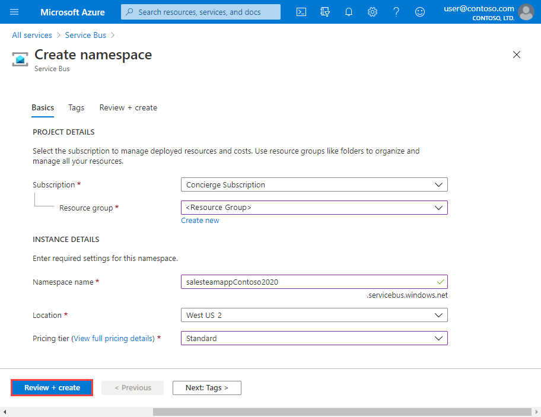
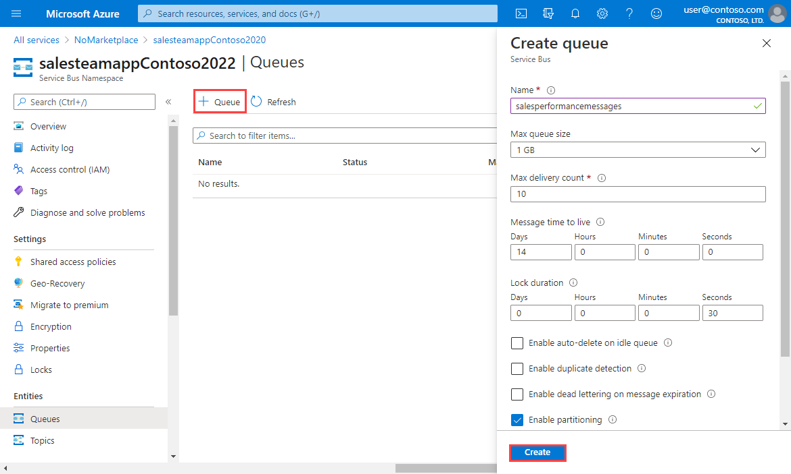

Suppose you have an application for the sales team in your global company. Each team member has a mobile phone where your app will be installed. A web service hosted in Azure implements the business logic for your application and stores information in Azure SQL Database. There is one instance of the web service for each geographical region. You have identified the following purposes for sending messages between the mobile app and the web service:

- Messages that relate to individual sales must be sent only to the web service instance in the user's region.
- Messages that relate to sales performance must be sent to all instances of the web service.

You have decided to implement a Service Bus queue for the first use case and the Service Bus topic for the second use case.

In this exercise, you will create a Service Bus namespace, which will contain both a queue and a topic with subscriptions.

## Create a Service Bus namespace

In Azure Service Bus, a namespace is a container, with a unique fully qualified domain name, for queues, topics, and relays. You must start by creating the namespace.

Each namespace has primary and secondary shared access signature encryption keys. To gain access to the objects within the namespace, a sending or receiving component must provide these keys when it connects.

To create a Service Bus namespace using the Azure portal, follow these steps:

1. Sign in to the [Azure portal](https://portal.azure.com/learn.docs.microsoft.com?azure-portal=true).

1. On the Azure portal menu or from the **Home** page, select **All services**.

1. In the **All Services** pane, scroll down to the **INTEGRATION** section, and then click **Service Bus**.

    

1. In the top left of the **Service Bus** pane, click **Add**.

1. In the **Name** text box, type a unique name for the namespace. For example: "salesteamapp" + *your initials* + *current date*.

1. In the **Pricing tier** drop-down list, select **Standard**.

1. In the **Subscription** drop-down list, select your subscription ("Concierge subscription").

1. Under **Resource group**, select **Use existing** and choose "<rgn>[sandbox resource group name]</rgn>".

1. In the **Location** drop-down list, select a location near you from the below list.

    [!include]

1. Click **Create** to create the Service Bus namespace.

    

## Create a Service Bus queue

Now that you have a namespace, you can create a queue for messages about individual sales. To do this, follow these steps:

1. In the **Service Bus** pane, click **Refresh**. The namespace you just created is displayed.

1. Click the namespace you just created.

1. In the top left of the namespace pane, click **+ Queue**.

1. In the **Create queue** pane, in the **Name** text box, type **salesmessages**, and then click **Create**. Azure creates the queue in your namespace.

    

## Create a Service Bus topic and subscriptions

You also want to create a topic that will be used for messages that relate to sales performance. Multiple instances of the business logic web service will subscribe to this topic from different countries. Each message will be delivered to multiple instances.

Follow these steps:

1. In the **Service Bus Namespace** pane, click **+ Topic**.

1. In the **Create topic** pane, in the **Name** text box, type **salesperformancemessages**, and then click **Create**. Azure creates the topic in your namespace.

    

1. When the topic has been created, in the **Service Bus Namespace** pane, under **Entities**, click **Topics**.

1. In the list of topics, click **salesperformancemessages**, and then click **+ Subscription**.

1. In the **Name** text box, type **Americas**, and then click **Create**.

1. Click **+ Subscription**.

1. In the **Name** text box, type **EuropeAndAfrica**, and then click **Create**.

You have built the infrastructure required to use Service Bus to increase the resilience of your sales force distributed application. You have created a queue for messages about individual sales and a topic for messages about sales performance. The topic includes multiple subscriptions because messages sent to that topic can be delivered to multiple recipient web services around the world.
