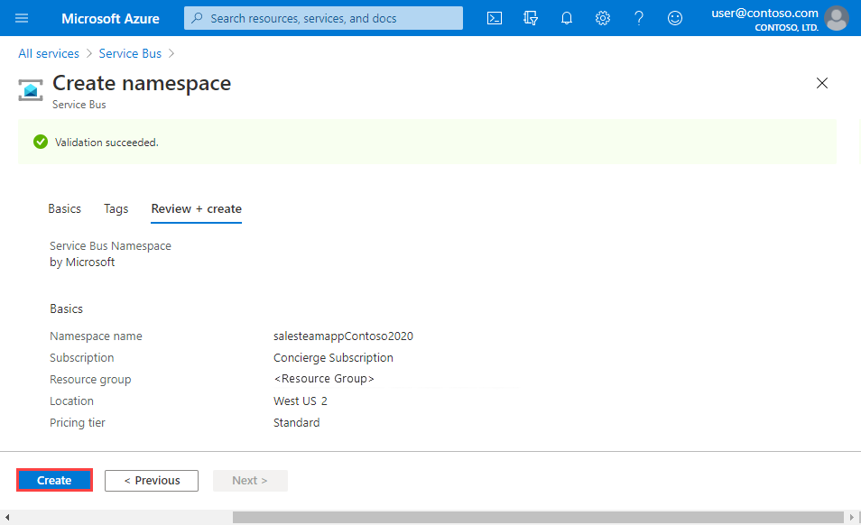

Suppose you have an application for the sales team in your global company. Each team member has a mobile phone where your app will be installed. A web service hosted in Azure implements the business logic for your application and stores information in Azure SQL Database. There is one instance of the web service for each geographical region. You have identified the following purposes for sending messages between the mobile app and the web service:

- Messages that relate to individual sales must be sent only to the web service instance in the user's region.
- Messages that relate to sales performance must be sent to all instances of the web service.

You have decided to implement a Service Bus queue for the first use case, and the Service Bus topic for the second use case.

In this exercise, you will create a Service Bus namespace, which will contain both a queue and a topic with subscriptions.

## Create a Service Bus namespace

In Azure Service Bus, a namespace is a container, with a unique fully qualified domain name, for queues, topics, and relays. You must start by creating the namespace.

Each namespace has primary and secondary shared access signature encryption keys. To gain access to the objects within the namespace, a sending or receiving component must provide these keys when it connects.

To create a Service Bus namespace using the Azure portal, follow these steps:

1. Sign in to the [Azure portal](https://portal.azure.com/learn.docs.microsoft.com?azure-portal=true).

1. Select **Create a resource**.

1. Enter **Service Bus** in the search box, select **Service Bus**, and then select **Create**. The **Create namespace** pane appears.

1. On the **Basics** tab, enter the following values for each setting.

    | Setting | Value | Description |
    |---|---|---|
    | **PROJECT DETAILS** |
    | **Subscription** | _Concierge subscription_ | Specifies the subscription under which this new function app is created. |
    | **Resource group** | _<rgn>[sandbox resource group name]</rgn>_ | Specifies the name of the resource group in which to create your Service Bus namespace. In this exercise, we'll create the namespace in the sandbox resource group that was assigned when we activated the sandbox, namely, _<rgn>[sandbox resource group name]</rgn>_. |
    | **INSTANCE DETAILS** |
    | **Namespace name** | _[Globally unique name]_ | Enter a unique name, for example, _salesteamapp_ + _your initials_ + _current date_. |
    | **Location** | _[Select from the list below]_ | Choose the region closest to you that is also one of the allowed *Sandbox regions* listed below. |
    | **Pricing tier** | _Standard_ | Specifies the pricing tier. |

    [!include]

1. Select **Review + create**.

    

1. Review the details, and after validation succeeds, select **Create** to create the Service Bus namespace.

    

## Create a Service Bus queue

When your namespace had been created, you can create a queue for messages about individual sales.

To create a Service Bus queue, follow these steps:

1. After deployment completes, select **Go to resource**. The namespace you just created appears.

1. In the top menu bar of the namespace pane, select **Queue**. The **Create queue** pane appears.

1. In the **Name** text box, enter **salesmessages**, and then select **Create**. Azure creates the queue in your namespace.

    

## Create a Service Bus topic and subscriptions

You also want to create a topic that will be used for messages that relate to sales performance. Multiple instances of the business logic web service will subscribe to this topic from different countries. Each message will be delivered to multiple instances.

To create a Service Bus topic and subscriptions, follow these steps:

1. In the top menu bar of the **Service Bus Namespace** pane, select **Topic**. The **Create topic** pane appears.

1. In the **Name** text box, enter **salesperformancemessages**, and then select **Create**. Azure creates the topic in your namespace.

    

1. When the topic has been created, at the bottom of the **Service Bus Namespace** pane, **Queues** and **Topics** tabs appear. Select **Topics**.

1. In the left pane, under **Entities**, select **Topics**.

1. In the list of topics, select **salesperformancemessages**.

1. Select **Subscription** to open the **Create subscription** pane for your first subscription.

1. Enter **Americas** for the **Name**, then enter **100** for the **Max delivery count**, and then select **Create**.

1. Select **Subscription** to open the **Create subscription** pane for your second subscription.

1. Enter **EuropeAndAfrica** for the **Name**, and then enter **100** for the **Max delivery count**, and then select **Create**.

You have built the infrastructure required to use Service Bus to increase the resilience of your sales force distributed application. You have created a queue for messages about individual sales, and a topic for messages about sales performance. The topic includes multiple subscriptions because messages sent to that topic can be delivered to multiple recipient web services around the world.
