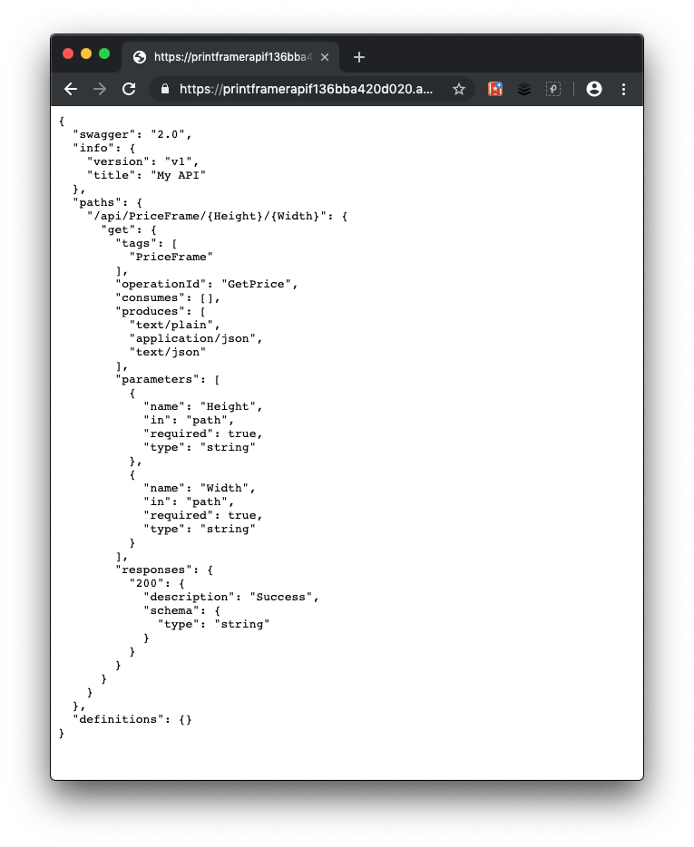

<!-- NOTE - All code for this module can be found at https://github.com/MicrosoftDocs/mslearn-improve-api-developer-experience-with-swagger -->

Your company has an API called **PrintFramerAPI** that calculates the cost of a picture frame based on the size of the frame dimensions. Internally, the small team knows how to use the API. However, to have the API adopted by third parties and therefore drive business, the API needs to be documented. This is an ASP.NET Core API, so you decide to expose the API documentation through Swagger.

In this exercise, you'll try out Swagger and Swashbuckle, in a real-world example. First, let's create an ASP.NET Core Web API project.

## Download the sample web API project to Cloud Shell

1. To clone the sample Web API Project from GitHub, in the Cloud Shell, run the following `git clone` command. 

   <!-- NOTE TO REVIEWER. REPLACE ToDoApi-repo with the URL of the repo containing the code. The code is currently provided in the src folder with this module-->

   ```bash
   git clone https://github.com/MicrosoftDocs/mslearn-improve-api-developer-experience-with-swagger.git \
     ~/code
   ```
## Host our API in the Azure sandbox
In this section, you'll run a script to host our code as a Web App API in Azure. The API is hosted in the sandbox environment and you do not incur any costs.

1. To navigate into the repo folder locally, run the following `cd` command.

    ```bash
    cd ~/code
    ```
    If you list the contents of this folder with the `ls` command, you'll see that the folder contains a file called **setup-exercise.sh** and a folder called **PrintFramerAPI**.

    As its name suggests, **setup-exercise.sh** is the script you'll run shortly to create your lab environment. **PrintFramerAPI** contains the app you want to deploy to Azure as a web app with a public API.

1. To execute the setup script, in the Cloud Shell, run the following command.

    ```bash
    bash setup-exercise.sh
    ```

   The script performs the following steps:

    - Creates an Azure App Service plan in the free tier.
    - Creates a Web API in Azure App Service, configured for Git deployment from a local repo.
    - Sets account-level deployment credentials for your app.
    - Configures Git locally.
    - Deploys your Web API to your App Service instance.

1. Wait for all script steps to complete.

    The  script takes a couple of minutes to run. When the script completes, a URL appears that you can use to test the app deployment.  Observe that during deployment, all dependencies needed for your app to run are automatically installed on the remote App Service at this point.

2. Take note of the values for **DEPLOYMENT-PASSWORD**, **API-ROOT-URL**, and **EXAMPLE-URL** that appear in the Cloud Shell. You'll need these values for the module exercises.

1. Copy the **EXAMPLE-URL** value that appears in the Cloud Shell when the script completes, and paste the address into your favorite browser. The URL will look similar to `https://PrintFramerAPIabc.azurewebsites.net/api/priceframe/6/17`. When you navigate to the address in the browser, it should respond with the message `The cost of a 6x17 frame is $20.00`.

Because you created the API, you knew its shape, but an external developer who wants to consume this API would not be so fortunate. You can help those developers by exposing some documentation about our API with the help of Swagger.

## Add the Swagger library to the solution

1. In the Cloud Shell, navigate to the PrintFramerAPI project.

    ```azurecli
    cd ~/code/PrintFramerAPI
    ```

1.  Add Swashbuckle to our project by running the `dotnet add package` command.

    ```azurecli
    dotnet add package Swashbuckle.AspNetCore
    ```

1. Open the Cloud Shell editor for the project running the following command.

    ```bash
    code .
    ```

    The built-in editor opens in the Cloud Shell, with all files belonging to our project in the left-hand navigation pane of the editor.

1. To open it in the editor, select the  **Startup.cs** file.
1. At the top of the file, add another *using* entry:

    ```csharp
    using Microsoft.OpenApi.Models;
    ```

1. To add the Swagger generator to the services collection. replace the method `ConfigureServices(IServiceCollection services)` with the following implementation.

    ```csharp
    public void ConfigureServices(IServiceCollection services)
    {
        services.AddMvc()
            .SetCompatibilityVersion(CompatibilityVersion.Version_2_2)
            .AddJsonOptions(options =>
            {
            options.SerializerSettings.Formatting = Formatting.Indented;
            });

        // NEW CODE STARTS HERE
        services.AddSwaggerGen(c =>
        {
            c.SwaggerDoc("v1", new OpenApiInfo { Title = "My API", Version = "v1" });
        });
        // NEW CODE ENDS HERE
    }
    ```

1. In the `Configure` method in **Startup.cs**, enable  middleware for the Swagger UI by adding `useSwagger` and `useSwaggerUI`, as shown in the following code snippet.

    ```csharp
    public void Configure(IApplicationBuilder app, IHostingEnvironment env)
    {
        if (env.IsDevelopment())
        {
            app.UseDeveloperExceptionPage();
        }
        else
        {
            app.UseExceptionHandler("/Error");
            app.UseHsts();
        }

        app.UseHttpsRedirection();
        app.UseStaticFiles();
        app.UseCookiePolicy();

        // Enable middleware to serve generated Swagger as a JSON endpoint.
        app.UseSwagger();

        // Enable middleware to serve swagger-ui (HTML, JS, CSS, etc.), 
        // specifying the Swagger JSON endpoint.
        app.UseSwaggerUI(c =>
        {
            c.SwaggerEndpoint("/swagger/v1/swagger.json", "My API V1");
        });


        app.UseMvc();
    }
    ```

1. Save these changes in the editor.

1. To see these changes in action in your live API, you must commit the changes and push into production.

    ```azurecli
    git add .
    git commit -m "adds Swagger to our API"
    git push production
    ```

1. When prompted, enter the **DEPLOYMENT-PASSWORD** you saved earlier.

1. Wait for the preceding commands to complete. The changes are pushed to your live API hosted at the URL you noted earlier.

1. In a browser, navigate to **API-ROOT-URL**/swagger/v1/swagger.json'. Replace API-ROOT-URL with the value you saved from the setup script.

   The response we get in the browser this time is a document describing the endpoints of the API, similar to the following response.
 
    
