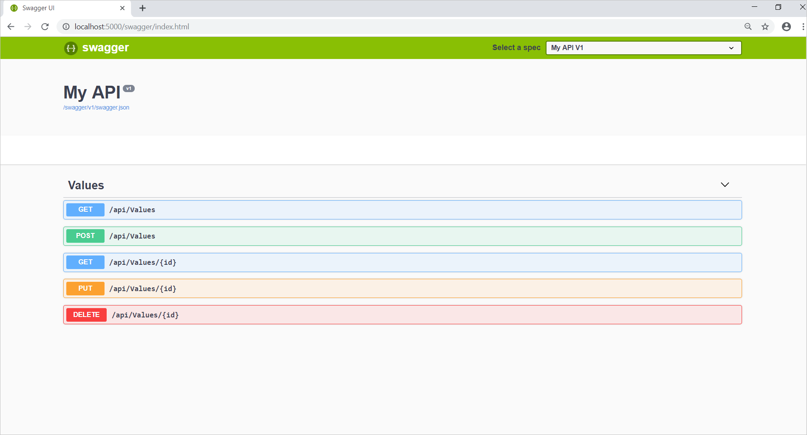
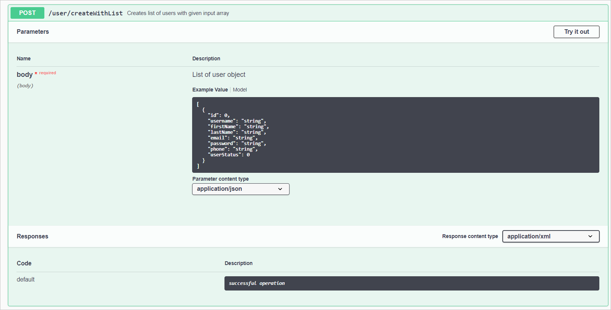
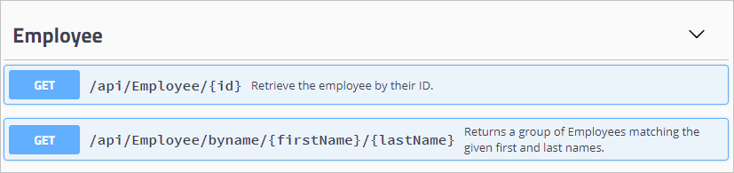
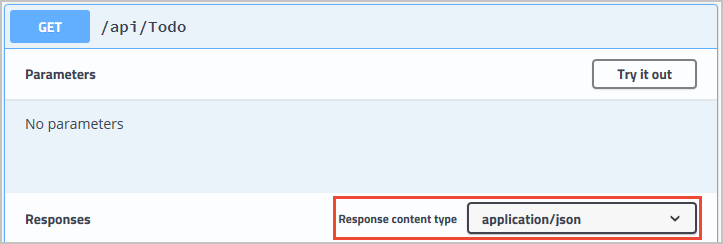

The Swagger UI allows you to interact and visualize an API's resources without requiring access to the source code. The graphical representation of your API is automatically generated from your Swagger/OpenAPI specification, and makes it easier for other developers to build applications that consume your APIs.

The Swagger UI visualizes operations and methods clearly, as shown in the image below.



The Swagger also UI allows you to interact and even try out each operation.



Automatically creating your API documentation with Swagger and Swashbuckle can really help third parties to understand your API’s resources. But what if you wanted to go a little further and provide even more detailed information? If you're using an API for the first time, you want as much information as possible.

## XML comments

You can create documentation for your code by including XML Comments. You would typically place these comments directly before the code block about which you're commenting.

```csharp
/// <summary>
/// Returns a group of Employees matching the given first and last names.
/// </summary>
/// <remarks>
/// Here is a sample remarks placeholder.
/// </remarks>
/// <param name="firstName">The first name to search for</param>
/// <param name="lastName">The last name to search for</param>
/// <returns>A string status</returns>
[HttpGet]
[Route("byname/{firstName}/{lastName}")]
public ActionResult<string> GetByName(string firstName, string lastName)
{
    return "Found another University employee";
}
```

Here's the XML nodes in use:

- summary: A high-level summary of what the method/class/field is or does.
- remarks: Additional detail about the method/class/field.
- param: A parameter to the method, and what it represents.
- returns: A description of what the method returns.

Swagger will automatically include your XML documentation comments in the API documentation, and allow you to view it in Swagger UI. 

 

## Data annotations

It's the same with data annotations! Just add an annotation to your model, and Swagger will extend the API documentation to include it.

For example, if you add the following annotation to a controller:

```csharp
[Produces("application/json")]
```

... you'll see the added information in Swagger UI!


