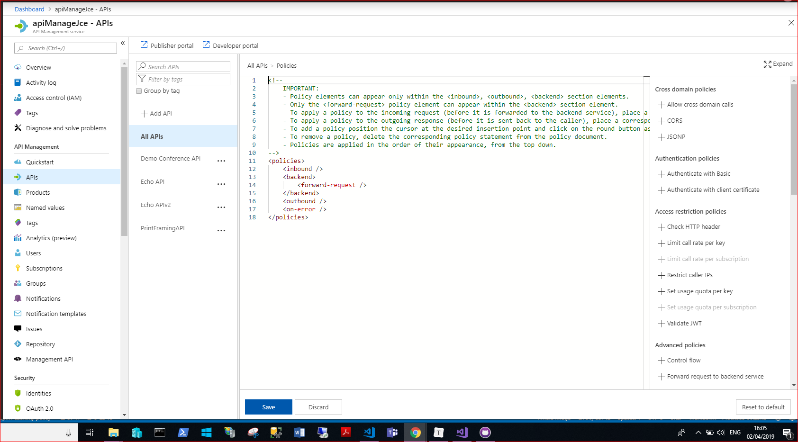
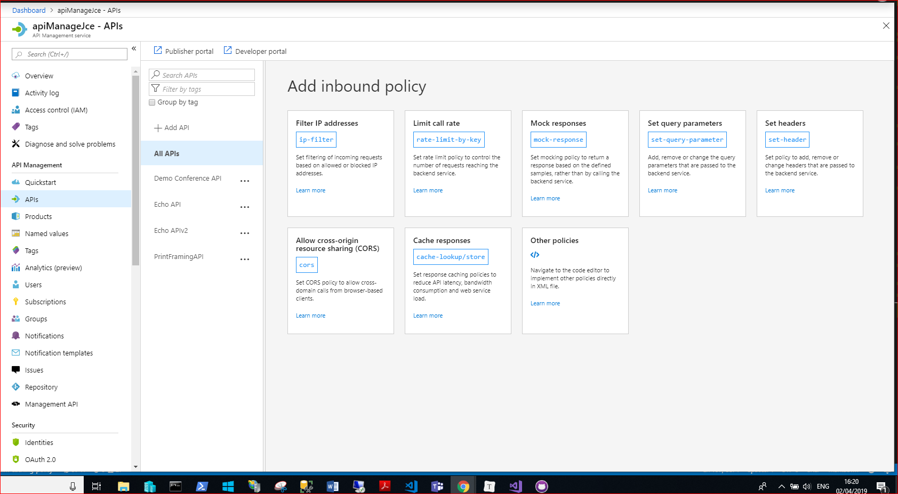
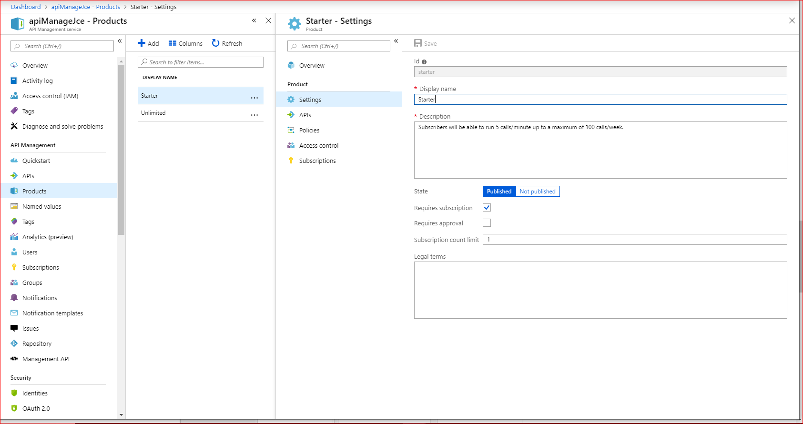
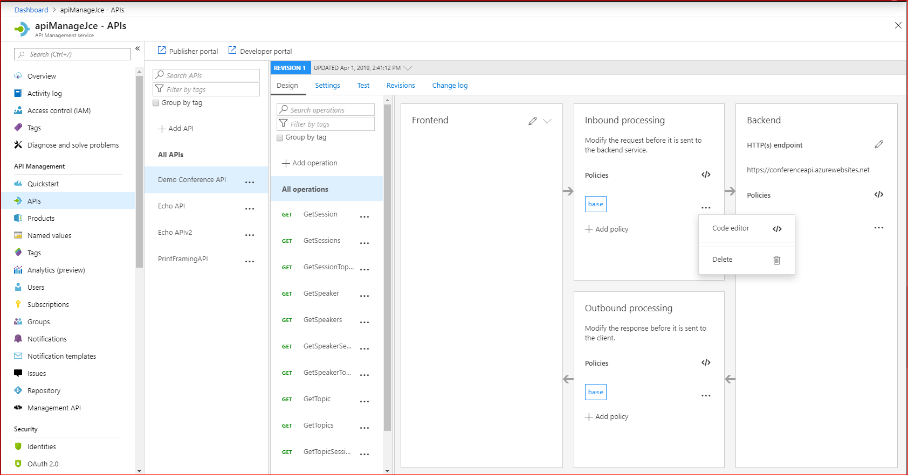
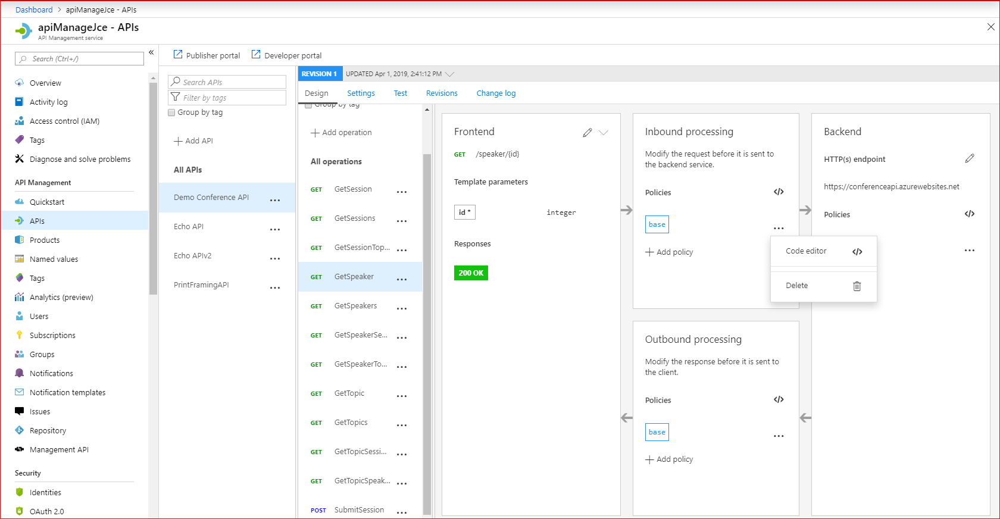

<!-- Guidance on writing the introductory text in a learning unit: https://review.docs.microsoft.com/en-us/learn-docs/docs/id-guidance-introductions?branch=master#use-the-standard-learning-unit-introduction-format -->

<!-- Use this syntax for any TODOs or notes to yourself or reviewers -->

<!-- If you have any relevant links to other content (in Learn, Docs or anywhere else), include it only in the Learn More section in the final Summary unit. -->

<!-- Images: all images must be original. Work with the team to submit an image creation request if new art is needed. See here for requirements on screenshots: https://review.docs.microsoft.com/en-us/help/contribute/contribute-how-to-create-screenshot?branch=master -->

<!-- Don't include a summary section in individual units -->

<!-- Don't include a sentence or section to transition to the next unit. The platform will insert the name of the next unit above the navigation button at the bottom -->
You can use API Management policies to control many aspects of a deployed API.

Suppose there is a need on the Board Gaming site to provide a faster response to requests. For example, users often request prices for various sizes of board for games. Your company ships these boards to the UK or other areas of the world. API Management policies can accelerate responses by configuring a cache of compiled responses.

First let's look at what you can use policies to do.

## What are policies?

Policies are formed of individual statements which are executed in order. The policy documents are XML structures, which contain elements that you can use to control the behavior of the API.

## When do policies execute?

In Azure API Management, policies execute at four different times:

- **Inbound**. These policies execute when a request is received from a client.
- **Backend**. These policies execute before a request is forwarded to a managed API.
- **Outbound**. These policies execute before a response is sent to a client.
- **On-Error**. These policies execute when an exeception is raised.

In the policy XML, there is a separate tag for each of these execution times:

```xml
<policies>
    <inbound>
        <base />
        <cache-lookup vary-by-developer="false" vary-by-developer-groups="false" downstream-caching-type="none" must-revalidate="true" caching-type="internal" >
            <vary-by-query-parameter>version</vary-by-query-parameter>
        </cache-lookup>
    </inbound>
    <backend>
        <base />
    </backend>
    <outbound>
        <cache-store duration="seconds" />
        <base />
    </outbound>
    </on-error>
        <base />
    </on-error>
</policies>
```

To set up a cache, you use an outbound element to store responses. You also use an inbound element to check if there is a cached response for the current request. You can see these two elements in the above policy.

## Policy Scopes

A policy's scope determines how broadly it will be applied. There are four possible scopes that you can choose from.

<!-- TODO: Policies are evaluated in order of scopes Global, Product, API, Operations.-->

### The global policy scope

Policies applied at the global scope affect all APIs within the instance of API Management.

To use the global scope, choose the **All APIS** menu item. You can open the XML editor by clicking on the tag symbol **</>**:


This image shows the policy editor and its default XML contents:



With the cursor in the &lt;inbound&gt; or &lt;outbound&gt; tags, click on a policy element on the right to open a wizard that adds that policy element:



### The product policy scope

In API Management, you can assemble one or more APIs into a single product and then manage access to that product as a single entity. Policies applied at the product scope affect all the APIs in that product.



### The API policy scope

Policies applied at the API scope affect only a single API. Use the **All Operations** option to apply a policy at this scope:



### Operation policy scope

Policies applied at the operation scope affect only one operation within the API, such as a GET or a POST operation:



## Which order are policies applied in?

You can use the `<base />` tag to determine when policies from a higher scope are applied. For example, consider this policy, applied at the API scope:

```xml
<policies>
    <inbound>
        <base />
        <find-and-replace from="game" to="board game" />
    </inbound>
</policies>
```

Because the `<base>` tag appears above the `<find-and-replace>` tag, Azure applies policies from the product and global scopes first, and then executes the find-and-replace policy.

## How to control the API Management cache

When you want to set up and configure a cache, you usually need at least two policies, which apply to inbound and outbound requests. There are some other cache control policies as well:

- Use the **Get from cache** element on inbound request to perform a cache look up and return a valid response.
- Use the **Store to cache** element to add a response to the cache for a specific time period.
- Use the **Get value from cache** element to retrieve a cached item by its key.
- Use the **Store value in cache** element to add an item to the cache by its key.
- Use the **Remove value from cache** element to remove an item from the cache by its key.

You will learn more about these policies later in this module.

## Elements used for restricting access

There are several policies that you can use to prevent or limit access:

- Use the **Check HTTP header** policy to check for a property in an HTTP Header. If the property is not found, Azure drops the request.
- Use the **Limit call rate by subscription** element to restrict the number of calls that can come from a single API subscription. This policy can ensure that users from one subscription do not use all your bandwidth.
- Use the **Limit call rate by key** element to restrict the number of calls that arrive with a single access key.
- Use the **Restrict caller IPs** element to allow or deny calls from specific IP addresses or ranges of IP addresses.

## Elements for Authentication

Several policies enable you to control authentication:

- Use the **Authenticate with Basic** element to enable authentication in plain text. Remember that this kind of authentication should be protected with SSL encryption.
- Use the **Authenticate with client certificate** element to enable clients authenticate by supplying a client certificate.

## Cross domain policies elements

Cross domain requests are usually considered a security threat and denied by browsers and APIs. However, for specific operations they can be desirable and API Management policies enable you to permit them in a secure manner:

- Use the **Allow cross-domain calls** element to permit calls from Adobe Flash and Silverlight.
- Use the **CORS** element to permi Cross-Origin Resource Sharing (CORS).
- Use the **JSONP** element to add JSON with padding to allow calls across domains from JavaScript browser-based clients.

## Transformation policies

It's often helpful to change the format or content of a response from a managed API. You can do that with several policies:

- Use the **Convert JSON to XML** and **Convert XML to JSON** elements to convert to and from JSON and XML.
- Use the **Find and replace string in body** to execute a string substitution.
- Use the **Mask URLs in content** element to re-write any links in the response body so that they point to a different location.
- Use the **Set body** element to set the message text for incoming and outgoing requests.
- Use the **Set HTTP header** element to add items to an existing response or request header.
- Use the **Set query string parameter** element to add replace a query string parameter.
- Use the **Rewrite URL** element to convert a request URL from its public form to a form a private destination.
- Use the **Transform XML** element to use an XSLT template to transform some XML text.

## Advanced elements

These policy element can be of use in scenarios when you want a non standard behavior:

- Use the **Control flow** element to apply policy statements based on a Boolean expression.
- Use the **Forward request** element to send on or forward a request to a backend server.
- Use the **Retry** element to retry the policy statements enclosed until a condition is met. Execution will repeat at the specified time intervals up until the retry count value is reached.
- Use the **Send one way request** element to send a request to a URL without waiting for a response.
- Use the **Set variable** element to persist a value in a named variable within the context.