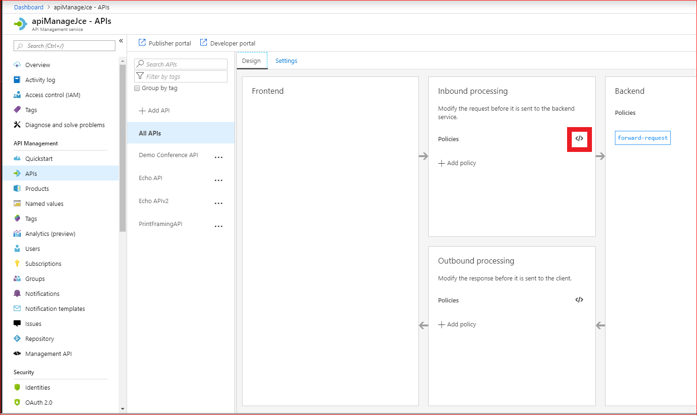

<!-- Guidance on writing the introductory text in a learning unit: https://review.docs.microsoft.com/en-us/learn-docs/docs/id-guidance-introductions?branch=master#use-the-standard-learning-unit-introduction-format -->

<!-- Use this syntax for any TODOs or notes to yourself or reviewers -->

<!-- If you have any relevant links to other content (in Learn, Docs or anywhere else), include it only in the Learn More section in the final Summary unit. -->

<!-- Images: all images must be original. Work with the team to submit an image creation request if new art is needed. See here for requirements on screenshots: https://review.docs.microsoft.com/en-us/help/contribute/contribute-how-to-create-screenshot?branch=master -->

<!-- Don't include a summary section in individual units -->

<!-- Don't include a sentence or section to transition to the next unit. The platform will insert the name of the next unit above the navigation button at the bottom -->
 Many organizations use APIs to publish data and services. Customers and partners can call these APIs from any kind of client: desktop applications, mobile apps, web apps, and other systems. If your API is popular, you may need to optimize its performance to guarantee a good service to users.

    Suppose you are a developer for a board game company. A product line produced by your company has recently become very popular, and the volume of requests from your retail partners to your inventory API is growing quickly: much faster than the rate that your inventory actually changes. You'd like to be able to respond to requests successfully without incurring load on your API.

    You use Azure API Management to host your API. You've read that you can configure an API Management policy to cache compiled responses to requests and you think that this will be a good way to optimize performance. You want to learn how to write API Management policies and how to use them to set up and control a cache. Then you want to write a policy that accelerates responses to users.

## Choosing the right policy

Policies in Azure API Management - APIM can be used to control many aspects of an already deployed API changing its behaviour via configuration. 
The statements which form a policy are executed sequentially on either outbound responses  or inbound requests. You therefore need to be aware of the built in configurable policies tat are available in Azure APIM

## Inbuilt Policies

**Some access restriction policy examples**

Check HTTP header is used to check for the existence or a particular value in an HTTP Header.

Limit call rate by subscription this is use to limit the number of calls based on the subscription.

Limit call rate by key  limits the call rate based on the key.

Restrict caller IPs is used to allow or deny calls from specific IPs or ranges of IP adressses.

**Some Advanced policy examples**

Control flow is used to applies policy statements based on a Boolean expression.

Forward request is used to send on or forward a request to a backend server.

Retry this  retries execution of the policy statements enclosed in its scope if and until the condition is met. Execution will repeat at the specified time intervals up until the retry count value is reached
.
Send one way request will enable the sending of a request to a URL without waiting for a response.

Set variable will persist a value in a named variable within the context

**Authentication policies**

Authenticate with Basic this does as it says, it authenticates with Basic Authentication.

Authenticate with client certificate this authenticates with backend services using client certificates

**Caching policies Creating these is the main emphasis of this module**

Get from cache - Perform cache look up and return a valid cached response when available.
Store to cache - Caches response according to the specified cache control configuration.
Get value from cache - Retrieve a cached item by key.
Store value in cache - Store an item in the cache by key.
Remove value from cache - Remove an item in the cache by key.

**Cross domain policies**

Allow cross-domain calls enables your API to be called from Adobe Flash and Silverlite

CORS enables cross-origin resource sharing (CORS) support to an operation within an API or an API to allow  calls acress domains from browser-based clients.
JSONP adds JSON with padding to allow calls  accross domains from JavaScript browser-based clients.

**Transformation policies** 

These can be very useful when a client needs a response or request to be  converted.

Convert JSON to XML and Convert XML to JSON both do a conversion to and from JSON and XML formats

Find and replace string in body this as its name says enables you to find and replace strings in the body.

Mask URLs in content will re-write any links in the response body so that they point to the equivalent link via the gateway.

Set backend service changes the backend service for an incoming request.

Set body is used to set the message body for incoming and outgoing requests.

Set HTTP header adds items to an existing response or request header or can be used to create completely new ones.

Set query string parameter - Adds, replaces value of, or deletes request query string parameter.

Rewrite URL Converts a request URL from its public form to a form expected a particularWeb service
.
Transform XML uses an XSLT template to carry out  XSL transformation to XML in the request or response body.

## Policy Scopes ##

Policys are evaluated in order of scopes Global, Product, API, Operations.

**The Global Policy Editor**

The All APIS menu item is at Global Scope

The XML editor is accessed by the </> 

Choosing Add Policy In the various processing areas launches a wizard to aid adding your values in the correct part of the policy document

