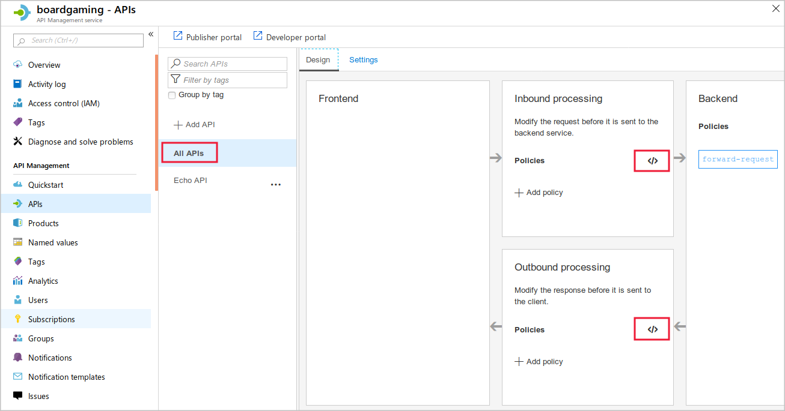
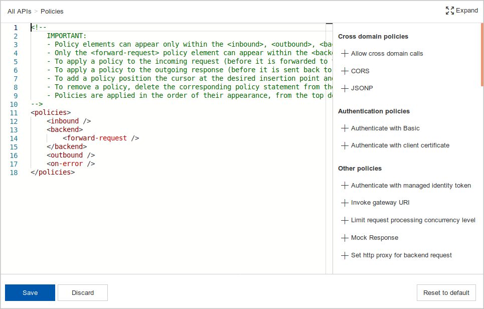
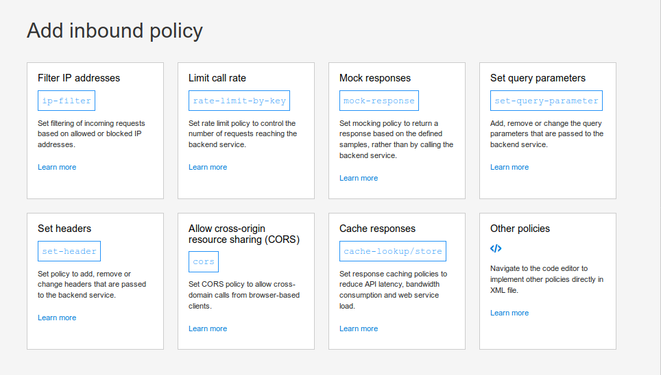
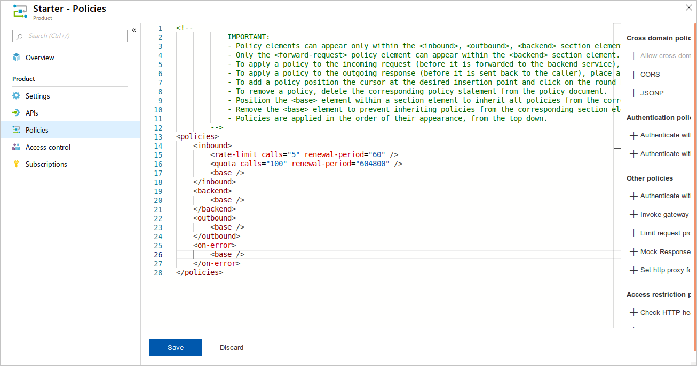
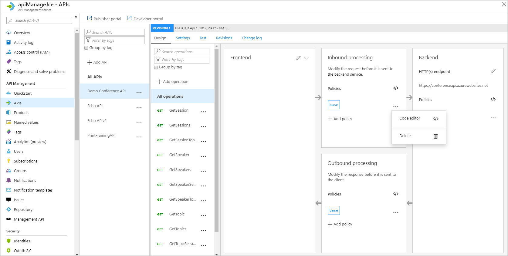
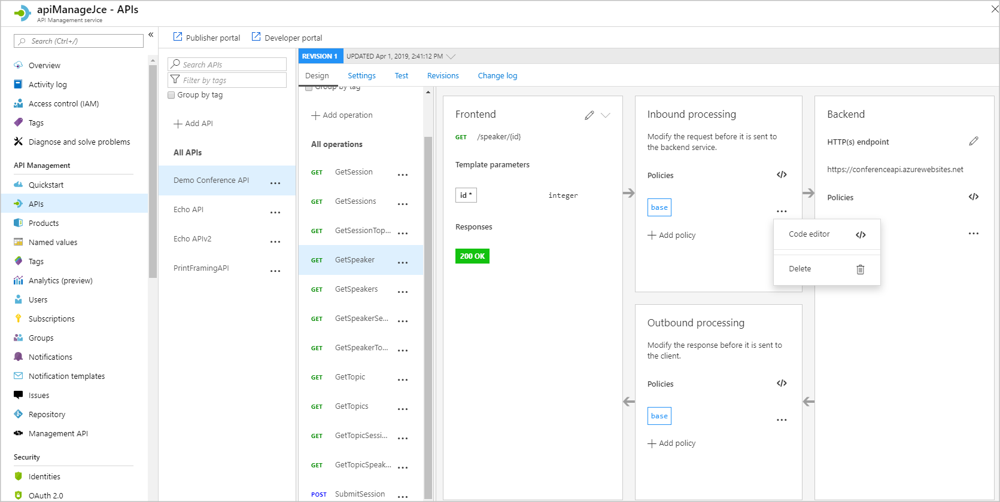

You can use API Management policies to control the behavior of a deployed API without rewriting its code.

In your board game company, you have a set of APIs that enable partner organizations to obtain price estimates, staff members to check stock levels, and customers to place orders. You want to address a particular issue with performance and investigate what else you can achieve with policies.

First, let's look at what you can use policies to do.

## What are policies?

In Azure API Management, administrators can use policies to alter the behavior of APIs through configuration. The primary functionality and behavior of an API is designed by the developers who write the code. However, administrators can use policies to set limits, convert response formats, or enforce security requirements. In this module, we'll concentrate on using policies to set up and control a cache.

Policies are made up of individual statements, which are executed in order. The policy documents are XML structures, which contain elements that you can use to control the behavior of the API.

## When do policies execute?

In Azure API Management, policies execute at four different times:

- **Inbound**: These policies execute when a request is received from a client.
- **Backend**: These policies execute before a request is forwarded to a managed API.
- **Outbound**: These policies execute before a response is sent to a client.
- **On-Error**: These policies execute when an exception is raised.

In the policy XML, there's a separate tag for each of these execution times:

```xml
<policies>
    <inbound>
        <base />
        <check-header name="Authorization" failed-check-httpcode="401" failed-check-error-message="Not authorized" ignore-case="false">
        </check-header>
    </inbound>
    <backend>
        <base />
    </backend>
    <outbound>
        <base />
        <json-to-xml apply="always" consider-accept-header="false" parse-date="false" />
    </outbound>
    <on-error>
        <base />
    </on-error>
</policies>
```

In this example, you can see that the policy checks inbound requests for a header named **Authorization**. If such a header isn't present, the policy displays an error message.

This policy also translates any out-bound responses in JSON format into XML.

## Policy scopes

A policy's scope determines how broadly it will be applied. There are four policy scopes from which you can choose:

- Global
- Product
- API
- Operation

### Global

Policies applied at the global scope affect all APIs within the instance of API Management.

To use the global scope, in your API Management service pane, in the left menu pane, under **API Management**, select **APIs**, and then select **All APIs** in the middle menu pane. You can open the XML editor by selecting the tag symbol **</>** in the **Inbound processing**, **Outbound processing**, or **Backend** sections:



The policy editor that appears contains default XML content. On the right, you can find shortcuts that add policies:



To create policy, you can manually edit the XML in the policy editor. Alternatively, on the **All APIs** pane, you can select **Add policy** to start a wizard that helps you to add policy with the correct syntax:



### Product

In API Management, you can assemble one or more APIs into a single product and then manage access to that product as a single entity. Policies applied to the product scope affect all the APIs in that product. APIs in other products are unaffected. When you manage a product in the Azure portal, select the **Policies** pane to bring up the XML policy editor:



### API

Policies applied at the API scope affect only a single API. To set a policy at the API scope, on the API Management home page, select **APIs**, then select the API you want to manage. Finally, under the **Design** tab, select **All operations**:



### Operation

Policies applied at the operation scope affect only one operation within the API. In the example below, the administrator has selected the **GetSpeaker** operation within the **Demo Conference API** and can set inbound, outbound, or backend policies that apply only to that operation:



## Which order are policies applied in?

You can use the `<base />` tag to determine when policies from a higher scope are applied. For example, consider this policy, applied at the API scope:

```xml
<policies>
    <inbound>
        <base />
        <find-and-replace from="game" to="board game" />
    </inbound>
</policies>
```

Because the `<base>` tag appears above the `<find-and-replace>` tag, Azure applies policies from the global and product scopes first, and then executes the find-and-replace policy.

## Commonly used policies

Let's examine some things you can do with policies in API Management.

### Policies for restricting access

There are several policies that you can use to prevent or limit access to an API or its operations:

Use the **Check HTTP header** policy to check for a property in an HTTP Header. If the property isn't found, Azure drops the request.

The **Limit call rate by subscription** policy restricts the number of calls that can come from a single API subscription. This policy can ensure that users from one subscription don't use all your bandwidth.

If you want to restrict the number of calls that arrive with a single access key, use the **Limit call rate by key** policy.

To allow or deny calls from specific IP addresses or ranges of IP addresses, use the **Restrict caller IP's** policy. This way to restrict access behaves like the IP address restrictions that you can apply on a firewall.

### Policies for authentication

Several policies enable you to control authentication:

You can use the **Authenticate with Basic** policy to enable authentication in plain text. This form of authentication is broadly supported, but remember that you should protect it with SSL encryption; otherwise, a malicious attack can intercept the credentials as they cross the network.

You can use the **Authenticate with client certificate** policy to enable clients to authenticate by supplying a client certificate.

### Cross-domain policies

Cross-domain requests are considered a security threat and denied by browsers and APIs. However, they can be desirable for specific operations, and API Management policies let you permit them securely.

Use the **Allow cross-domain calls** policy to permit calls from Adobe Flash and Silverlight. If your API or client apps rely on Cross-Origin Resource Sharing (CORS), use the **CORS** policy to permit them.

Some AJAX code, which runs on the browser, uses JSON with padding to make cross-domain calls securely. Use the **JSONP** policy to permit clients to use this technique.

### Transformation policies

It's often helpful to change the format or content of a response from a managed API. You can do that with several policies:

To convert to and from JSON and XML, use the **Convert JSON to XML** and **Convert XML to JSON** policies. This policy often helps to make multiple APIs in a product consistent. It can also remove the need to recode an API when an app expects a response in a specific format.

Sometimes you want to keep a response in XML, but alter its schema. In such cases, use the **Transform XML** policy to apply an XSLT template.

Use **Find and replace string in body** to execute a string substitution. For example, if a brand name has changed, you could use this policy to ensure that the change is reflected in all responses, even if the underlying data still includes references to the old name.

The **Mask URLs in content** policy can rewrite any links in the response body so that they point to a different location. This policy is useful when a website or web API has moved.

Use the **Set body** policy to set the message text for incoming and outgoing requests.

If you want to modify an incoming HTTP request or outgoing response, you can use several different policies. To add items to an existing response or request header, use the **Set HTTP header** policy. If you need to modify the query strings, which appear after the question mark in the URL, use the **Set query string parameter** policy. If a public URL, which a user has requested, must be mapped to a different internal destination, the **Rewrite URL** policy can perform the conversion both inbound and outbound.

### Advanced policies

These policies can be of use in scenarios when you want non-standard behavior.

For example, if you want to apply a policy only when the response passes a specific test, use the **Control flow** policy.

Use the **Forward request** policy to forward a request to a backend server.

To control what happens when an action fails, use the **Retry** policy. Policy statements enclosed in **Retry** will execute repeatedly until a condition is met. Execution will repeat at the specified time intervals up until the retry count value is reached.

The **Send one-way request** policy can send a request to a URL without waiting for a response.

If you want to store a value for use in a later calculation or test, use the **Set variable** policy to persist a value in a named variable.
