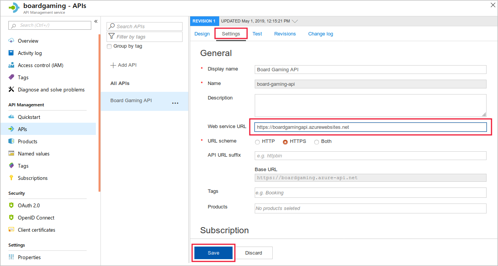

Companies that use Azure API Management to host API can modify their behavior, without rewriting code, by using policies.

Suppose you have planned to implement caching for the Board Pricing API. You want to add the API to API Management and write the necessary policies.

In this exercise, you'll import an API into Azure API Management and add a caching policy to it.

[!include[](../../../includes/azure-sandbox-activate.md)]

[!include[](../../../includes/azure-sandbox-regions-first-mention-note-friendly.md)]

## Create a Web API in Azure Apps Service

Start by creating a new Web API app in Azure Apps Service. You'll use this resource to host the Board Pricing API:

1. To create an App Service plan for the web API, in the Cloud Shell on the left, type this command and then press Enter:

    ```azurecli
    az appservice plan create --name BoardGamingServicePlan --resource-group <rgn>Sandbox resource group</rgn>
    ```

1. To create the web API by deploying code from a GitHub repository, type this command and then press Enter:

    ```azurecli
    az webapp create --name <unique name> --plan BoardGamingServicePlan --resource-group <rgn>Sandbox resource group</rgn> --deployment-source-url https://github.com/MicrosoftDocs/mslearn-improve-api-performance-with-apim-caching-policy.git
    ```

## Test the deployed Web API

Now the API is completed and deployed, let's test it. We can do that by submitting a GET request in the browser and also by checking the OpenAPI definition:

1. In the [Azure portal](https://portal.azure.com/learn.docs.microsoft.com?azure-portal=true), select **All resources** and then select the API App.
1. On the **Overview** response, select **Browse**. The browser will indicate that the page can't be found &mdash; this is just because our app is an API and does not serve a webpage.
<!-- REVIEW Please include a very brief introduction of the API near the top of this unit; this URL is introduced from nowhere -->
1. In the **Address** bar, append the URL with **/api/quotes/usa/chess?height=7&width=6**. The browser displays a result in JSON format. Notice that the result includes the server time.
1. In the **Address** bar, replace **/api/quotes/usa/chess?height=7&width=6** with **/swagger**. The browser displays the Swagger UI. Keep this browser tab open for later.

## Create a new Azure API Management instance

Now that we have a functional API, let's set up API Management:

1. In the [Azure portal](https://portal.azure.com/learn.docs.microsoft.com?azure-portal=true), select **Create a resource > Web > API Management**.
1. In the **API Management service** window, enter the following settings, and then click **Create**:

    | Setting | Value |
    | --- | --- |
    | Name | Choose a unique name. Make a note of it, you'll need it later on. |
    | Subscription | *Concierge Subscription* |
    | Resource group | Select *Use existing* and choose *<rgn>Sandbox resource group</rgn>* |
    | Location | Select from one of the following: North Central US, West US, West Europe, North Europe, Southeast Asia, and Australia East. The Consumption tier used in this exercise is only available in these regions. |
    | Organization | BoardGames |
    | Administrator email | Enter your own email address or use the default |
    | Pricing tier | Consumption |
    | | |

    > [!NOTE]
    > We're using the consumption tier in this module because Azure can set up API Management instances in this tier within a minute or so. Instances in other tiers can take 30 minutes or so to initiate.

## Create a Redis cache

The consumption tier in API Management is intended for those organizations who prefer to build APIs on serverless principals. One difference with this tier is that it does not have its own internal cache. Therefore, to use a caching policy, we must create an external Redis cache, and configure the API Management instance to use it. Let's create that cache now:

1. In the [Azure portal](https://portal.azure.com/learn.docs.microsoft.com?azure-portal=true), select **Create a resource > Databases > Azure Cache for Redis**.
1. In the **New Redis Cache** page, enter the following settings, and then click **Create**:

    | Setting | Value |
    | --- | --- |
    | DNS Name | Choose a unique name. Make a note of it, you'll need it later on. |
    | Subscription | *Concierge Subscription* |
    | Resource group | Select *Use existing* and choose *<rgn>Sandbox resource group</rgn>* |
    | Location | Choose the same location you used for the API Management instance |
    | Pricing tier | Standard C1 |
    | | |

    

## Configure API Management to use the external cache

The Redis cache takes a few minutes to deploy. When the deployment is complete, you can configure the API Management instance to use it as an external cache:

1. In the [Azure portal](https://portal.azure.com/learn.docs.microsoft.com?azure-portal=true), click **All Resources**, and then click the new Redis cache.
1. Under **Settings**, click **Access keys**.
1. To the right of the **Primary connection string** textbox, click the **Copy to clipboard** button.

    

1. Click **All Resources**, and then click the management service you created above.
1. Under **Settings**, click **External cache**, and then click **+ Add**.

    

1. In the **Cache instance** drop-down list, select **Custom**, and then in the **Use from** textbox, select the same location you used for the API Management instance.
1. To paste in the connection string, put the cursor in the **Connection string** textbox, press CTRL-V, and then click **Save**.

    

## Add the API in API Management

Before you can apply a policy, you must add the API to the API Management instance

1. In the [Azure portal](https://portal.azure.com/learn.docs.microsoft.com?azure-portal=true), click **All Resources** and then click the API Management service you created above.
1. Under **API Management**, click **APIs**, and then click **OpenAPI**.

    

1. Switch to the browser tab that displays the Swagger interface for the API, and then click the link to the **swagger.json** file.
1. Copy all the text in the address bar.
1. In the **Create from OpenAPI specification** window, place the cursor in the **OpenAPI specification** textbox, and then press CTRL-V.
1. Click **Create**. Azure adds the API to the management instance.

    

## Configure the new API in API Management

<!-- REVIEW This shouldn't be necessary, the OpenAPI document should include this information and it should auto-populate. Please see what was done in https://docs.microsoft.com/en-us/learn/modules/publish-manage-apis-with-azure-api-management/ to avoid this step.-->

Next, let's configure the API in API Management with its original URL. This setting ensures that API Management trusts requests from that domain:

1. When the API has been created, click the **Settings** tab.
1. Place the cursor in the **Web service URL** text box, and then press CTRL-V.
1. From the pasted text, remove `/swagger/v1/swagger.json` and then click **Save**

    

## Test the API in API Management

The API is now added to the management instance. Let's test the API before any policy is applied:

1. Click the **Test** tab and then click the **GET** operation.
1. Use the following values for template parameters and query parameters and then click **Send**:

    | Name | Value |
    | --- | --- |
    | ShippingCode | USA |
    | Game | Chess |
    | Height| 8 |
    | Width | 8 |
    | | |

    

1. Examine the results. Note the precise time that is included in the response.
1. Click the **Send** button to resend the request. Notice that the time in the response has changed.

## Add a caching policy

Now we can enable the cache by adding policies to the XML:

1. Click the **Design** tab and then click the **GET** operation.
1. In the **Inbound processing** section, click **+Add policy**.

    

1. Click **Cache responses**.
1. In the **Duration in seconds** box, type **600**, and then click **Save**.
1. In the **Inbound processing** section, click **</>**. The portal displays the policy XML editor.
1. Notice that a **&lt;cache-lookup&gt;** tag has been added to the **&lt;inbound&gt;** section, and a **&lt;cache-store&gt;** tag has been added to the **&lt;outbound&gt;** section.

    

1. Click **Save**.

## Test the cache

We'll run the same test on the API in API Management and observe the results of the cache:

1. Click the **Test** tab and then click the **GET** operation.
1. Use the following values for template parameters and query parameters and then click **Send**:

    | Name | Value |
    | --- | --- |
    | ShippingCode | USA |
    | Game | Chess |
    | Height | 8 |
    | Width | 8 |
    | | |

    

1. Examine the results. Note the precise time that is included in the response.
1. Click the **Send** button to resend the request. Notice that the time in the response has not changed, because the cached response has been served.

## Configure the cache to vary by query parameter

<!-- REVIEW See comment in previous unit about the need for this element. I'd still like to illustrate its use; the scenario/API may need to be altered a bit. -->
To ensure that the system caches different responses for different board sizes, you must configure the cache to vary by query parameters:

1. Click the **Design** tab and then click the **GET** operation.
1. In the **Inbound processing** section, click **</>**.
1. Within the `<cache-lookup>` policy, add the following XML: <!-- REVIEW Please be more clear here; it's not obvious that the user needs to rework the existing element into separate open/close tags and put this inside -->

    ```xml
    <vary-by-query-parameter>height</vary-by-query-parameter>
    ```

1. Click **Save**.

## Test the new cache configuration

The cache should now keep separate responses for different values of the height query parameter. Let's test that:

1. Click the **Test** tab, click the **GET** operation, use the following values for template parameters and query parameters and then click **Send**:

    | Name | Value |
    | --- | --- |
    | ShippingCode | USA |
    | Game | Chess |
    | Height | 8 |
    | Width | 8 |
    | | |

1. Examine the results. Note the precise time that is included in the response.
1. Click the **Send** button to resend the request. As before, notice that the time in the response has not changed, because the cached response has been served.
1. To test the height parameter, use the following values for template parameters and query parameters and then click **Send**:

    | Name | Value |
    | --- | --- |
    | ShippingCode | USA |
    | Game | Chess |
    | Height | 100 |
    | Width | 8 |
    | | |

1. Examine the results. This time, because the height query parameter in the request has changed, the cached response is not used and the result is updated. This behavior is correct for our API.
1. To test the width parameter, use the following values for template parameters and query parameters and then click **Send**:

    | Name | Value |
    | --- | --- |
    | ShippingCode | USA |
    | Game | Chess |
    | Height | 100 |
    | Width | 500 |
    | | |

1. Examine the results. This time, although the width query parameter in the request has changed, the cached response is used and the result does not change.