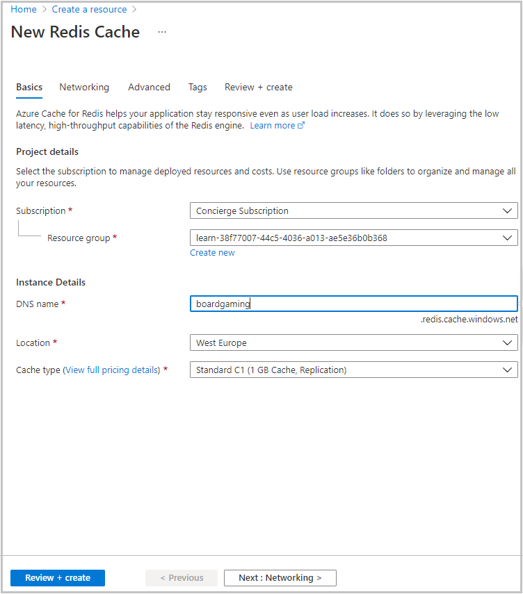
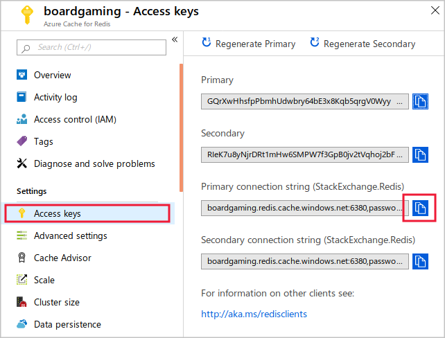
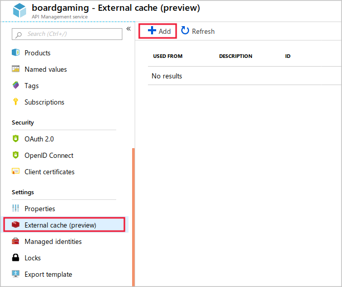
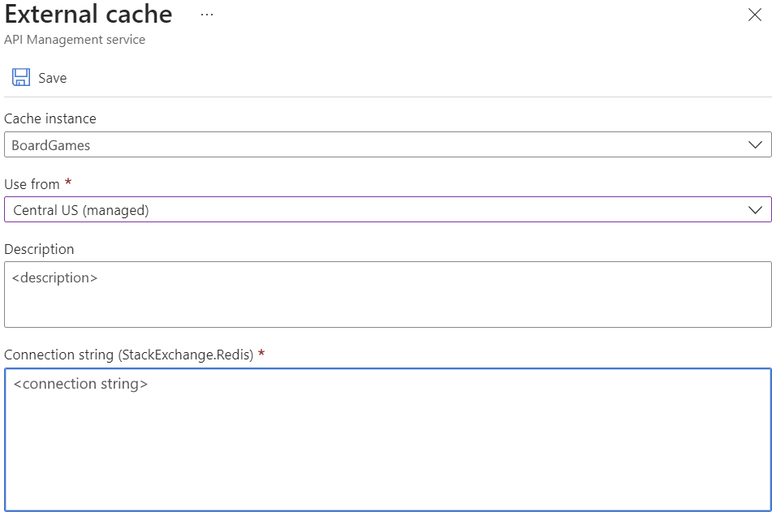
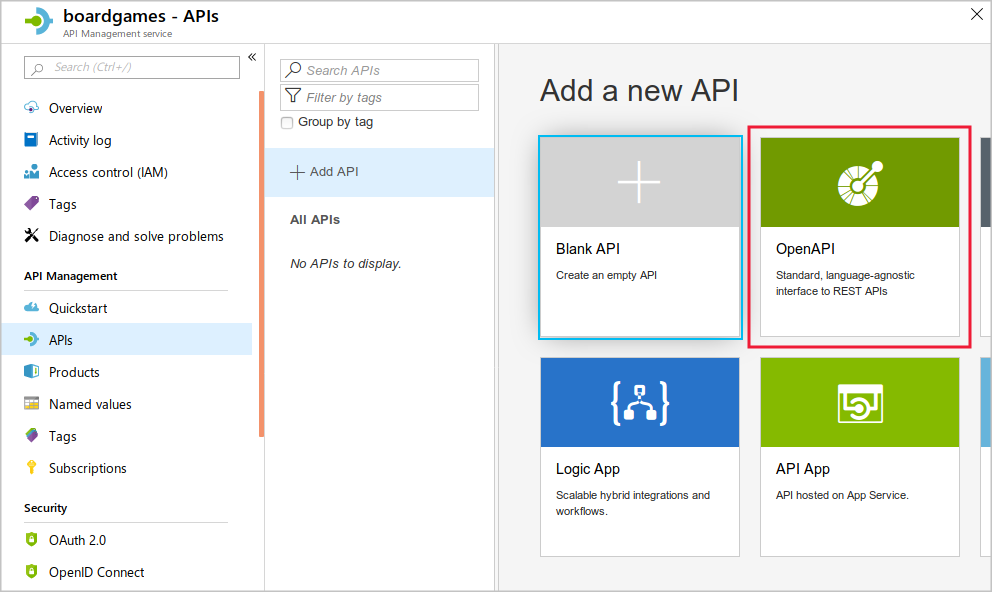
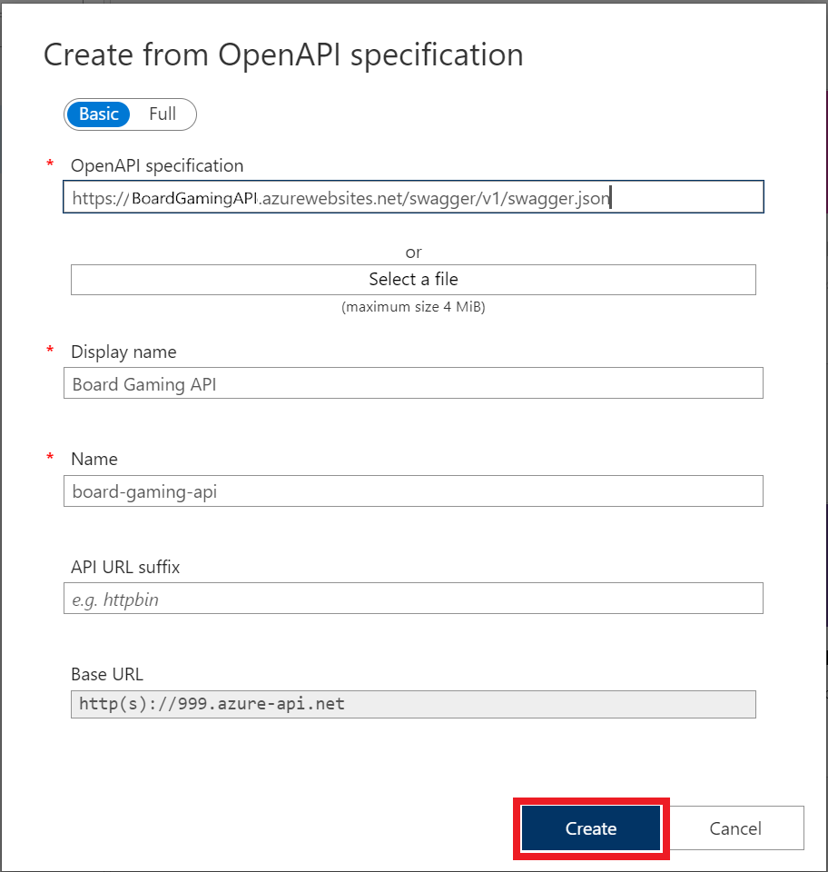
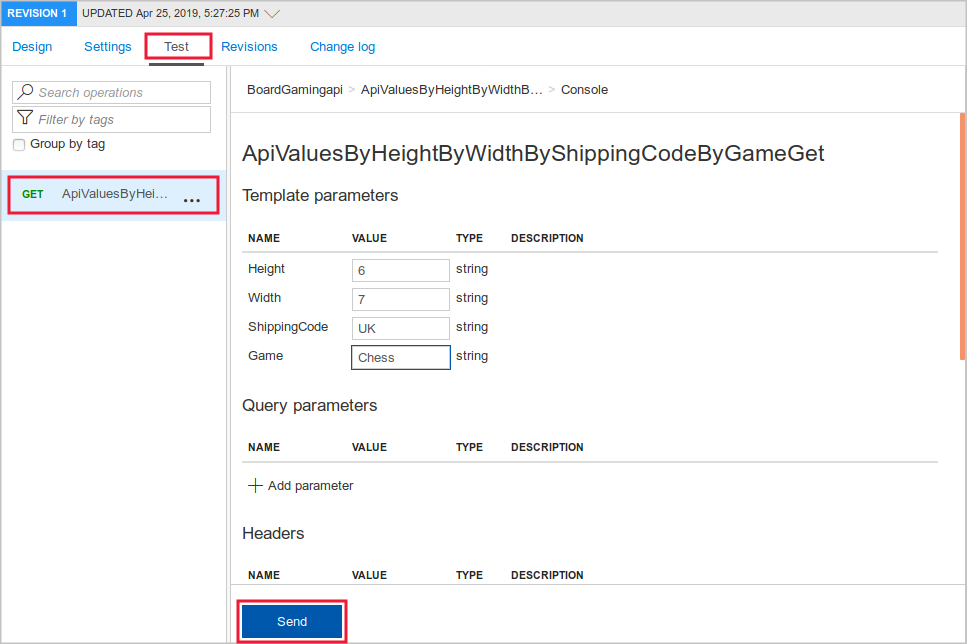
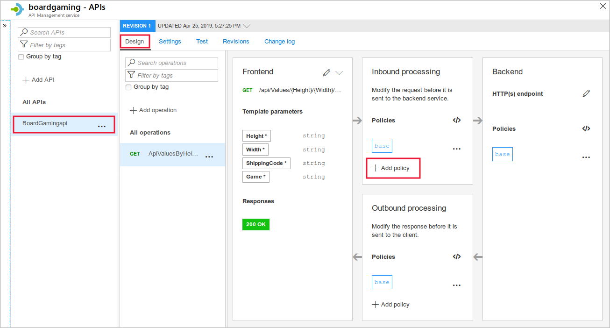
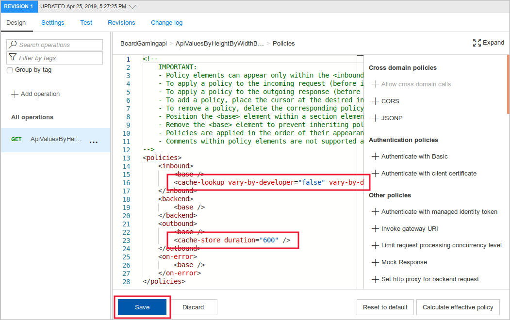

Companies that use Azure API Management to host API can modify their behavior, without rewriting code, by using policies.

Suppose you have planned to implement caching for the Board Pricing API. You want to add the API to API Management and write the necessary policies. The cost for a board is dependent on the height of the board, but not its width. 

In this exercise, you'll import an API into Azure API Management and add a caching policy to it.

[!include[](../../../includes/azure-sandbox-regions-first-mention-note-friendly.md)]

> [!NOTE]
> In this exercise, the Board Gaming web API is hosted in the **azurewebsites.net** domain. The API Management instance is in the **azure-api.net** domain. 

## Create a Redis cache

In this module, we're using the consumption tier for Azure API Management because Azure can set up API Management instances in this tier within a minute or so. Instances in other tiers can take 30 minutes to initiate. The consumption tier in API Management is intended for those organizations who prefer to build APIs on serverless principles. One difference with this tier is that it does not have its internal cache. Therefore, to use a caching policy, we must create an external Redis cache, and configure the API Management instance to use it. Let's create that cache now so that the process can complete while we take other steps:

1. On the [Azure portal](https://portal.azure.com/learn.docs.microsoft.com?azure-portal=true) menu or from the **Home** page, select **Create a resource**.
1. Then select **Databases** > **Azure Cache for Redis**.
1. In the **New Redis Cache** page, enter the following settings, and then click **Create**:

    | Setting | Value |
    | --- | --- |
    | DNS Name | Choose a unique name. Make a note of it, you'll need it later on. |
    | Subscription | *Concierge Subscription* |
    | Resource group | *<rgn>Sandbox resource group</rgn>* |
    | Location | Select from one of the following: North Central US, West US, West Europe, North Europe, Southeast Asia, and Australia East. The Consumption tier used in this exercise is only available in these regions. |
    | Pricing tier | Standard C1 |
    | | |

    

## Create a Web API in Azure Apps Service

Now, deploy the sample web API to Azure App Service:

1. In the Cloud Shell, to clone the sample web API, run this command:

    ```bash
    git clone https://github.com/MicrosoftDocs/mslearn-improve-api-performance-with-apim-caching-policy.git
    ```

1. To set up the web API, run these commands:

    ```bash
    cd mslearn-improve-api-performance-with-apim-caching-policy
    bash setup.sh
    ```

1. The script takes about a minute to run. When the script finishes, it displays three URLs:
    
    - A URL for testing the Web API.
    - A URL for the Swagger UI.
    - A URL for the OpenAPI definition. 
    
    Copy these URLs to a text file. You will need them later in this exercise.

## Test the deployed Web API

Now the API is completed and deployed, let's test it. We can do that by submitting a GET request in the browser and also by checking the OpenAPI definition. These tests, run against the web API before it is added to API Management, are in the **azurewebsites.net** domain:

1. On the [Azure portal](https://portal.azure.com/learn.docs.microsoft.com?azure-portal=true) menu or from the **Home** page, select **All resources** and then select the App Service.
1. On the **Overview** page, click **Browse**. The browser will display a blank page. This is expected because the Web API doesn't implement a user interface.
1. In the **Address** bar, paste the Web API test URL that you copied earlier. The browser displays a result in JSON format. Notice that the result includes the server time.
1. In the **Address** bar, paste the Swagger URL that you copied earlier. The browser displays the Swagger UI. Keep this browser tab open for later.
1. In the **Address** bar, paste the Swagger JSON URL that you copied earlier. The browser displays the OpenAPI specification in JSON format.

## Create a new Azure API Management instance

Now that we have a functional API, let's set up API Management:

1. On the [Azure portal](https://portal.azure.com/learn.docs.microsoft.com?azure-portal=true) menu or from the **Home** page, select **Create a resource**.
1. Then select **Web** > **API Management**.
1. In the **API Management service** window, enter the following settings, and then click **Create**:

    | Setting | Value |
    | --- | --- |
    | Name | Choose a unique name. Make a note of it, you'll need it later on. |
    | Subscription | *Concierge Subscription* |
    | Resource group | Select *Use existing* and choose *<rgn>Sandbox resource group</rgn>* |
    | Location | Choose the same location you used for the Redis Cache. |
    | Organization | BoardGames |
    | Administrator email | Enter your email address or use the default |
    | Pricing tier | Consumption |
    | | |

## Configure API Management to use the external cache

Now, if the Redis cache deployment has been complete, you can configure the API Management instance to use it as an external cache:

1. On the [Azure portal](https://portal.azure.com/learn.docs.microsoft.com?azure-portal=true) menu or from the **Home** page, select **All Resources**, and then click the new Redis cache.
1. Check the **Status** value at the top of the window. If the status has not yet reached **Running**, you'll have to wait until the Redis cache deployment has completed. You can refresh this page every couple of minutes to check the status.
1. Once setup is complete, under **Settings**, click **Access keys**.
1. To the right of the **Primary connection string** textbox, click the **Copy to clipboard** button.

    

1. Click **All Resources**, and then click the API management service you created above.
1. Under **Settings**, click **External cache**, and then click **+ Add**.

    

1. In the **Cache instance** drop-down list, select **Custom**, and then in the **Use from** textbox, select the same location you used for the API Management instance.
1. To paste in the connection string, put the cursor in the **Connection string** textbox, press CTRL-V, and then click **Save**.

    

## Add the API in API Management

Before you can apply a policy, you must add the API to the API Management instance

1. On the [Azure portal](https://portal.azure.com/learn.docs.microsoft.com?azure-portal=true) menu or from the **Home** page, select **All Resources** and then click the API Management service you created above.
1. Under **API Management**, click **APIs**, and then click **OpenAPI**.

    

1. In the **Create from OpenAPI specification** window, in the **OpenAPI specification** textbox, paste the Swagger JSON URL that you copied earlier.
1. Click **Create**. Azure adds the API to the management instance.

    

## Test the API in API Management

The API is now added to the management instance. Let's test the API before any policy is applied:

1. Click the **Test** tab and then click the **GET** operation.
1. Use the following values for template parameters and query parameters and then click **Send**:

    | Name | Value |
    | --- | --- |
    | ShippingCode | USA |
    | Game | Chess |
    | Height| 8 |
    | Width | 8 |
    | | |

    

1. Examine the results. Note the precise time that is included in the response.
1. Click the **Send** button to resend the request. Notice that the time in the response has changed.

## Add a caching policy

Now we can enable the cache by adding policies to the XML:

1. Click the **Design** tab and then click the **GET** operation.
1. In the **Inbound processing** section, click **+Add policy**.

    

1. Click **Cache responses**.
1. In the **Duration in seconds** box, type **600**, and then click **Save**.
1. In the **Inbound processing** section, click **</>**. The portal displays the policy XML editor.
1. Notice that a **&lt;cache-lookup&gt;** tag has been added to the **&lt;inbound&gt;** section, and a **&lt;cache-store&gt;** tag has been added to the **&lt;outbound&gt;** section.

    

1. Click **Save**.

## Test the cache

We'll run the same test on the API in API Management and observe the results of the cache:

1. Click the **Test** tab and then click the **GET** operation.
1. Use the following values for template parameters and query parameters and then click **Send**:

    | Name | Value |
    | --- | --- |
    | ShippingCode | USA |
    | Game | Chess |
    | Height | 8 |
    | Width | 8 |
    | | |

    

1. Examine the results. Note the precise time that is included in the response.
1. Click the **Send** button to resend the request. Notice that the time in the response has not changed, because the cached response has been served.

## Configure the cache to vary by a query parameter

To ensure that the system caches different responses for different board heights, you must configure the cache to vary by the **height** query parameter. You don't want to vary by the **width** parameter, because that value is not used in the cost calculation:

1. Click the **Design** tab and then click the **GET** operation.
1. In the **Inbound processing** section, click **</>**.
1. Replace the entire `<cache-lookup>` tag, with the following XML:

    ```xml
    <cache-lookup vary-by-developer="false" vary-by-developer-groups="false" downstream-caching-type="none">
        <vary-by-query-parameter>height</vary-by-query-parameter>
    </cache-lookup>
    ```

1. Click **Save**.

## Test the new cache configuration

The cache should now keep separate responses for different values of the **height** query parameter. However, because the **width** parameter does not influence the cost calculation, when you change only that parameter a cached response can be used. Let's test that:

1. Click the **Test** tab, click the **GET** operation, use the following values for template parameters and query parameters and then click **Send**:

    | Name | Value |
    | --- | --- |
    | ShippingCode | USA |
    | Game | Chess |
    | Height | 8 |
    | Width | 8 |
    | | |

1. Examine the results. Note the precise time that is included in the response.
1. Click the **Send** button to resend the request. As before, notice that the time in the response has not changed, because the cached response has been served.
1. To test the height parameter, use the following values for template parameters and query parameters and then click **Send**:

    | Name | Value |
    | --- | --- |
    | ShippingCode | USA |
    | Game | Chess |
    | Height | 100 |
    | Width | 8 |
    | | |

1. Examine the results. This time, because the height query parameter in the request has changed, the cached response is not used and the result is updated. This behavior is correct for our API.
1. To test the width parameter, use the following values for template parameters and query parameters and then click **Send**:

    | Name | Value |
    | --- | --- |
    | ShippingCode | USA |
    | Game | Chess |
    | Height | 100 |
    | Width | 500 |
    | | |

1. Examine the results. This time, although the width query parameter in the request has changed, the cached response is used and the result does not change.
