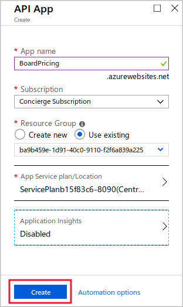
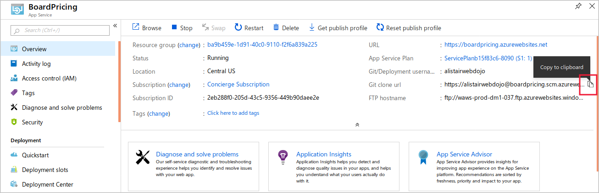

Companies that use Azure API Management to host API can modify their behavior, without rewriting code, by using policies.

Suppose you have planned to implement caching for the Board Pricing API. You want to add the API to API Management and write the necessary policies.

In this exercise, you'll import an API into Azure API Management and add a caching policy to it.

[!include[](../../../includes/azure-sandbox-activate.md)]

[!include[](../../../includes/azure-sandbox-regions-first-mention-note-friendly.md)]

<!-- REVIEW Please have the user do the App Service create/deploy in the Cloud Shell, as it can be reduced to two commands: `az appservice plan create` and `az webapp create` with the `--deployment-source-url` argument pointed at the GitHub repo URL. -->
## Create a Web API in Azure Apps Service

Start by creating a new Web API app in Azure Apps Service. You'll use this resource to host the Board Pricing API:

1. Go to the [Azure portal](https://portal.azure.com/learn.docs.microsoft.com?azure-portal=true).
1. In the portal, select **Create a resource > Web > API App**.
1. In the **API App** window, enter the following settings, and then click **Create**:

    | Setting | Value |
    | --- | --- |
    | App name | Choose a unique name. Make a note of it, you'll need it later on. |
    | Subscription | *Concierge Subscription* |
    | Resource group | Select *Use existing* and choose *<rgn>Sandbox resource group</rgn>* |
    | App Service plan/Location | Leave default |
    | Application Insights | Disabled |
    | | |

    

## Configure git deployment for the API app

We will use the `git` tool to deploy our Web API code. This technique relies on the Kudu build server. To configure the API app to support Kudu:

1. When the API App has been created, select **All resources** and then click the API App.
1. In the **App Service** resource, under **Deployment** click **Deployment Center**.
1. Click **Local Git** and then click **Continue**.
1. Click **App Service build service**, click **Continue**, and then click **Finish**.
1. Click **Deployment Credentials** and then click the **User Credentials** tab.
1. In the **Password** and **Confirm Password** text boxes, type **Pa$$w0rd** and then click **Save Credentials**.

## Configure the git command

[!include[](../../../includes/azure-cloudshell-copy-paste-tip.md)]

Before you can deploy the Web API, you must configure the **git** tool with your name and email address:

1. In the Cloud Shell on the right, run the following command to set your full name to be recorded in newly created commits.

    ```bash
    git config --global user.name "Your Name"
    ```

1. In the Cloud Shell on the right, run the following command to set your email to be recorded in newly created commits.

    ```bash
    git config --global user.email "Your Email Address"
    ```

## Clone a Web API project

We'll use `git` to clone a Web API project. This Web API includes a frame price calculation method That includes 3 parameters for use with the caching exercise We'll also configure `git` to deploy code to Azure:

1. In the Cloud Shell on the right, to create a Web API project and add the Swagger tool to it, run the following commands:

    <!-- TODO: when the GitHub repo is ready for this module, add its URL to the git clone command here. The sample Web API is in the code folder. -->

    ```bash
    git clone **GitHub Repo URL**
    cd BoardGamingapi
    ```

1. In the [Azure portal](https://portal.azure.com/learn.docs.microsoft.com?azure-portal=true), select **All resources** and then select the API App.
1. On the **Overview** response, to the right of the **Git clone URL** field, select **Click to copy**.

    

1. In the Cloud Shell, run the following command, pasting in the URL that you copied:

    ```bash
    git remote add production **git URL**
    ```

    This command adds a remote named production for the repository at the URL you gave.

## Deploy the Web API

Now, you can deploy the Web API to Azure:

1. To deploy the Web API, run the following command, and enter the password you set for git deployment:

    ```bash
    git push --set-upstream production master
    ```

## Test the deployed Web API

Now the API is completed and deployed, let's test it. We can do that by submitting a GET request in the browser and also by checking the OpenAPI definition:

1. In the [Azure portal](https://portal.azure.com/learn.docs.microsoft.com?azure-portal=true), select **All resources** and then select the API App.
1. On the **Overview** response, select **Browse**. The browser displays the home response for the API, which is blank.
1. In the **Address** bar, append the URL with **/api/values/6/7/uk/chess**. The browser displays a result in JSON format. Notice that the result includes the server time.
1. In the **Address** bar, replace **/api/values/6/7/uk/chess** with **/swagger**. The browser displays the Swagger UI. Keep this browser tab open for later.

## Create a new Azure API Management instance

Now that we have a functional API, let's set up API Management:

1. In the [Azure portal](https://portal.azure.com/learn.docs.microsoft.com?azure-portal=true), select **Create a resource > Web > API Management**.
1. In the **API Management service** window, enter the following settings, and then click **Create**:

    | Setting | Value |
    | --- | --- |
    | Name | Choose a unique name. Make a note of it, you'll need it later on. |
    | Subscription | *Concierge Subscription* |
    | Resource group | Select *Use existing* and choose *<rgn>Sandbox resource group</rgn>* |
    | Location | Choose from West Europe or Southeast Asia | <!-- These are the only two locations supported by both the sandbox and the consumption tier -->
    | Organization | BoardGames |
    | Administrator email | Enter your own email address or use the default |
    | Pricing tier | Consumption |
    | | |

## Add the API in API Management

Before you can apply a policy, you must add the API to the API Management instance

1. In the [Azure portal](https://portal.azure.com/learn.docs.microsoft.com?azure-portal=true), click **All Resources** and then click the management service you created above.
1. Under **API Management**, click **APIs**, and then click **OpenAPI**.

    

1. Switch to the browser tab that displays the Swagger interface for the API, and then click the link to the **swagger.json** file.
1. Copy all the text in the address bar.
1. In the **Create from OpenAPI specification** window, place the cursor in the **OpenAPI specification** textbox, and then press CTRL-V.
1. Click **Create**. Azure adds the API to the management instance.

    

## Test the API in API Management

The API is now added to the management instance. Let's test the API before any policy is applied:

1. Click the **Test** tab and then click the **GET** operation.
1. Use the following values for template parameters and then click **Send**:

    | Name | Value |
    | --- | --- |
    | Height | 6 |
    | Width | 7 |
    | ShippingCode | UK |
    | Game | Chess |
    | | |

    

1. Examine the results. Note the precise time that is included in the response.
1. Click the **Send** button to resend the request. Notice that the time in the response has changed.

## Add a caching policy

Now we can enable the cache by adding policies to the XML:

1. Click the **Design** tab and then click the **GET** operation.
1. In the **Inbound processing** section, click **+Add policy**.

    

1. Click **Cache responses**.
1. In the **Duration in seconds** box, type **600**, and then click **Save**.
1. In the **Inbound processing** section, click **</>**. The portal displays the policy XML editor.
1. Notice that a **&lt;cache-lookup&gt;** tag has been added to the **&lt;inbound&gt;** section, and a **&lt;cache-store&gt;** tag has been added to the **&lt;outbound&gt;** section.

    

1. Click **Save**.

## Test the cache

We'll run the same test on the API in API Management and observe the results of the cache:

1. Click the **Test** tab and then click the **GET** operation.
1. Use the following values for template parameters and then click **Send**:

    | Name | Value |
    | --- | --- |
    | Height | 6 |
    | Width | 7 |
    | ShippingCode | UK |
    | Game | Chess |
    | | |

    

1. Examine the results. Note the precise time that is included in the response.
1. Click the **Send** button to resend the request. Notice that the time in the response has not changed, because the cached response has been served.

<!-- REVIEW Please clean up the code a bit and make it more idiomatic. GetQuery()'s name should be more indicative of what it does, and should return a JsonResult with Json() instead of manually constructing a JSON string. "Height" and "Width" inputs should be numbers, not strings. Not sure how the published operation name ended up as "ApiValuesByHeightByWidthByShippingCodeByGameGet", please change it. The calculated shipping value is not included in the response (not that it makes a difference to the exercise, but the code reflects poorly on the overall module). The resource-based URL parameter scheme doesn't make sense and misses out on an opportunity to require the user to modify the caching policy; have it use querystring params instead. -->