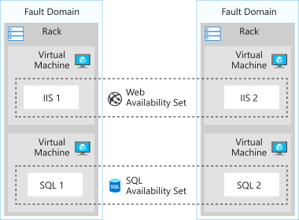
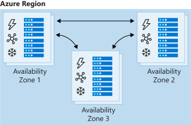

With Azure Load Balancer, you can spread user requests across multiple virtual machines or other services. That way, you can scale the app to larger sizes than a single virtual machine can support, and you ensure that users get service, even when a virtual machine fails.

In your healthcare organization, you can expect large user demand. It's of vital importance to each user that they can book an appointment, even at times of peak demand or when virtual machines fail. If you use multiple virtual servers for your front end and a load balancer to distribute traffic between them, you achieve a high capacity because all the virtual servers collaborate to satisfy requests. You also improve resilience because the load balancer can automatically route traffic away when a virtual server fails.

Here, you will learn how the features of Load Balancer help you create robust app architectures.

## Distribute traffic with Azure Load Balancer

Azure Load Balancer is a service you can use to distribute traffic across multiple virtual machines. Use Load Balancer to scale applications and create high availability for your virtual machines and services. Load balancers use a hash-based distribution algorithm. By default, a five-tuple hash is used to map traffic to available servers. The hash is made from the following elements:

- **Source IP**: The IP address of the requesting client.
- **Source port**: The port of the requesting client.
- **Destination IP**: The destination IP of the request.
- **Destination port**: The destination port of the request.
- **Protocol type**: The specified protocol type, TCP or UDP.

Load Balancer supports inbound and outbound scenarios, provides low latency and high throughput, and scales up to millions of flows for all TCP and UDP applications.

Load balancers aren't physical instances. Load balancer objects are used to express how Azure configures its infrastructure to meet your requirements.

To achieve high availability with Load Balancer, you can choose to use availability sets and availability zones to ensure that virtual machines are always available:

| Configuration | Service level agreement (SLA) | Information |
| ------------- | --- | ----------- |
| **Availability set** |  99.95% | Protection from hardware failures within datacenters |
| **Availability zone** |  99.99% | Protection from entire datacenter failure |
| | |

### Availability sets

An availability set is a logical grouping that you use to isolate virtual machine resources from each other when they're deployed. Azure ensures that the virtual machines you put in an availability set run across multiple physical servers, compute racks, storage units, and network switches. If there's a hardware or software failure, only a subset of your virtual machines is affected. Your overall solution stays operational. Availability sets are essential for building reliable cloud solutions.

### Availability zones

An availability zone offers groups of one or more datacenters that have independent power, cooling, and networking. The virtual machines in an availability zone are placed in different physical locations within the same region. Use this architecture when you want to ensure that, when an entire datacenter fails, you can continue to serve users.

Availability zones don't support all virtual machine sizes and aren't available in all Azure regions. Check that they are supported in your region before you use them in your architecture.

## Select the right Load Balancer product

Two products are available when you create a load balancer in Azure: basic load balancers and standard load balancers.

Basic load balancers allow:

- Port forwarding
- Automatic reconfiguration
- Health probes
- Outbound connections through source network address translation (SNAT)
- Diagnostics through Azure Log Analytics for public-facing load balancers

Basic load balancers can be used only with availability sets.

Standard load balancers support all of the basic features. They also allow:

- HTTPS health probes
- Availability zones
- Diagnostics through Azure Monitor, for multidimensional metrics
- High availability (HA) ports
- Outbound rules
- A guaranteed SLA (99.99% for two or more virtual machines)

## Internal and external load balancers

An external load balancer operates by distributing client traffic across multiple virtual machines. An external load balancer permits traffic from the internet. The traffic might come from browsers, module apps, or other sources. In a healthcare organization, the balancer distributes the load of all the browsers that run the client healthcare application.

An internal load balancer distributes a load from internal Azure resources to other Azure resources. For example, if you have front-end web servers that need to call business logic that's hosted on multiple middle-tier servers, you can distribute that load evenly by using an internal load balancer. No traffic is allowed from internet sources. In a healthcare organization, the load balancer distributes a load across the internal application tier.
