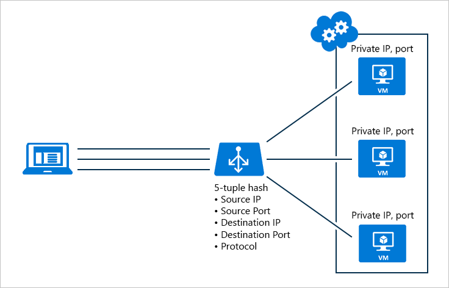

## Features and benefits of Azure Load Balancer

Azure Load Balancer enables you to scale your applications and create high availability for your virtual machines and services. Load balancers use a hash-based distribution algorithm. By default, it uses a five-tuple hash to map traffic to available servers. The hash is made from the following:

1. **Source IP** - The IP address of the requesting client
1. **Source port** - The port of the requesting client
1. **Destination IP** - The destination IP of the request
1. **Destination Port** - The destination port of the request
1. **Protocol Type** - The specified protocol type e.g. HTTP, HTTPS, HTTP/2

Azure Load Balancer supports inbound and outbound scenarios, provides low latency and high throughput, and scales up to millions of flows for all TCP and UDP applications

Load Balancers are not physical instances. Load balancer objects are used to express how Azure should configure its infrastructure to achieve your requirements. There are two types of configuration groups that can be used when setting up the load balancer

| Configuration | SLA | Information |
| ------------- | --- | ----------- |
| **Availability Set** |  99.95% | Protect from Hardware failures within data centers |
| **Availability Zone** |  99.99% | Protect from entire data center failure |

### Availability Sets

An Availability Set is a logical grouping capability for isolating VM resources from each other when they're deployed. Azure makes sure that the VMs you place within an Availability Set run across multiple physical servers, compute racks, storage units, and network switches. If a hardware or software failure happens, only a subset of your VMs are impacted and your overall solution stays operational. Availability Sets are essential for building reliable cloud solutions.

### Availability Zones

This offers groups of one or more data centers that have completely independent power, cooling and networking

## Selecting the right SKU

There are two SKUs available when creating a load balancer

### 1. Basic

Allows the following:

- Port Forwarding
- Application Agnostic and Transparent
- Automatic Reconfiguration
- Health Probes
- Outbound Connections (SNAT)
- Diagnostics via Azure Log Analytics for public-facing Load Balancers
- Can only be used with availability sets

### 2. Standard

All of the Basic features, along with

- HTTPS Health Probes
- Availability Zones
- Diagnostics via Azure Monitor supporting multi-dimensional metrics
- HA Ports
- Outbound Rules
- Can be used with availability sets and availability zones
- Guaranteed SLA (99.99% for 2+ VMs)

## Internal and External Load Balancers

An external load balancer operates by distributing client traffic (browsers, mobile apps) across multiple front end VMs. Using the healthcare example, this would distribute the load of all the browsers operating the client healthcare application

An internal load balancer distributes load internally across the data tier. Using the healthcare example this would distribute load across the databases that serve the business layer.

## External Load balancer for the healthcare portal

Revisiting the healthcare portal. The external load balancer can be used to distribute the client load between the healthy VMs

