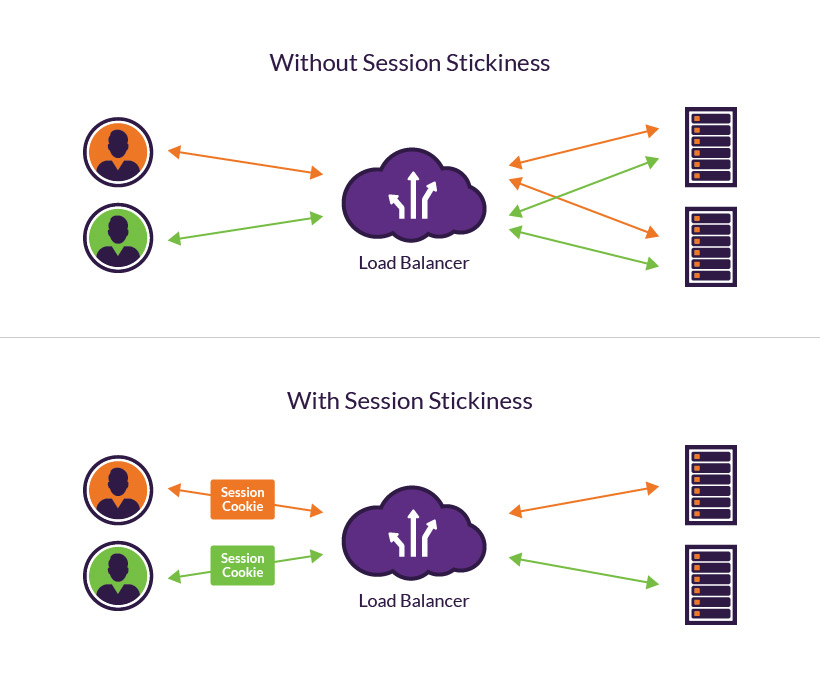

With a full understanding of your app, you can correctlt configure Azure Load Balancer.

As the solution architect for the healthcare portal, you need to distribute the load from the client browsers over the Virtual Machines (VMs) in your web farm. You'll need to set up a load balancer and configure the VMs to be balanced.

A public load balancer maps the public IP address and port number of incoming traffic to the private IP address and port number of a VM in the backend pool. The responses are then returned to the client. By applying load-balancing rules, you distribute specific types of traffic across multiple VMs or services.

## Distribution modes

By default, Azure Load Balancer distributes network traffic equally among VM instances. The following distribution modes are also possible if a different behavior is required:

| Distribution Mode | Details |
|-------------------|---------|
| **5-tuple hash** | The default distribution mode for Azure Load Balancer is a 5-tuple hash. The tuple is composed of the source IP, source port, destination IP, destination port, and protocol type. The load is distributed according to the health and availability of the VMs. |
| **Source IP affinity** | This distribution mode is also known as session affinity, client IP affinity, or sticky sessions. The mode uses a 2-tuple – source IP and destination IP – or 3-tuple – source IP, destination IP, and protocol type – hash to map traffic to the available servers. The hash provides a sticky session with the VM behind the load balancer. |
| | |

<!-- TODO: Create an image similar to the one below, taken from: https://www.imperva.com/learn/wp-content/uploads/sites/13/2019/01/session-stickiness-diagram.jpg - Replace sticky session headers with the headers from the above table. -->



## Choose a distribution mode

In the healthcare portal example, imagine that a developer requirement of the presentation tier is to use in-memory sessions to store the logged user's profile as they interact with the portal. 

In this scenario, the load balancer must provide source IP affinity to maintain a user's session – the profile will only be stored on the VM that the client first connected to. When you create the load balancer endpoint, you must specify the distribution mode by using the PowerShell example below.

```Powershell
$lb = Get-AzLoadBalancer -Name MyLb -ResourceGroupName MyResourceGroup
$lb.LoadBalancingRules[0].LoadDistribution = 'sourceIp'
Set-AzLoadBalancer -LoadBalancer $lb
```

To add session persistence through the Azure portal:

1. Sign into the [Azure portal](https://portal.azure.com/learn.docs.microsoft.com?azure-portal=true).
1. In the left menu, select **All Resources**, and then select your load balancer.
1. Under **Load-balancing rules**, select **myHTTPRule**.
1. Change the **Session persistence** value to **Client IP**


### Problems with session persistence

Ensure developers understand that, by having this requirement, the load balancer can't be as effective. It's better to create a stateless solution where state is managed in a separate shared resource, away from the VM. If you decide to use sticky sessions, there are two main drawbacks.

| Problem | Reason |
| ------- | ------ |
| **Load balancing** | A load balancer should keep a load fairly evenly distributed between servers in a backend pool.  Sticky sessions can interfere because, depending on user activity, the load becomes unbalanced. Eventually, an individual server might become overused and unresponsive. The load balancer then begins to reroute traffic that's destined for one server to another.  It keeps the application up, but the user will experience a glitch. |
| **Maintenance** | Occasionally, a server has to come down to do maintenance. You might need patches to the operating system or updates to the application. When you have to take down servers, the load balance automatically moves traffic to remaining servers. Again, the user experiences a glitch because they lose their session. |
| | |
