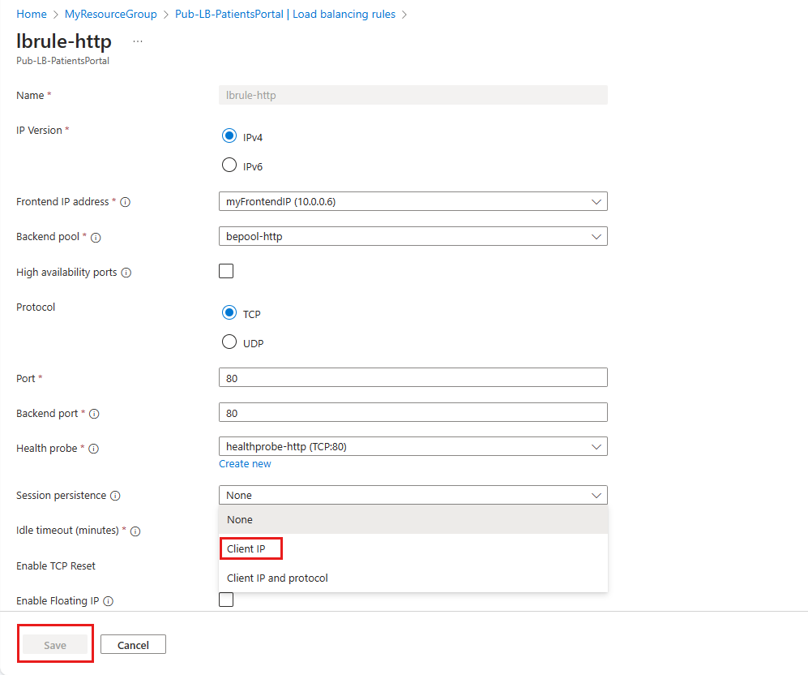

As the solution architect for the healthcare portal, you need to distribute the load from the client browsers over the virtual machines in your web farm. You'll need to set up a load balancer and configure the virtual machines to be balanced.

A public load balancer maps the public IP address and port number of incoming traffic to the private IP address and port number of a virtual machine in the backend pool. The responses are then returned to the client. By applying load-balancing rules, you distribute specific types of traffic across multiple virtual machines or services.

## Distribution modes

By default, Azure Load Balancer distributes network traffic equally among virtual machine instances. The following distribution modes are also possible if a different behavior is required:

- **Five-tuple hash.** The default distribution mode for Azure Load Balancer is a five-tuple hash. The tuple is composed of the source IP, source port, destination IP, destination port, and protocol type. Because the source port is included in the hash, and the source port changes for each session, clients may be directed to a different virtual machine for each session.
  
    

- **Source IP affinity.** This distribution mode is also known as session affinity or client IP affinity. To map traffic to the available servers, the mode uses a 2-tuple hash (from the source IP address and destination IP address) or 3-tuple hash (from the source IP address, destination IP address, and protocol type). The hash ensures that requests from a given client are always sent to the same virtual machine behind the load balancer.

    

## Choose a distribution mode

In the healthcare portal example, imagine that a developer requirement of the presentation tier is to use in-memory sessions to store the logged user's profile as they interact with the portal.

In this scenario, the load balancer must provide source IP affinity to maintain a user's session. The profile will only be stored on the virtual machine that the client first connected to since that IP address will be directed to the same server. When you create the load balancer endpoint, you must specify the distribution mode by using the PowerShell example below.

```powershell
$lb = Get-AzLoadBalancer -Name MyLb -ResourceGroupName MyResourceGroup
$lb.LoadBalancingRules[0].LoadDistribution = 'sourceIp'
Set-AzLoadBalancer -LoadBalancer $lb
```

To add session persistence through the Azure portal:

1. In the Azure portal, open the load balancer resource.
1. Edit the relevant of the **Load-balancing rules**.
1. Change the **Session persistence** value to **Client IP**



## Azure Load Balancer and Remote Desktop Gateway

Remote Desktop Gateway is a Windows service that you can use to enable clients on the internet to make Remote Desktop Protocol (RDP) connections through firewalls to Remote Desktop servers on your private network. The default five-tuple hash in Load Balancer is incompatible with this service. If you want to use Load Balancer with your Remote Desktop servers, use source IP affinity.

## Azure Load Balancer and media upload

Another use case for source IP affinity is media upload. In many implementations, a client initiates a session through a TCP protocol and connects to a destination IP address. This connection remains open throughout the upload to monitor progress, but the file is uploaded through a separate UDP protocol.

With the five-tuple hash, the TCP and UDP connections are likely to be sent to different destination IP addresses by the load balancer, which stops the upload from completing successfully. Use source IP affinity to fix this problem.
