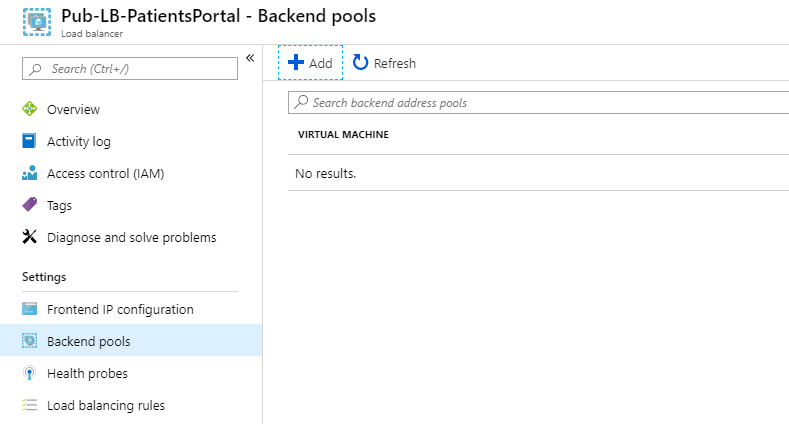
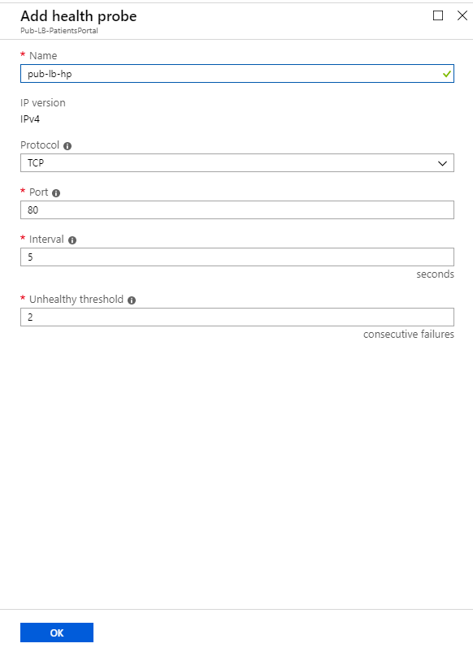

You can configure Azure Load Balancer by using the Azure portal, PowerShell, or Azure CLI.

In your healthcare organization, you want to load balance the client traffic, to provide a consistent response, based on the health of the patient portal web servers. You have two virtual machines within an availability set to act as your healthcare portal web application.

Here, you will create a load balancer resource and use it to distributed load across the virtual machines.

[!include[](../../../includes/azure-sandbox-activate.md)]

## Deploy the patient portal web application

First, deploy your patient portal application across two virtual machines within a single availability set. To save time, let's start by running a script to create this application. The script will:

- Create a virtual network and network infrastructure for the virtual machines.
- Create two virtual machines in this virtual network.

1. Run the following git clone command in the Cloud Shell, to clone the repo that contains the source for the app, and setup script from GitHub.

    ```bash
    git clone https://github.com/MicrosoftDocs/mslearn-improve-app-scalability-resiliency-with-load-balancer.git
    ```

1. Go to the repo folder locally by running this command.

    ```bash
    cd mslearn-improve-app-scalability-resiliency-with-load-balancer
    ```

1. As its name suggests, this script will generate two virtual machines within a single availability set. The script takes about two minutes to run.

    ```bash
    bash create-high-availability-vm-with-sets.sh <rgn>[sandbox resource group name]</rgn>
    ```

1. When the script finishes, in the [Azure portal](https://portal.azure.com/learn.docs.microsoft.com?azure-portal=true), select **Resource groups**, then select the **<rgn>[sandbox resource group name]</rgn>** resource group. Review the resources that were created by the script.

::: zone pivot="portal"

## Create a load balancer

Now, let's create the load balancer.

1. In the [Azure portal](https://portal.azure.com/learn.docs.microsoft.com?azure-portal=true), click **+ Create a resource > Networking > Load Balancer** and then click **Create**.

    

1. Enter the following information.

    | Field | Information |
    | ----- | ----------- |
    | **Subscription** | **Concierge** |
    | **Resource group** | <rgn>[sandbox resource group name]</rgn> |
    | **Name** | Enter a unique name. For example, **Pub-LB-PatientsPortal**. |
    | **Location** | Choose the location where the virtual machines were created. |
    | **Type** | Select **Public** |
    | **SKU** | Select **Basic** |
    | **Public IP address** | Select **Create new** |
    | **Public IP address name** | Enter a unique name for the public IP. For example, **Pub-LB-PatientsPortal-IP** |
    | **Assignment** | Select **Static** |
    | **Add a public IPv6 address** | Choose **No** |

    

1. Click the **Review + create** button.
1. After validation is passed, select **Create**.

## Add a backend pool

Next, create a backend pool in the load balancer and add the virtual machines to it.

1. In the [Azure portal](https://portal.azure.com/learn.docs.microsoft.com?azure-portal=true), click **All resources** and then click the load balancer that you created.

1. Under **Settings**, click **Backend pools**, and then click **Add**.

    

1. On the **Add Backend pool** screen, enter the following information.

    | Field | Information |
    | ----- | ----------- |
    | **Name** | Give a unique name to the backend pool. For example, **bepool-http** |
    | **IP version** | Choose **IPv4** |
    | **Associated to** | Select **Availability set** |
    | **Availability set** | Choose the existing **portalAvailabilitySet** |
    | | |

1. Click **+ Add a target network IP configuration**, and then choose the first virtual machine from the availability set – **webVM1**.

1. Choose the first Network IP configuration – **ipconfig1**.

1. Click **+ Add a target network IP configuration** again, and then choose the second virtual machine from the availability set – **webVM2**.

1. Choose the second Network IP configuration – **ipconfig2**, and then click **OK**.

    

## Add health probes

Create a health probe that monitors the two virtual machines:

1. Go to **Health probes**.

1. Click **+ Add**, and then enter the following information.

    | Field | Information |
    | ----- | ----------- |
    | **Name** | A name for the probe. For example: **probe-http** |
    | **Protocol** | Select **TCP** |
    | **Port** | Enter port **80** (default) |
    | **Interval** | Enter **5** (default). This value is the amount of time between the probes. |
    | **Unhealthy threshold** | Enter **2** (default). This value is the number of consecutive probe failures that must occur before a virtual machine is considered unhealthy. |

    

1. Click **OK**.

## Add a load balancer rule

Finally, let's create a rule for the load balancer:

1. Go to **Load Balancing Rules**, click **Add**, and then enter the following information.

    | Field | Information |
    | ----- | ----------- |
    | **Name** | A name for the load balancing rule. For example: **lbrule-http** |
    | **IP version** | Choose **IPv4** |
    | **Frontend IP address** | Choose the existing public IP of the load balancer |
    | **Protocol** | Choose **TCP** |
    | **Port** | 80 (default) |
    | **Backend port** | 80 (default) |
    | **Backend pool** | Select the existing backend pool |
    | **Health probe** | Select the existing health probe |
    | **Session persistence** | Choose **None** |
    | **Idle timeout** | Select 4 (default).  This value is the time to keep a TCP or HTTP connection open without relying on clients to send keep-alive messages. |
    | **Floating IP** | Choose **Disabled** (default) |
    | | |

    

1. Select **OK** to complete the load balancer configuration.

1. Back on the **Overview** page, copy the **Public IP address** for the load balancer.

::: zone-end

::: zone pivot="powershell"

## Create IP addresses

First, we need a public IP address for the load balancer.

1. In the Cloud Shell, start PowerShell by running this command.

    ```bash
    pwsh
    ```

1. In PowerShell, create a new public IP address.

    ```Powershell
    $Location = $(Get-AzureRmResourceGroup -ResourceGroupName <rgn>[sandbox resource group name]</rgn>).Location

    $publicIP = New-AzPublicIpAddress `
      -ResourceGroupName <rgn>[sandbox resource group name]</rgn> `
      -Location $Location `
      -AllocationMethod "Static" `
      -Name "myPublicIP"
    ```

1. Create a frontend IP with the `New-AzLoadBalancerFrontendIpConfig` cmdlet. The following example creates a frontend IP configuration named **myFrontEnd** and attaches the **myPublicIP** address.

    ```Powershell
    $frontendIP = New-AzLoadBalancerFrontendIpConfig `
      -Name "myFrontEnd" `
      -PublicIpAddress $publicIP
    ```

## Create the load balancer

When you use PowerShell to configure a load balancer, you must create the back-end address pool, the health probe, and the rule before you create the balancer itself.

1. Create a back-end address pool with the `New-AzLoadBalancerBackendAddressPoolConfig` cmdlet. You will attach the virtual machines to this back-end pool in the final steps. The following example creates a backend address pool named **myBackEndPool**.

    ```Powershell
    $backendPool = New-AzLoadBalancerBackendAddressPoolConfig -Name "myBackEndPool"
    ```

1. To allow the load balancer to monitor the status of the healthcare portal, create a health probe. The health probe dynamically adds or removes virtual machines from the load balancer rotation, based on their response to health checks.

    ```Powershell
    $probe = New-AzLoadBalancerProbeConfig `
      -Name "myHealthProbe" `
      -Protocol http `
      -Port 80 `
      -IntervalInSeconds 5 `
      -ProbeCount 2 `
      -RequestPath "/"
    ```

1. You now need a load balancer rule that's used to define how traffic is distributed to the virtual machines. You define the front-end IP configuration for the incoming traffic and the back-end IP pool to receive the traffic, along with the required source and destination port. To make sure only healthy virtual machines receive traffic, you also define the health probe to use.

    ```Powershell
    $lbrule = New-AzLoadBalancerRuleConfig `
      -Name "myLoadBalancerRule" `
      -FrontendIpConfiguration $frontendIP `
      -BackendAddressPool $backendPool `
      -Protocol Tcp `
      -FrontendPort 80 `
      -BackendPort 80 `
      -Probe $probe
    ```

1. Now you can create the basic load balancer with the `New-AzLoadBalancer` cmdlet.

    ```Powershell
    $lb = New-AzLoadBalancer `
      -ResourceGroupName <rgn>[sandbox resource group name]</rgn> `
      -Name 'MyLoadBalancer' `
      -Location $Location `
      -FrontendIpConfiguration $frontendIP `
      -BackendAddressPool $backendPool `
      -Probe $probe `
      -LoadBalancingRule $lbrule
    ```

1. Connect the virtual machines to the backend pool by updating the network interfaces that the script created with the backend pool information.

    ```Powershell
    $nic1 = Get-AzureRmNetworkInterface -ResourceGroupName <rgn>[sandbox resource group name]</rgn> -Name "webNic1"
    $nic2 = Get-AzureRmNetworkInterface -ResourceGroupName <rgn>[sandbox resource group name]</rgn> -Name "webNic2"

    $nic1.IpConfigurations[0].LoadBalancerBackendAddressPools = $backendPool
    $nic2.IpConfigurations[0].LoadBalancerBackendAddressPools = $backendPool

    Set-AzureRmNetworkInterface -NetworkInterface $nic1 -AsJob
    Set-AzureRmNetworkInterface -NetworkInterface $nic2 -AsJob
    ```

1. Run the following command to get the public IP address of the load balancer and the URL for your web site.

    ```Powershell
    Write-Host http://$($(Get-AzPublicIPAddress `
      -ResourceGroupName <rgn>[sandbox resource group name]</rgn> `
      -Name "myPublicIP").IpAddress)
    ```

::: zone-end

::: zone pivot="bash"

## Create a load balancer

Let's use the Azure CLI to create the load balancer and its associated resources.

1. Create a new public IP address.

    ```Azure CLI
    az network public-ip create \
      --resource-group <rgn>[sandbox resource group name]</rgn> \
      --allocation-method Static \
      --name myPublicIP
    ```

1. Create the load balancer.

    ```Azure CLI
    az network lb create \
      --resource-group <rgn>[sandbox resource group name]</rgn> \
      --name myLoadBalancer \
      --public-ip-address myPublicIP \
      --frontend-ip-name myFrontEndPool \
      --backend-pool-name myBackEndPool
    ```

1. To allow the load balancer to monitor the status of the healthcare portal, create a health probe. The health probe dynamically adds or removes virtual machines from the load balancer rotation, based on their response to health checks.

    ```Azure CLI
    az network lb probe create \
      --resource-group <rgn>[sandbox resource group name]</rgn> \
      --lb-name myLoadBalancer \
      --name myHealthProbe \
      --protocol tcp \
      --port 80  
    ```

1. You'll now need a load balancer rule that's used to define how traffic is distributed to the virtual machines. You define the frontend IP configuration for the incoming traffic and the backend IP pool to receive the traffic, along with the required source and destination port. To make sure only healthy virtual machines receive traffic, you also define the health probe to use.

    ```Azure CLI
    az network lb rule create \
      --resource-group <rgn>[sandbox resource group name]</rgn> \
      --lb-name myLoadBalancer \
      --name myHTTPRule \
      --protocol tcp \
      --frontend-port 80 \
      --backend-port 80 \
      --frontend-ip-name myFrontEndPool \
      --backend-pool-name myBackEndPool \
      --probe-name myHealthProbe
    ```

1. Connect the virtual machines to the backend pool by updating the network interfaces you created in the script with the backend pool information.

    ```Azure CLI
    az network nic ip-config update \
      --resource-group <rgn>[sandbox resource group name]</rgn> \
      --nic-name webNic1 \
      --name ipconfig1 \
      --lb-name myLoadBalancer \
      --lb-address-pools myBackEndPool

    az network nic ip-config update \
      --resource-group <rgn>[sandbox resource group name]</rgn> \
      --nic-name webNic2 \
      --name ipconfig1 \
      --lb-name myLoadBalancer \
      --lb-address-pools myBackEndPool
    ```

1. Run the following command to get the public IP address of the load balancer and the URL for your web site.

    ```Azure CLI
    echo http://$(az network public-ip show \
                    --resource-group <rgn>[sandbox resource group name]</rgn> \
                    --name myPublicIP \
                    --query ipAddress \
                    --output tsv)
    ```

::: zone-end

## Test the load balancer configuration

Let's test the load balancer setup to show how it can handle availability and health issues dynamically.

1. In a new tab, browse to the public IP address that you noted. You'll see that the response will be returned from one of the virtual machines.

1. Try 'force refresh' by using Ctrl+F5 a few times to see the response will be returned randomly from both virtual machines.

1. In the [Azure portal](https://portal.azure.com/learn.docs.microsoft.com?azure-portal=true), click **All resources**, click **webVM1**, and then click **Stop**.

1. Return to the tab that shows the web site and force a refresh of the webpage. All requests will be returned from **webVM2**.
