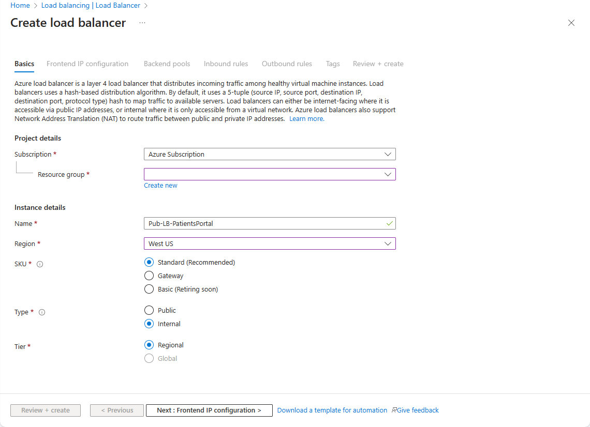
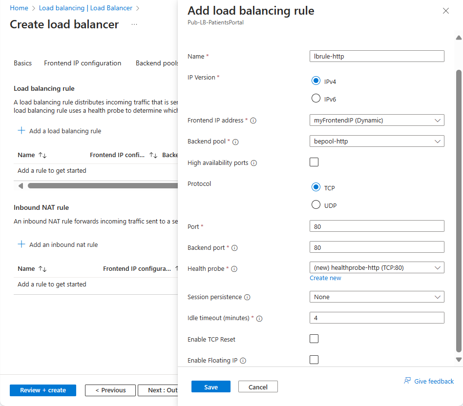

You can configure Azure Load Balancer by using the Azure portal, PowerShell, or the Azure CLI.

In your healthcare organization, you want to load-balance client traffic to provide a consistent response based on the health of the patient portal web servers. You have two virtual machines (VMs) in an availability set to act as your healthcare portal web application.

Here, you will create a load balancer resource and use it to distribute a load across the VMs.

## Deploy the patient portal web application

First, deploy your patient portal application across two virtual machines in a single availability set. To save time, let's start by running a script to create this application. The script will:

- Create a virtual network and network infrastructure for the VMs.
- Create two VMs in this virtual network.

To deploy the patient portal web application:

1. Run the following `git clone` command in Azure Cloud Shell. The command clones the repo that contains the source for the app and runs the setup script from GitHub. You then change to the directory of the cloned repo.

    ```bash
    git clone https://github.com/MicrosoftDocs/mslearn-improve-app-scalability-resiliency-with-load-balancer.git
    cd mslearn-improve-app-scalability-resiliency-with-load-balancer
    ```

1. As its name suggests, this script generates two VMs in a single availability set. The script takes about two minutes to run.

    ```bash
    bash create-high-availability-vm-with-sets.sh <rgn>[sandbox resource group name]</rgn>
    ```

1. When the script finishes, on the [Azure portal](https://portal.azure.com/learn.docs.microsoft.com?azure-portal=true) menu or from the **Home** page, select **Resource groups**, then select the **<rgn>[sandbox resource group name]</rgn>** resource group. Review the resources that were created by the script.

::: zone pivot="portal"

## Create a load balancer

Now, let's create the load balancer.

1. On the [Azure portal](https://portal.azure.com/learn.docs.microsoft.com?azure-portal=true) menu or from the **Home** page, under **Azure services**, select **Create a resource**. The **Create a resource** pane appears.

1. In the **Search services and marketplace** search box, enter **Load Balancer**, and then press <kbd>Enter</kbd>.

1. From the ensuing list, select *Load Balancer - Microsoft*. Then, select **Create**.

    

1. On the **Basics** tab, enter the following values for each setting:

    | Setting | Value |
    | ----- | ----------- |
    | **Project details** |
    | Subscription | **Concierge** |
    | Resource group | <rgn>[sandbox resource group name]</rgn> |
    | **Instance details** |
    | Name | Enter a unique name. For example, *Pub-LB-PatientsPortal*. |
    | Region | Select the location where the VMs were created. |
    | Type | **Public** |
    | SKU | **Basic** |

## Add a front-end IP configuration

1. Select **Next : Frontend IP configuration**.

1. Enter the following values for each setting.

    | Setting | Value |
    | ----- | ----------- |
    | Select **Add a frontend IP**. The **Add frontend IP address** pane appears. |
    | Name | Enter a unique name for the front-end IP address. |
    | IP version | IPv4 |
    | Public IP address | Select **Create new** link. In the **Add a public IP address** dialog box that appears, enter a unique name for the public IP address. For example, *Pub-LB-PatientsPortal-IP*. |
    | Assignment | **Static** |

1. To close the dialog box, select **OK**. The **Add frontend IP address** pane reappears. Select **Add**.

    

1. Select **Review + create**.

1. When validation passes, select **Create**.

## Add a back-end pool

1. Select **Next : Backend pools**.

1. Enter the following values for each setting.

    | Setting | Value |
    | ----- | ----------- |
    | Select **Add a backend pool**. The **Add backend pool** pane appears. |
    | Name | Enter a unique name for the back-end pool. For example, *bepool-http*. |
    | Virtual network | **bePortalVnet** |
    | Associated to | **Virtual machines** |
    | IP Version | **IPv4** |
 
1. Select **Add**. The **Create load balancer** pane reappears.

1. In the **Virtual machines** section, select **Add**. The **Add virtual machines to backend pool** pane appears.

    

1. Select the **webVM1** and **webVM2** virtual machines and the **ipconfig1** IP addresses for both VMs.

1. Select **Add**. The *bepool-http* pane reappears.

1. Select **Save**.

## Add a load balancing rule

Finally, let's create a rule for the load balancer.

1. Select **Next : Inbound rules**.

1. In the **Load balancing rule** section, select **Add a load balancing rule**. The **Add load balancing rule** pane appears.

1. Enter the following values for each setting.

    | Setting | Value |
    | ----- | ----------- |
    | Name | A name for the load balancing rule. For example, *lbrule-http*. |
    | IP Version | **IPv4** |
    | Frontend IP address | Select the existing public IP address of the load balancer. |
    | Protocol | **TCP** |
    | Port | Enter **80** (default). |
    | **Backend port** | Enter **80** (default). |
    | **Backend pool** | Select the existing back-end pool. |
    | **Health probe** | Select the **Create new** link. The **Add health probe** dialog box appears. |

1. Enter the following values for each setting.

    | Setting | Value |
    | ----- | ----------- |
    | Name | A name for the health probe. For example, *healthprobe-http*. |
    | Protocol | **TCP** |
    | Port | Enter **80** (default). |
    | Interval | Enter 5 (default). This value is the amount of time between probes. |
    | Unhealthy threshold | Enter 2 (default). This value is the number of consecutive probe failures that must occur before a VM is considered unhealthy. |

1. Select **OK** to close the dialog box. The **Add load balancing rule** pane reappears.

1. Continue entering the following values for each setting.

    | Setting | Value |
    | ----- | ----------- |
    | Session persistence*| **None** |
    | Idle timeout (minutes) | Select **4** (default). This value is the time to keep a TCP or HTTP connection open without relying on clients to send keep-alive messages. |
    | Floating IP | **Disabled** (default). |
    | | |

    

1. Select **Add** to complete the load balancer configuration.

1. Return to the **Overview** page. Copy the **Public IP address** for the load balancer.

::: zone-end

::: zone pivot="powershell"

## Create IP addresses

First, we need a public IP address for the load balancer.

1. In Cloud Shell, start PowerShell by running this command.

    ```bash
    pwsh
    ```

1. In PowerShell, create a new public IP address.

    ```powershell
    $Location = $(Get-AzureRmResourceGroup -ResourceGroupName <rgn>[sandbox resource group name]</rgn>).Location

    $publicIP = New-AzPublicIpAddress `
      -ResourceGroupName <rgn>[sandbox resource group name]</rgn> `
      -Location $Location `
      -AllocationMethod "Static" `
      -Name "myPublicIP"
    ```

1. Create a front-end IP by using the **New-AzLoadBalancerFrontendIpConfig** cmdlet. The following example creates a front-end IP configuration named **myFrontEnd** and attaches the **myPublicIP** address.

    ```powershell
    $frontendIP = New-AzLoadBalancerFrontendIpConfig `
      -Name "myFrontEnd" `
      -PublicIpAddress $publicIP
    ```

## Create the load balancer

When you use PowerShell to configure a load balancer, you must create the back-end address pool, the health probe, and the rule before you create the balancer itself.

1. Create a back-end address pool by running the **New-AzLoadBalancerBackendAddressPoolConfig** cmdlet. You attach the VMs to this back-end pool in the final steps. The following example creates a back-end address pool named **myBackEndPool**.

    ```powershell
    $backendPool = New-AzLoadBalancerBackendAddressPoolConfig -Name "myBackEndPool"
    ```

1. To allow the load balancer to monitor the status of the healthcare portal, create a health probe. The health probe dynamically adds or removes VMs from the load balancer rotation based on their response to health checks.

    ```powershell
    $probe = New-AzLoadBalancerProbeConfig `
      -Name "myHealthProbe" `
      -Protocol http `
      -Port 80 `
      -IntervalInSeconds 5 `
      -ProbeCount 2 `
      -RequestPath "/"
    ```

1. You now need a load balancer rule that's used to define how traffic is distributed to the VMs. You define the front-end IP configuration for the incoming traffic and the back-end IP pool to receive the traffic, along with the required source and destination port. To make sure only healthy VMs receive traffic, you also define the health probe to use.

    ```powershell
    $lbrule = New-AzLoadBalancerRuleConfig `
      -Name "myLoadBalancerRule" `
      -FrontendIpConfiguration $frontendIP `
      -BackendAddressPool $backendPool `
      -Protocol Tcp `
      -FrontendPort 80 `
      -BackendPort 80 `
      -Probe $probe
    ```

1. Now, you can create the basic load balancer by running the **New-AzLoadBalancer** cmdlet.

    ```powershell
    $lb = New-AzLoadBalancer `
      -ResourceGroupName <rgn>[sandbox resource group name]</rgn> `
      -Name 'MyLoadBalancer' `
      -Location $Location `
      -FrontendIpConfiguration $frontendIP `
      -BackendAddressPool $backendPool `
      -Probe $probe `
      -LoadBalancingRule $lbrule
    ```

1. Connect the VMs to the back-end pool by updating the network interfaces that the script created to use the back-end pool information.

    ```powershell
    $nic1 = Get-AzNetworkInterface -ResourceGroupName <rgn>[sandbox resource group name]</rgn> -Name "webNic1"
    $nic2 = Get-AzNetworkInterface -ResourceGroupName <rgn>[sandbox resource group name]</rgn> -Name "webNic2"

    $nic1.IpConfigurations[0].LoadBalancerBackendAddressPools = $backendPool
    $nic2.IpConfigurations[0].LoadBalancerBackendAddressPools = $backendPool

    Set-AzNetworkInterface -NetworkInterface $nic1 -AsJob
    Set-AzNetworkInterface -NetworkInterface $nic2 -AsJob
    ```

1. Run the following command to get the public IP address of the load balancer and the URL for your website.

    ```powershell
    Write-Host http://$($(Get-AzPublicIPAddress `
      -ResourceGroupName <rgn>[sandbox resource group name]</rgn> `
      -Name "myPublicIP").IpAddress)
    ```

::: zone-end

::: zone pivot="bash"

## Create a load balancer

Let's use the Azure CLI to create the load balancer and its associated resources.

1. Create a new public IP address.

    ```azurecli
    az network public-ip create \
      --resource-group <rgn>[sandbox resource group name]</rgn> \
      --allocation-method Static \
      --name myPublicIP
    ```

1. Create the load balancer.

    ```azurecli
    az network lb create \
      --resource-group <rgn>[sandbox resource group name]</rgn> \
      --name myLoadBalancer \
      --public-ip-address myPublicIP \
      --frontend-ip-name myFrontEndPool \
      --backend-pool-name myBackEndPool
    ```

1. To allow the load balancer to monitor the status of the healthcare portal, create a health probe. The health probe dynamically adds or removes VMs from the load balancer rotation based on their response to health checks.

    ```azurecli
    az network lb probe create \
      --resource-group <rgn>[sandbox resource group name]</rgn> \
      --lb-name myLoadBalancer \
      --name myHealthProbe \
      --protocol tcp \
      --port 80  
    ```

1. Now you need a load balancer rule that's used to define how traffic is distributed to the VMs. You define the front-end IP configuration for the incoming traffic and the back-end IP pool to receive the traffic, along with the required source and destination port. To make sure only healthy VMs receive traffic, you also define the health probe to use.

    ```azurecli
    az network lb rule create \
      --resource-group <rgn>[sandbox resource group name]</rgn> \
      --lb-name myLoadBalancer \
      --name myHTTPRule \
      --protocol tcp \
      --frontend-port 80 \
      --backend-port 80 \
      --frontend-ip-name myFrontEndPool \
      --backend-pool-name myBackEndPool \
      --probe-name myHealthProbe
    ```

1. Connect the VMs to the back-end pool by updating the network interfaces you created in the script to use the back-end pool information.

    ```azurecli
    az network nic ip-config update \
      --resource-group <rgn>[sandbox resource group name]</rgn> \
      --nic-name webNic1 \
      --name ipconfig1 \
      --lb-name myLoadBalancer \
      --lb-address-pools myBackEndPool

    az network nic ip-config update \
      --resource-group <rgn>[sandbox resource group name]</rgn> \
      --nic-name webNic2 \
      --name ipconfig1 \
      --lb-name myLoadBalancer \
      --lb-address-pools myBackEndPool
    ```

1. Run the following command to get the public IP address of the load balancer and the URL for your website.

    ```azurecli
    echo http://$(az network public-ip show \
                    --resource-group <rgn>[sandbox resource group name]</rgn> \
                    --name myPublicIP \
                    --query ipAddress \
                    --output tsv)
    ```

::: zone-end

## Test the load balancer configuration

Let's test the load balancer setup to show how it can handle availability and health issues dynamically.

1. In a new browser tab, go to the public IP address that you noted. You'll see that the response is returned from one of the VMs.

1. Try a "force refresh" by pressing <kbd>Ctrl+F5</kbd> a few times to see that the response is returned randomly from both VMs.

1. On the [Azure portal](https://portal.azure.com/learn.docs.microsoft.com?azure-portal=true) menu or from the **Home** page, select **All resources**. Then select **webVM1** > **Stop**.

1. Return to the tab that shows the website and force a refresh of the webpage. All requests are returned from **webVM2**.
