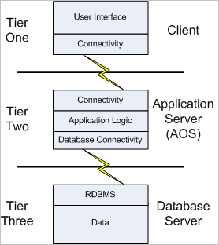

## N-tier Architecture

The healthcare portal is split into a 3 tiered architecture.

- Presentation (Client) Tier
- Application (Business) Tier
- Data Tier

-----Would like a to find a better image

This is a common architecture that allows scaling up and scaling out. The presentation layer is public facing, the other tiers are only accessible within the local azure VNET. The previous exercise created an external load balancer to balance the VMs in the presentation layer

## Configure Internal Load Balancer

In the current healthcare portal scenario, there is a application (business) tier which is used by the presentation tier. The application tier is also deployed on two virtual machines and is a web application hosting web services. To allow the front-end web portal to survive losing a connection to an entire data center you will setup an internal load balancer using availability zones.
The internal load balancer should only be visible to the front end presentation tier. All the VMs hosting the business tier are in one vnet so an internal load balancer can be used to distribute traffic to those VMs.

------Can we change this diagram to have an API layer over port 80 rather than SQL

## Choose Distribution Mode

Using the healthcare portal example. The application tier is completely stateless, so we don't need to use Source IP affinity distribution. Therefore, the default distribution mode of a 5 tuple hash can be used. This offers the greatest scalability and resilience as the VM that will handle the request is decided by the load balancer, purely on the basis of the healthiest and least worked VM in the set.

