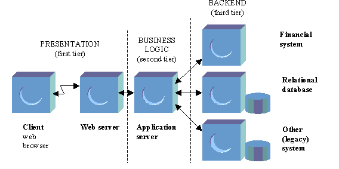
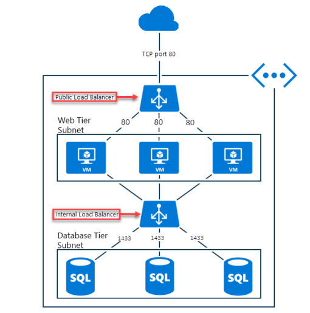

As well as balancing requests from users to front-end servers, you can also use Azure Load Balancer to distribute traffic from front-end server evenly between back-end servers.

In your healthcare organization, front-end servers call business logic that is hosted on a middle tier. You want to ensure that the middle tier is as scalable and resilient as the front end. You want to use a load balancer to distribute requests from the front-end servers evenly among the middle-tier servers. This way, you'll scale the middle-tier servers out to achieve the highest capacity possible. You'll also ensure that the middle-tier is resilient to failures because, when a server fails, the load balancer will automatically reroute traffic.

Here, you'll learn how to use load balancers to distribute internal traffic.

## N-tier architecture

The healthcare portal is split into a three-tiered architecture:

- Presentation (Client) Tier
- Application (Business) Tier
- Data Tier

<!-- TODO: Create an image similar to this, taken from: http://spmarchitecture.com/wp-content/uploads/2016/01/fig-multi-tier-web-application-server-architecture-5599.jpg - The backend tier, simply needs one block reflecting a database -->

This architecture is common and allows you to scale out. The presentation layer is public facing, the other tiers are only accessible within the local Azure virtual network. The previous exercise created an external load balancer to balance the virtual machines in the presentation layer.

## Configure an internal load balancer

In the healthcare portal scenario, there is an application tier, which hosts business logic and is called by the presentation tier. The application tier is also deployed on two virtual machines and is a web application hosting web services. To allow the front-end web portal to continue to serve client requests if a application tier server fails, you will set up an internal load balancer to distribute traffic to the appliction tier servers.

You can configure an internal load balancer in almost the same way as an external load balancer, but with these differences:

- When you create the load balancer, for the **Type** value, select **Internal**. When you choose this setting, the front-end IP address of the load balancer is not exposed to the internet. 
- Assign a private IP address for the front-end of the load balancer, not a public IP address.
- Place the load balancer in the protected virtual network that contains the virtual machines you want to handle the requests.

The internal load balancer should only be visible to the front-end presentation tier. All the virtual machines hosting the business tier are in one virtual network so an internal load balancer can be used to distribute traffic to those virtual machines.

<!-- Source URL: https://docs.microsoft.com/en-us/azure/load-balancer/media/load-balancer-overview/load-balancer-distribution.png - Can we change this diagram to have the internal balancer using an API layer over port 80 rather than SQL using 1433 -->

## Choose distribution mode

In the healthcare portal, the application tier is stateless, so we don't need to use source IP affinity. Therefore, the default distribution mode of a five-tuple hash can be used. This mode offers the greatest scalability and resilience, as the load balancer will route traffic to any healthy server.
