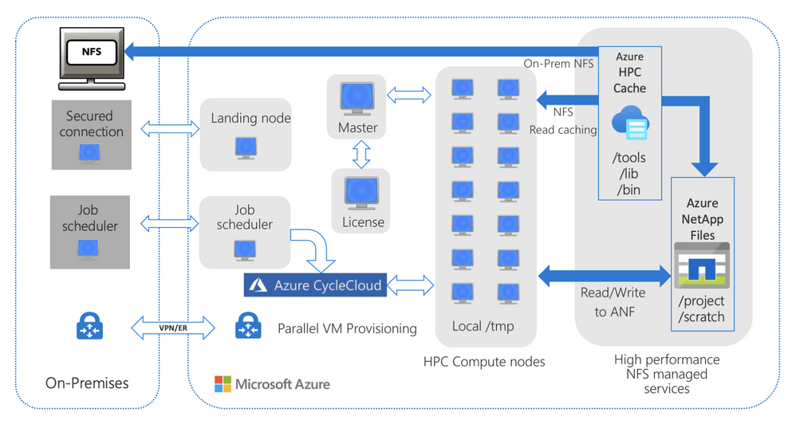

In this module, we introduce performance suggestions for reference architecture, client VMs, and network when you're running your EDA applications on Azure NetApp Files.

## Understanding your EDA workload by reviewing a reference architecture

The simulation processes for EDA tools and chips might have different reference architectures. The following reference architecture illustrates a generic case for how you can use Azure NetApp Files for EDA workloads in both cloud-bursting (hybrid) and fully on Azure scenarios.



## Suggestions for virtual networks, accelerated networking, and client updates

When possible, put your client VMs and Azure NetApp Files in the same region and same virtual network, to reduce network latency in between.

Enable accelerated networking on your client VMs if it's supported, to provide 30+ gigabits per second (Gbps) in networking throughput. Accelerated networking lowers the latency from client VMs to Azure NetApp Files. It also boosts overall performance, especially on a distributed multi-scenario analysis (DMSA) type of simulation.

It's a best practice to run the latest patch version available for the operating system. You should also update the Network File System (NFS) utilities to their latest releases, to get the newest bug fixes and feature functionality. These updates help ensure optimal performance and system stability.

For example, run these commands:

```bash
sudo yum update
sudo yum update nfs-utils
```
