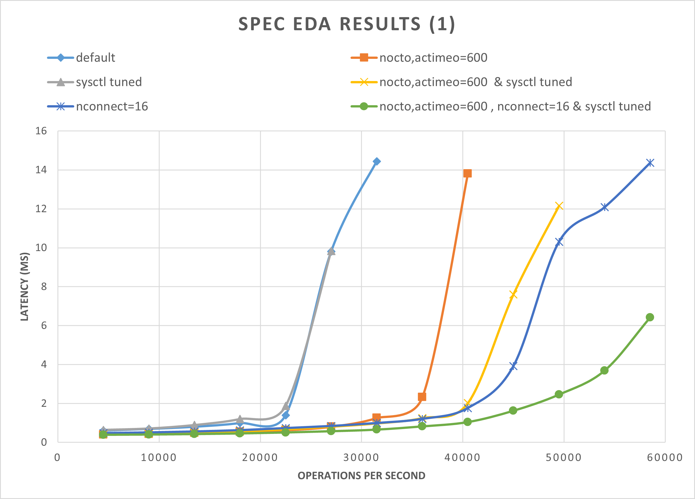
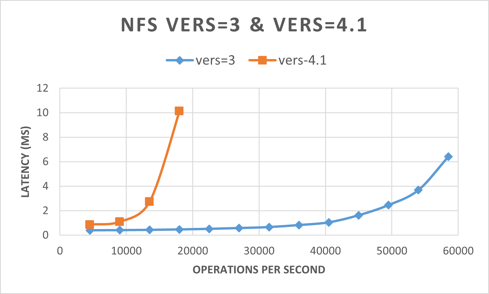
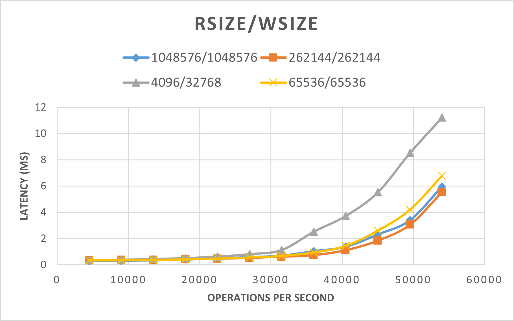
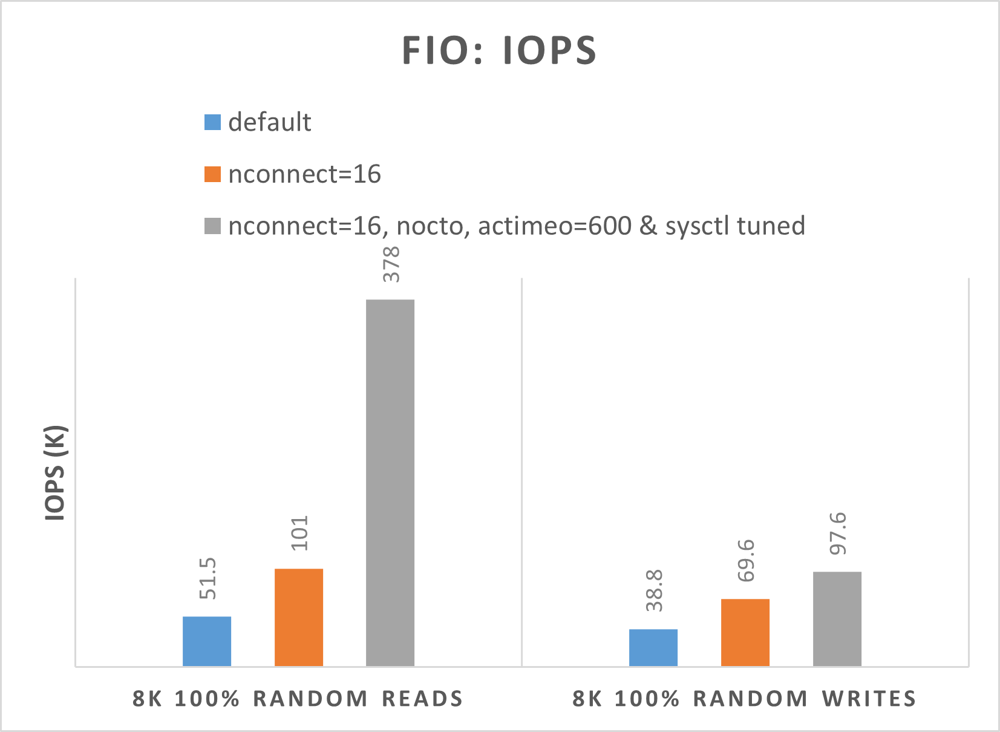
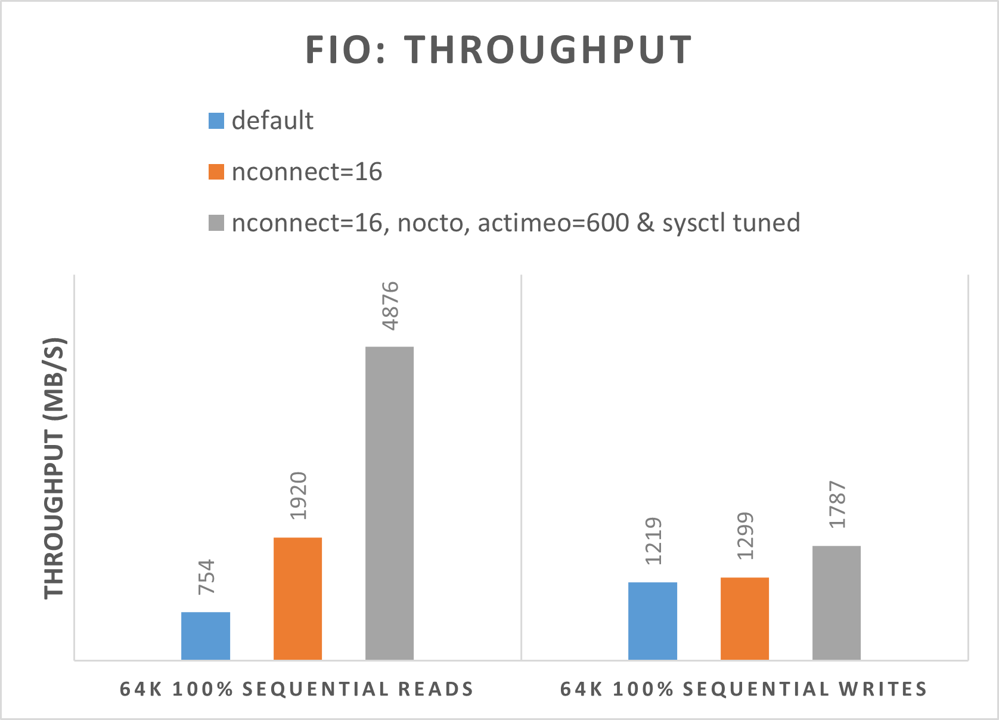

Now, we examine benchmark results to verify the performance tips that we discussed in the previous unit. Specifically, we focus on using the SPEC SFS benchmark suite to spawn multiple threads that simulate EDA production-like workloads. Also, we show FIO results to examine some performance practices.

## Overview of the two benchmark tools

The SPEC SFS suite is a standard industry benchmark for EDA. A typical EDA workload consists of functional and physical phases. The functional phase drives mostly random I/O and file-system metadata operations. The physical phase drives large-block sequential reads and writes.

FIO is an I/O tool that can generate consistent random or sequential read/write loads to benchmark IOPS and throughput of a storage target.

## Benchmark results of the SPEC EDA tool

The graphs in this section demonstrate the I/O and latency curves. They examine some combinations of the following performance practices:

- `nocto,actimeo=600`
- `sysctl tuned`
- `nconnect=16`

When all three of the preceding practices are applied, the I/O operations per second increase and still maintain low latency (less than 1 millisecond).



The following graph demonstrates that NFSv3 performs better than NFSv4.1.



The following graph demonstrates that `rsize=wsize=262144(256 K)` performs better than other settings.



## Benchmark results of the FIO tool

The following FIO commands benchmark IOPS and throughput, respectively.

```bash
// FIO commands to benchmark IOPS:
// 8K Random Reads
fio --name=8krandomreads --rw=randread --direct=1 --ioengine=libaio --bs=8k --numjobs=4 --iodepth=128 --size=4G --runtime=600 --group_reporting
// 8K Random Writes
fio --name=8krandomwrites --rw=randwrite --direct=1 --ioengine=libaio --bs=8k --numjobs=4 --iodepth=128 --size=4G --runtime=600 --group_reporting

// FIO commands to benchmark throughput:
// 64K Sequential Reads
fio --name=64kseqreads --rw=read --direct=1 --ioengine=libaio --bs=64k --numjobs=4 --iodepth=128 --size=4G --runtime=600 --group_reporting
// 64K Sequential Writes
fio --name=64kseqwrites --rw=write --direct=1 --ioengine=libaio --bs=64k --numjobs=4 --iodepth=128 --size=4G --runtime=600 --group_reporting
```

The following two graphs demonstrate that when `nocto,actimeo=600`, `nconnect=16`, and `sysctl` are tuned, Azure NetApp Files can achieve higher IOPS and throughput.




