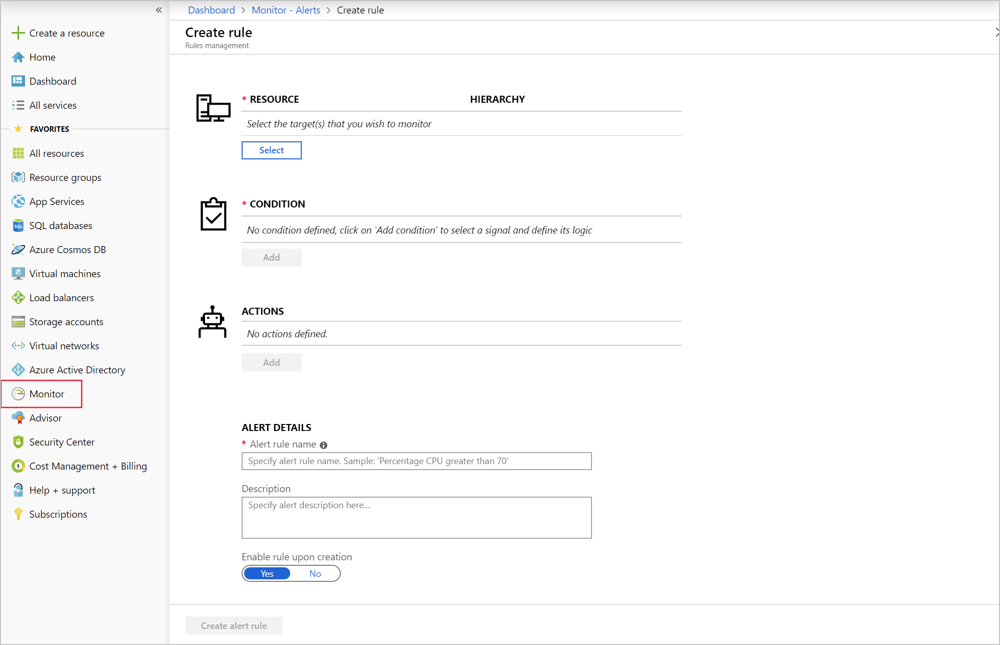

Azure Monitor is a powerful reporting and analytics tool. Use it for insights into the behavior and running of your environment and applications. You can then respond proactively to faults in your system.

After the downtime that your customers faced, you set up monitoring on your key resources in Azure. With the monitoring in place, you want to make sure the right people are being alerted, at the right level.

In this unit, you'll see how Azure Monitor receives resource data, what makes up an alert, and how and when to use an alert. Finally, you'll learn how to create and manage your own alerts.

## Data types in Azure Monitor

Azure Monitor receives data from target resources like applications, operating systems, Azure resources, Azure subscriptions, and Azure tenants. The nature of the resource defines which data types are available. A data type will be a metric, a log, or both a metric and a log.

- The focus for *metric*-based data types is the numerical time-sensitive values that represent some aspect of the target resource.
- The focus for *log*-based data types is the querying of content data held in structured, record-based log files that are relevant to the target resource.

You'll learn about the three signal types that you can use to monitor your environment:

- **Metric** alerts provide an alert trigger when a specified threshold is exceeded. For example, a metric alert can notify you when CPU usage is greater than 95 percent.
- **Activity log** alerts notify you when Azure resources change state. For example, an activity log alert can notify you when a resource is deleted.
- **Log** alerts are based on things written to log files. For example, a log alert can notify you when a web server has returned a number of 404 or 500 responses.

## Composition of an alert rule

Every alert or notification available in Azure Monitor is the product of a rule. Some of these rules are built into the Azure platform. You use alert rules to create custom alerts and notifications. No matter which target resource or data source you use, the composition of an alert rule remains the same.

- **RESOURCE**
  - The *target resource* to be used for the alert rule. It's possible to assign multiple target resources to a single alert rule. The type of resource will define the available signal types.
- **CONDITION**
  - The *signal type* to be used to assess the rule. The signal type can be a metric, an activity log, or logs. There are others, but this module doesn't cover them.
  - The *alert logic* applied to the data that's supplied via the signal type. The structure of the alert logic will change depending on the signal type.
- **ACTIONS**
  - The *action*, like sending an email, sending an SMS message, or using a webhook. 
  - An *action group*, which typically contains a unique set of recipients for the action.
- **ALERT DETAILS**
  - An *alert name* and an *alert description* that should specify the alert's purpose.
  - The *severity* of the alert if the criteria or logic test evaluates `true`. The five severity levels are:
    - **0**: Critical
    - **1**: Error
    - **2**: Warning
    - **3**: Informational
    - **4**: Verbose

## Scope of alert rules

You can get monitoring data from across most of the Azure services, and report on it by using the Azure Monitor pipeline. In the Azure Monitor pipeline, you can create alert rules for these items and more:

- Metric values
- Log search queries
- Activity log events
- Health of the underlying Azure platform
- Tests for website availability

The following alert capabilities aren't yet available for the generation of monitoring data:

- Service health alerts based on activity logs
- Web availability tests through Application Insights

## Managing alert rules

Not every alert rule that you create needs to run forever. With Azure Monitor, you can specify one or more alert rules and enable or disable them, as needed.

As an Azure solution architect, you would use Azure Monitor to enable tightly-focused and specific alerts before any application change. You would then disable the alerts after a successful deployment.

## Alert summary view

By default, the alert page shows a summary of all alerts. Note that the view doesn't show classic alerts. You can apply filters to the view by using one or more of the following three categories: subscriptions, resource groups, or time ranges. The view includes only alerts that match these criteria. The following constraints apply:

- **Subscriptions**: You're limited to reporting on a maximum of five subscriptions.
- **Resource groups**: You can have only one resource group.
- **Time ranges**: These ranges support the past hour, the past 24 hours, the past 7 days, and the past 30 days.

### Understanding the alert state in the resolution process

You control the alert state to manage and specify where you are in the alert resolution process. Currently, there are three states:

- Every new alert has an alert state of **New**. This state means that the issue has been detected but not yet reviewed.
- After an admin has reviewed the alert and is working on it, the alert state changes to **Acknowledged**.
- When the issue is resolved, the alert state is set to **Closed**.

### Filtering alerts

From the alert summary window, you'll see a satellite view of the alerts being reported in Azure Monitor. You filter this view to reduce the volume of alerts being reported to a specific subset that you're interested in.

You can select the following items to filter the view:

- **Smart groups**: You can select this filter if it's enabled.
- **Resource type**: Applies only when it's used with a resource group.
- **Resource**: Applies only when a resource type has been specified.
- **Severity**: Identifies the severity assigned by the alert rule.
- **Monitor condition**: Set by the system and indicates if the alert is fired or resolved.
- **Alert state**: Typically, finds the **New** and **Acknowledged** alerts.
