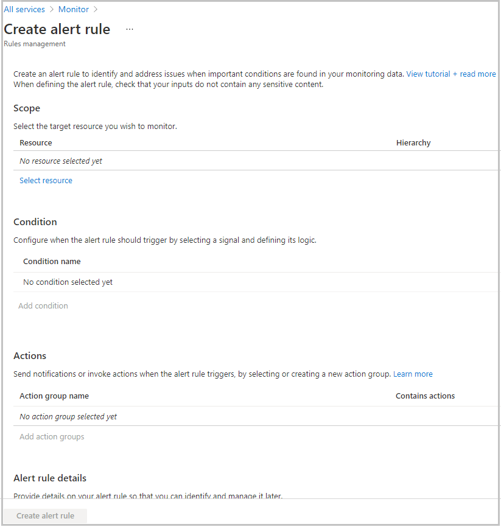
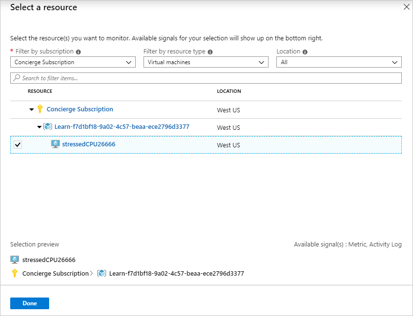
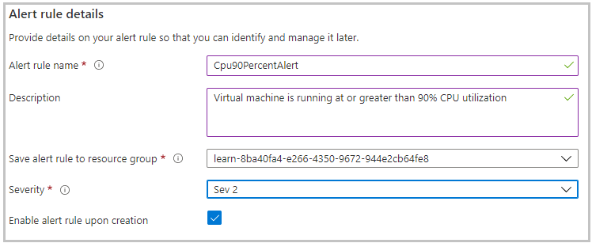
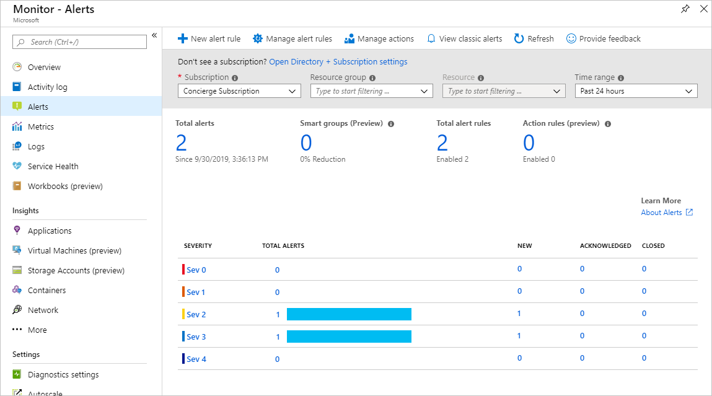
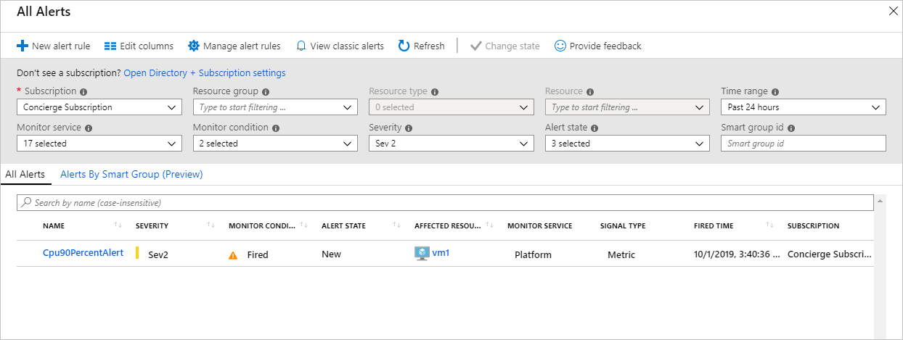

The shipping company that you work for would like to avoid any future issues with updates to its applications on the Azure platform. To improve the alerting capabilities within Azure, you've chosen to use Azure metric alerting.

Your goal is to create the Linux VM, set it to 100% CPU utilization, then sign in to the Azure portal sandbox and create a metric monitoring rule.

You'll use the Azure Cloud Shell to execute commands quickly in Azure without needing the Azure portal. In this exercise, you'll use Cloud Shell to prepare the environment before using the Azure portal to set up the monitoring.

## Create the VM

This VM will run a specific configuration that stresses the CPU and generates the metric monitoring data needed to trigger an alert.

1. Let's start by creating the configuration script. Run this command in the Cloud Shell to create the `cloud-init.txt` file with the configuration for the virtual machine.

    ```bash
    cat <<EOF > cloud-init.txt 
    #cloud-config
    package_upgrade: true
    packages:
    - stress
    runcmd:
    - sudo stress --cpu 1
    EOF
    ```

1. Run the `az vm create` command to set up an Ubuntu Linux VM. This command will use the `cloud-init.txt` file you created in the previous step to configure the VM after it's created.

    ```azurecli
    az vm create \
        --resource-group <rgn>[sandbox resource group name]</rgn> \
        --name vm1 \
        --image UbuntuLTS \
        --custom-data cloud-init.txt \
        --generate-ssh-keys
    ```

## Create the Azure Metric Monitor through the Azure portal

You use either the Azure portal or the CLI to create a metric monitor. In this exercise we will cover both, starting with the Azure portal.

1. Sign into the [Azure portal](https://portal.azure.com/learn.docs.microsoft.com?azure-portal=true) using the same account you activated the sandbox with.

1. On the left, select **Monitor**, then select **Alerts** in the left panel.

1. Select **+ New alert rule**. The **Create rule** page will be displayed.

    

1. In the **RESOURCE** section, press **Select**.

1. The **Filter by subscription** drop-down should already be populated with the **Concierge Subscription**. In the **Filter by resource type** drop-down select **Virtual machines**.

    Select the `vm1` virtual machine under the **<rgn>[sandbox resource group name]</rgn>** resource group, then select **Done** at the bottom of the page.

    

1. Next you will configure the conditional logic for this resource. In the **CONDITION** section, select **Add**.

1. For **Signal Type** select **Metrics** and for **Monitor Service** select **All**.

    The list of available signals will change depending on the signal type selected. From the list of available signal types, select **Percentage CPU**.

    

1. In the **Configure signal logic** panel, configure the following settings:

    | Setting | Value |
    |---------|---------|
    | Threshold | Static |
    | Operator | Greater than |
    | Aggregation type | Maximum |
    | Threshold value | 90 |
    | Aggregation granularity (period) | 1 minute |
    | Frequency of evaluation | every 1 minute |

    Select **Done**.

    

1. In the **ALERT DETAILS** section, provide the following information:

    | Setting | Value |
    |---------|---------|
    | Alert rule name | Cpu90PercentAlert |
    | Description | Virtual machine is running at or greater than 90% CPU utilization |
    | Severity | Sev 2 |
    | Enabled rule upon creation | Yes |
    | | |

    

1. Select **Create alert rule** to create the alert rule.

You have successfully created a metric alert rule that will trigger an alert when the CPU percentage on the  virtual machine exceeds 90%. The rule will check every minute and review one minute of data. It can take up to 10 minutes for a metric alert rule to become active.

## Create the Azure Metric Monitor through the CLI

You can set up metric alerts using the CLI. This process can be quicker compared to using the portal, especially if you are planning to set up a number of alerts.

Let's create a new metric alert similar to the one you set up in the Azure portal.

1. Run this command in the Cloud Shell to obtain the resource ID of the virtual machine created earlier.

    ```bash
    VMID=$(az vm show \
            --resource-group <rgn>[sandbox resource group name]</rgn> \
            --name vm1 \
            --query id \
            --output tsv)
    ```

1. Using the Cloud Shell create a new metric alert, that will be triggered when the VM CPU is greater than 80%.

    ```azurecli
    az monitor metrics alert create \
        -n "Cpu80PercentAlert" \
        --resource-group <rgn>[sandbox resource group name]</rgn> \
        --scopes $VMID \
        --condition "max percentage CPU > 80" \
        --description "Virtual machine is running at or greater than 80% CPU utilization" \
        --evaluation-frequency 1m \
        --window-size 1m \
        --severity 3
    ```

## View your metric alerts in Azure Monitor

In the example, you set up an Ubuntu VM and configured it to stress test the CPU. You also created a metric rule to detect when the maximum CPU percentage exceeds 80% and 90%.

By now the alert should be active and generating alerts.

1. Return to the [Azure portal](https://portal.azure.com/learn.docs.microsoft.com?azure-portal=true).

1. On the left, select **Monitor**, then select **Alerts** in the left panel.

1. This will present the alert summary page. Here's an example of the summary page after it has been running the alert for an hour or more.

    

1. You configured your metric alerts with a severity of Sev3 and Sev4. You now select the severity level Sev4 to show all the alerts for that level.

    

1. Selecting one of the alerts will display the details on the alert. After the issue is resolved, you can also change the alert state.