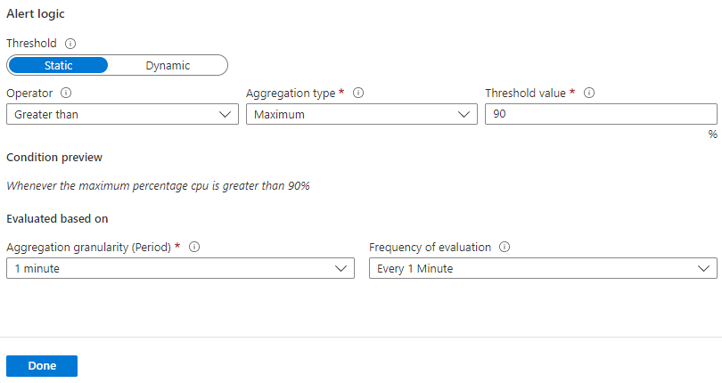

The shipping company that you work for wants to avoid any future issues with updates to its applications on the Azure platform. To improve the alert capabilities in Azure, you've chosen to use Azure metric alerts.

In this exercise, you'll create a Linux virtual machine (VM). This VM will run an app that runs the CPU at 100 percent utilization. You'll create monitoring rules in the Azure portal and in the Azure CLI to alert you about high CPU usage.

## Create the VM

This VM will run a specific configuration that stresses the CPU, and generates the metric monitoring data needed to trigger an alert.

1. Start by creating the configuration script. To create the `cloud-init.txt` file with the configuration for the VM, run the following command in Azure Cloud Shell.

    ```bash
    cat <<EOF > cloud-init.txt
    #cloud-config
    package_upgrade: true
    packages:
    - stress
    runcmd:
    - sudo stress --cpu 1
    EOF
    ```

1. To set up an Ubuntu Linux VM, run the following `az vm create` command. This command uses the `cloud-init.txt` file that you created in the previous step to configure the VM after it's created.

    ```azurecli
    az vm create \
        --resource-group <rgn>[sandbox resource group name]</rgn> \
        --name vm1 \
        --location eastUS \
        --image UbuntuLTS \
        --custom-data cloud-init.txt \
        --generate-ssh-keys
    ```

## Create the metric alert through the Azure portal

> [!Note]
> Wait until the VM is successfully created to proceed to the next exercise. The VM creation process is complete when you see a "Finished .." message in the output.

You use either the Azure portal or the CLI to create a metric alert. In this exercise we'll cover both, starting with the Azure portal.

1. Sign in to the [Azure portal](https://portal.azure.com/learn.docs.microsoft.com?azure-portal=true) by using the same account that you used to activate the sandbox.

1. On the Azure portal menu, select **More services**, then search for and select **Monitor**. The Monitor **Overview** pane appears.

1. In the left menu pane, select **Alerts**. The **Monitor | Alerts** pane appears.

1. On the command bar, select **Create +** and select **Alert rule**. The **Create an alert rule** pane appears.

    :::image type="content" source="../media/4-create-monitor-rule.png" alt-text="Screenshot that shows the 'Create alert rule' pane.":::

1. Under **Scope**, select the **Select resource** link. The **Select a resource** pane appears.

1. The **Filter by subscription** should already be populated with **Concierge Subscription**. In the **Filter by resource type** dropdown list, select **Virtual machines**.

1. Select the **vm1** virtual machine under the **<rgn>[sandbox resource group name]</rgn>** resource group. Then, select **Done** at the bottom of the pane.

    :::image type="content" source="../media/4-select-resource.png" alt-text="Screenshot showing the 'Select a resource' pane.":::

1. Next, you'll configure the conditional logic for this resource. From the **Create an alert rule** pane, select the **Condition** tab and select the **+ Add condition** link. The **Select a signal** pane appears.

1. For **Signal type**, from the dropdown list, select **Metrics**. For **Monitor service**, select **All**.

1. The list of available signals will change depending on the selected signal type. From the list of available signal types, search for and select **Percentage CPU**.

    

    The **Configure signal logic** pane appears.

1. Enter the following values for each setting.

    | Setting | Value |
    |---------|---------|
    | **Alert logic** |
    | Threshold | Static |
    | Operator | Greater than |
    | Aggregation type | Maximum |
    | Threshold value | 90 |
    | **Evaluated based on** |
    | Aggregation granularity (Period) | 1 minute |
    | Frequency of evaluation | Every 1 Minute |

1. Select **Done**.

    

1. From the **Create an alert rule** pane, select the **Details** tab. Under the **Alert rule details** section, enter the following values for each setting.

    | Setting | Value |
    |---------|---------|
    | Severity | Sev 2 - Warning |
    | Alert rule name | Cpu90PercentAlert |
    | Description | Virtual machine is running at or greater than 90% CPU utilization |
    | Enable alert rule upon creation | Yes (checked) |
    | Automatically resolve alerts | Yes (checked) |

    :::image type="content" source="../media/4-metric-alert-details.png" alt-text="Screenshot that shows a completed section for alert details.' pane.":::

1. Select **Review + create** to validate your input.

1. Select **Create**.

You've successfully created a metric alert rule that will trigger an alert when the CPU percentage on the VM exceeds 90 percent. The rule will check every minute and review one minute of data. It can take up to 10 minutes for a metric alert rule to become active.

## Create the metric alert through the CLI

You can set up metric alerts by using the CLI. This process can be quicker compared to using the portal, especially if you're planning to set up more than one alert.

Let's create a new metric alert similar to the one you set up in the Azure portal.

1. Run the following command in Cloud Shell to obtain the resource ID of the virtual machine previously created.

    ```bash
    VMID=$(az vm show \
            --resource-group <rgn>[sandbox resource group name]</rgn> \
            --name vm1 \
            --query id \
            --output tsv)
    ```

1. Run the following command to create a new metric alert that will be triggered when the VM CPU is greater than 80 percent.

    ```azurecli
    az monitor metrics alert create \
        -n "Cpu80PercentAlert" \
        --resource-group <rgn>[sandbox resource group name]</rgn> \
        --scopes $VMID \
        --condition "max percentage CPU > 80" \
        --description "Virtual machine is running at or greater than 80% CPU utilization" \
        --evaluation-frequency 1m \
        --window-size 1m \
        --severity 3
    ```

## View your metric alerts in Azure Monitor

In the example, you set up an Ubuntu VM, and configured it to stress test the CPU. You also created a metric rule to detect when the maximum CPU percentage exceeds 80 percent and 90 percent.

It might take 10 minutes before you see the alerts show up in your portal.

1. Return to the [Azure portal](https://portal.azure.com/learn.docs.microsoft.com?azure-portal=true).

1. On the Azure portal menu, select **Monitor**, and then select **Alerts** in the left menu pane.

   This step presents the alert summary pane, where you can see the count of the number of alerts.

   :::image type="content" source="../media/4-alert-summary-pane.png" alt-text="Screenshot that shows the alert summary pane.' pane.":::

1. You configured your metric alerts with severities of 2 and 3. Select one of the alerts to view the severity level.

    Selecting one of the alerts shows the details on the alert.
