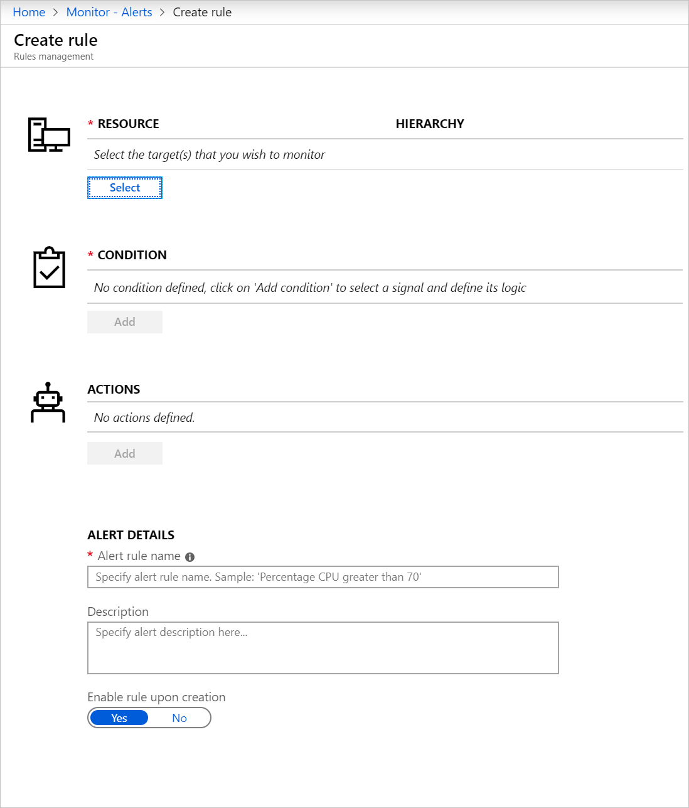
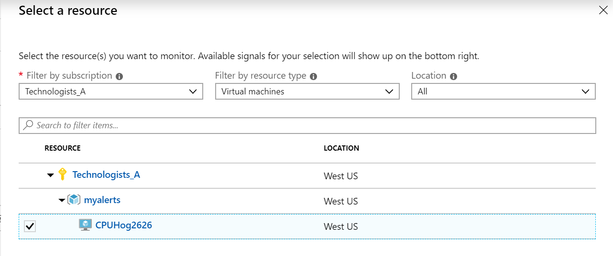
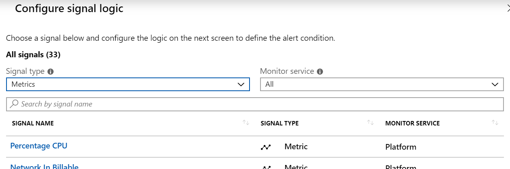
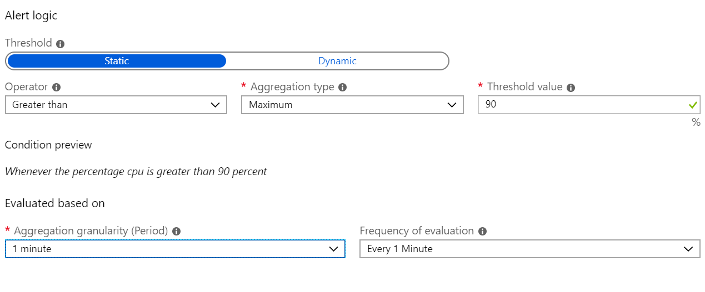
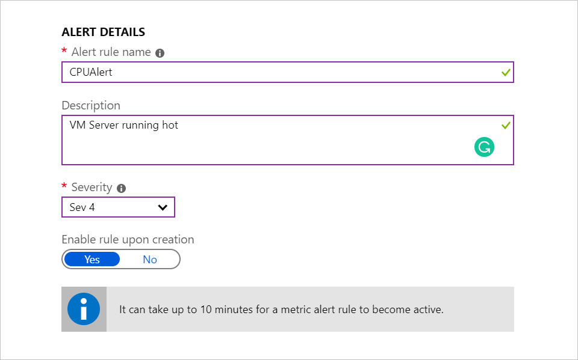
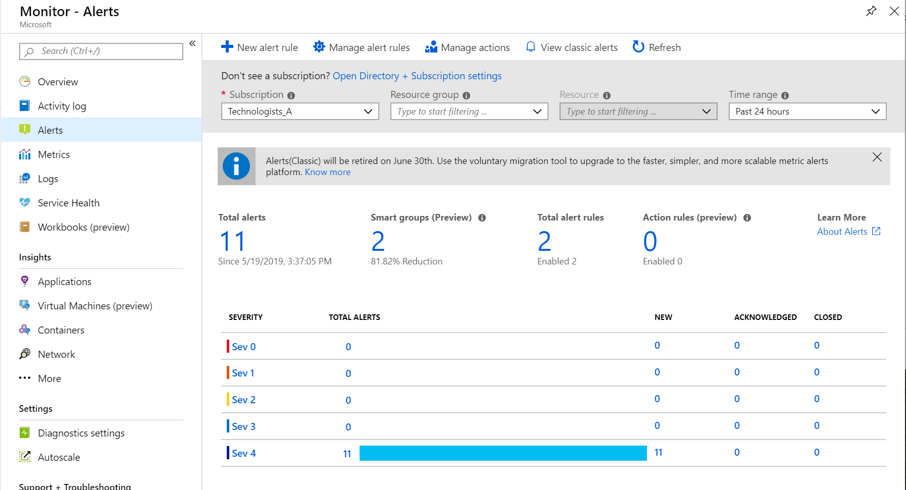
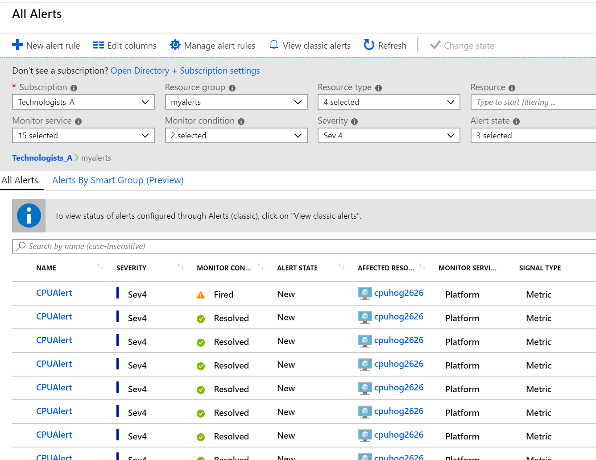

The shipping company that you work for is keen to avoid any future issues with updates to its applications on the Azure platform. To improve the alerting capabilities within Azure, you've chosen to use Azure metric alerting. 

> [!NOTE]
> This example uses Azure Monitor through the portal. To generate monitoring data, you will set up a Linux VM running at 100% CPU utilization.

Your goal is to create the Linux VM, set it to 100% CPU utilization, then sign in to the Azure portal sandbox and create a metric monitoring rule.

[!include[](../../../includes/azure-sandbox-activate.md)]

You'll use the Azure Cloud Shell to execute commands quickly in Azure without needing the Azure portal. In this exercise, you'll use Cloud Shell to prepare the environment before using the Azure portal to set up the monitoring.

## Create the VM

This VM will run a specific configuration that stresses the CPU and generates the metric monitoring data needed to trigger an alert.

1. Create the configuration script for the VM.

    Before you create the VM, you need to set up the configuration script. Use the Cloud Shell to run the following command:

    ```azurecli
    { 
	echo '#cloud-config'
	echo 'package_upgrade: true' 
	echo 'packages:' 
	echo '- stress'
	echo 'runcmd:' 
	echo '- sudo stress --cpu 1' 
    } > cloud-init.txt
    ```

    Use the following command to check that the file has been created and matches the above content:

    ```azurecli
    head cloud-init.txt
    ```

1. Run the 'az vm create' command to set up an Ubuntu Linux VM. This command will use the custom-data file you created in the previous step.

    ```azurecli
    export SUBS=$(az vm create \
    --resource-group <rgn>[sandbox resource group name]</rgn> \
    --name stressedCPU$RANDOM \
    --image UbuntuLTS \
    --custom-data cloud-init.txt \
    --generate-ssh-keys \
    --output tsv --query id)
    ```

## Create the Azure Metric Monitor through the Azure portal

You use either the Azure portal or the CLI to create a metric monitor. For completeness, we will cover both.

1. Sign into the [Azure portal](https://portal.azure.com/learn.docs.microsoft.com?azure-portal=true) using the same account you activated the sandbox with.
1. On the left, select **Monitor**, then select **Alerts** in the left panel.
1. Select the **+ New alert rule**. The **Create rule** page will be displayed.

    

1. From the Resource section, press **Select**.

    

    Find your Azure sandbox subscription, and then filter by virtual machine. The virtual machine will be visible under the **myalerts** resource group. Select the virtual machine (the one with random numbers after it) and select **Done** at the bottom of the page.

1. Configure the conditional logic for this resource. Select **Add** in the **CONDITION** section.

    For this exercise, you will use the following settings:

    - Signal Type: **Metrics**
    - Monitor Service: **All**
    
    The list of available signals will change depending on the signal type selected. From the list of available signal types, find and select:

    - **Percentage CPU**

    

    
1. Define the logic test that will be applied to the metric monitoring data. In the condition section, select **Add**. This will display the Alert logic panel.

    

    - Threshold: **Static**
    - Operator: **Greater than**
    - Aggregation type: **Maximum**
    - Threshold value: **90**
    - Aggregation granularity (period): **1 minute**
    - Frequency of evaluation: **every 1 minute**

    Use the details above to complete the panel.

 1. Give the alert a name and a description. In the Alert Details section, provide the following information:

    
    
    - Alert rule name: **CPUAlert**
    - Description: **VM Server running hot**
    - Severity: **Sev 4**
    - Enabled rule upon creation: **Yes**

1. Now that you have defined the rule, you select 'Create alert rule'.
    
    You have successfully created a metric alert rule that will trigger an alert when the CPU percentage on the  virtual machine exceeds 90%. The rule will check every minute and review one minute of data. It can take up to 10 minutes for a metric alert rule to become active.

## Create the Azure Metric Monitor through the CLI
You can set up metric alerts using the CLI. This process can be quicker compared to using the portal, especially if you are planning to set up a number of alerts.

You'll create a new metric alert similar to the one you set up in the Azure portal.

1. Using the Cloud Shell create a new metric alert, that will be triggered when the VM CPU is greater than 80%.

    ```azurecli
    az monitor metrics alert create -n "CPUWarmingUp" \
    --resource-group <rgn>[sandbox resource group name]</rgn> \
    --scopes $SUBS \
    --condition "max Percentage CPU > 80" \
    --description "VM Server warming up" \
    --evaluation-frequency 1m --window-size 1m --severity 3
    ```

## View your metric alerts in Azure Monitor

In the example, you set up an Ubuntu VM and configured it to stress test the CPU. You also created a metric rule to detect when the maximum CPU percentage exceeds 80% and 90%.

By now the alert should be active and generating alerts.

1. Return to the [Azure portal](https://portal.azure.com/learn.docs.microsoft.com?azure-portal=true).
1. On the left, select **Monitor**, then select **Alerts** in the left panel.

    

1. This will present the alert summary page. Here's an example of the summary page after it has been running the alert for an hour or more.

1. You configured your metric alerts with a severity of Sev4. You now select the severity level sev4 to show all the alerts for that level.

    

1. Selecting one of the alerts will display an Alert Details Panel. From this panel, you'll see specific details on the alert. After the issue is resolved, you can also change the alert state.