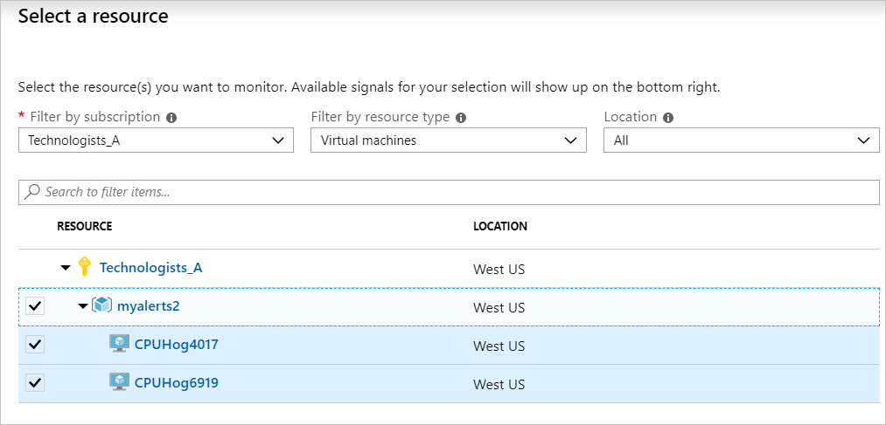
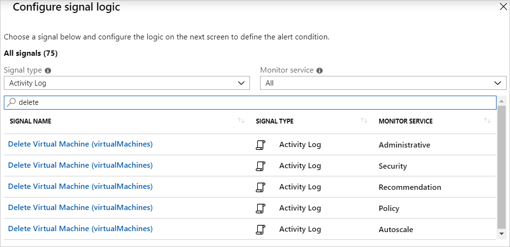
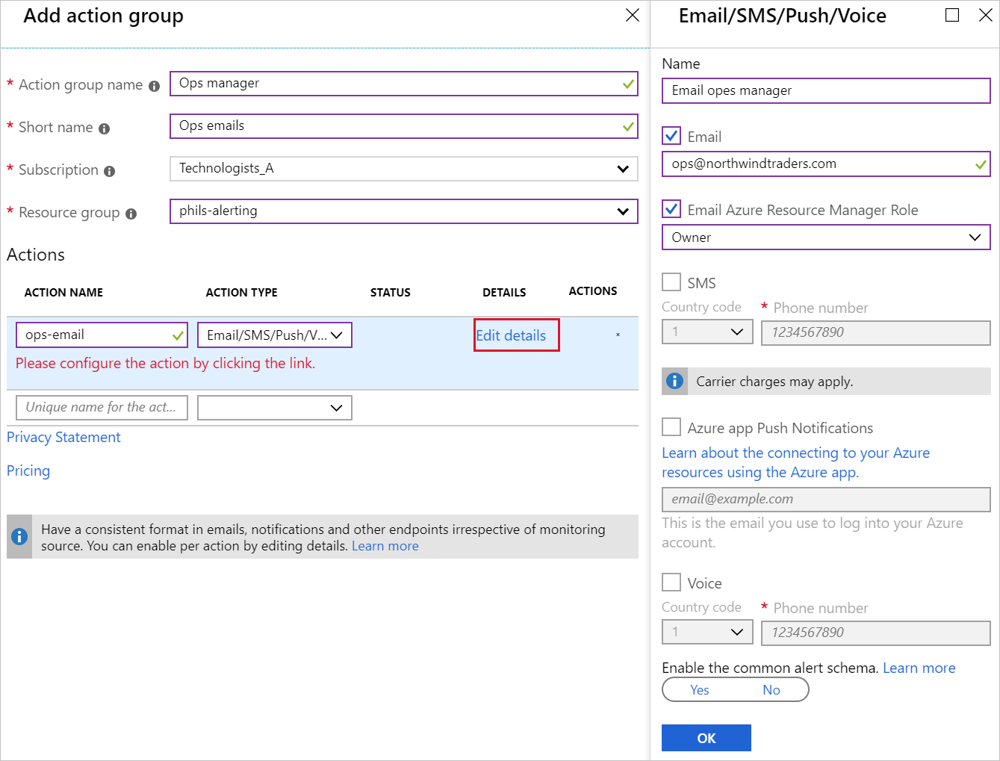
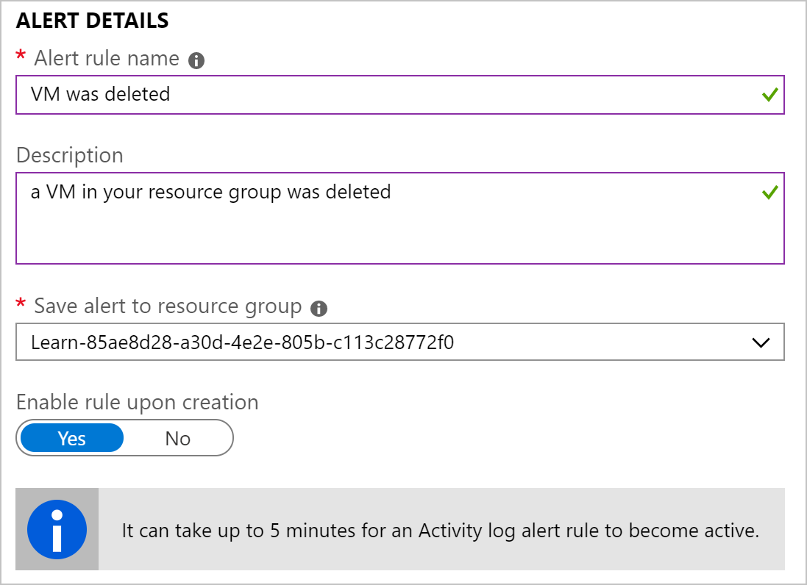
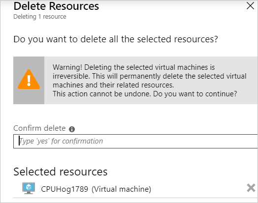
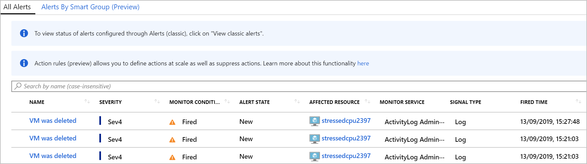

The shipping company that you work for is keen to avoid any future issues with updates to its applications on the Azure platform. To improve the alerting capabilities within Azure, you'll use activity log alerting. 

Your goal is to set up the Linux VM and create an activity log monitoring rule to detect when a virtual machine is deleted – then delete the VM.

## Create the Azure Activity Log Monitor

1. Sign into the [Azure portal](https://portal.azure.com/learn.docs.microsoft.com?azure-portal=true) using the same account you activated the sandbox with.
1. On the left, select **Monitor**, then select **Alerts** in the left panel.
1. Select the **+ New alert rule**.
1. From the **Resource** section, choose **Select**.

    

    You can either select a specific virtual machine to monitor or select the resource group, which will monitor all virtual machines.  In this exercise, you'll select the latter.  When selecting a resource group, all the virtual machines in the group are also selected.

1. You'll need to configure the signal logic for this alert.  The signal type varies, depending on the type of resource selected.

    

    - Signal Type: **Activity Log**
    - Monitor Service: **All**
    - In the search panel, type **delete**.

    Select **Delete Virtual Machine (virtualMachines)** that is the **Administrative** service.

1. Define the logic test that will be applied to the metric monitoring data.  In the **Condition** section, select **Add**.

    

    - Event Level: **All**
    - Status: **All**

    Fill in the details.  When you're done, they should look like this:

## Add an email alert action

For the previous Azure Monitor alert you didn't add any actions. You just view triggered alerts on the Azure portal. Actions allow you to send emails for notifications, trigger an Azure Function, or call a webhook. You'll now add an email alert when VMs are deleted.

1. Under **ACTIONS** select **Create action group**.

    

    Enter the following details:

    - Action group name: **Ops Manager**
    - Short name: **Ops emails**
    - Subscription: **Concierge Subscription**
    - Resource group: **<rgn>[sandbox resource group name]</rgn>**
    - ACTION NAME: **ops-email**
    - ACTION TYPE: Email/SMS/Push/Voice
    - Email: **Your email address**

    Then select **OK** on the panel.

1. At the bottom of the **Add action group** pane, select **OK**.

1. Finally, you'll need to give the alert a name and a description.  In the **ALERT DETAILS** section, provide the following information:

    

    - Alert rule name: **VM was deleted**
    - Description: **a VM in your resource group was deleted**
    - Enabled rule upon creation: **Yes**

1. Now that you've defined the rule, select **Create alert rule**. It can take up to five minutes for an activity log alert rule to become active.  In this exercise, if you delete the virtual machine before this time, the alert rule will not trigger.

## Delete your virtual machine

To trigger the alert, you need to delete the virtual machine you created earlier.  

1. From the Azure portal, select **Virtual machines**.  This action will display a list of the virtual machines.

1. Select your virtual machine.

1. From the menu bar, select **Delete**.

1. A side panel will be displayed, prompting you to enter **yes** to confirm the deletion.

   

1. Select **done** at the bottom of the page.  You've now deleted a virtual machine.  

> [!NOTE]
> It can take a few minutes for the virtual machine to be deleted.

## View your activity log alerts in Azure Monitor

In the example, you set up an Ubuntu VM, and created an activity log rule to detect when the VM was deleted.  You've deleted a virtual machine from your resource group. You now need to check if an alert was triggered. 

1. Open your email program, you should have received an email from azure-noreply@microsoft.com.

    

1. On the Azure portal, select **Monitor** and then **Alerts**.

1. In the grey filter bar, change the resource group to **<rgn>[sandbox resource group name]</rgn>**.

1. Select the **Total alerts**.

1. The summary page will now display your results.

    

The alert list now shows an alert for the virtual machine you deleted. The affected resource column tells you which virtual machine was removed. If you delete the last remaining virtual machine from the resource group, a second set of alerts will appear.
