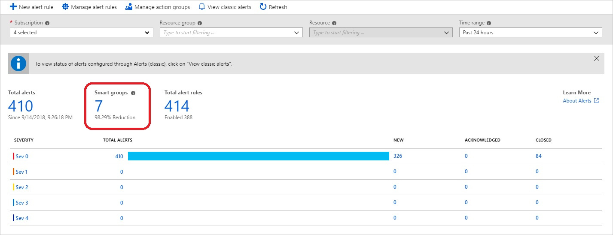
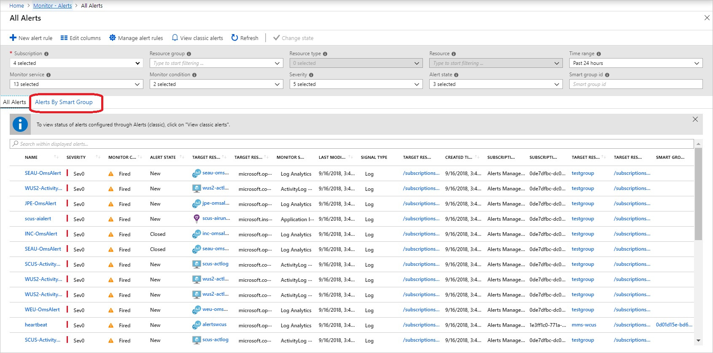

As an Azure solution architect, you realize that, by using metric, log, and activity log alerts, Azure Monitor will generate a large number of alerts. It can be hard to see the difference between your critical and nonessential issues. You want to explore the options available in Azure Monitor. Is there a mechanism that might reduce the alert noise and make the task of managing alerts easier?

In this unit, you'll investigate how to use smart groups, and see how they can help you manage alerts in Azure Monitor.

## What are smart groups?
Smart groups are an automatic feature of Azure Monitor. Using machine learning algorithms, it groups together alerts based on repeat occurrence or similarity. Smart groups allow you to address a group of alerts instead of each alert separately.

The name of the smart group, its taxonomy, is assigned automatically and is the name of the first alert in the group. It's important to assign meaningful names to each alert that you create, as the name of the smart group can't be changed or amended.

## When to use smart groups
Think of smart groups as a dynamic filter applied to all the alerts in Azure Monitor. Azure Monitor's machine learning algorithm groups together alerts based on information such as historical patterns, similar properties, or structure. 

Using smart groups can reduce alert noise by more than 90%.
Presently, smart groups only apply to alerts from the same monitoring service within a subscription. 

The power of smart groups is that they show you all related alerts, giving improved analytics, and can often identify a previously unseen root cause.

## Managing smart groups
There are two ways to get to your smart groups, either through the **Alert Summary Page**

or from the **All Alerts** page, then select **Alerts by Smart Group**. 

Either method results in a new page that displays all the smart groups. You can now resolve a smart group.

Selecting a smart group opens the details page, which splits into two sections: alerts and history.
- **Alerts**: lists all the alerts included in the smart group.
- **History**: provides a history of all the changes made to the smart group.

## Smart group states
Smart groups, like regular alerts, have their own smart group state. The smart group state shows the progress of the smart group in the resolution process. Changing the state of a smart group doesn't alter the state of the individual alerts.

To change the state, select **Change smart group state**.

The states are:
- **New**: the smart group has been created with an aggregation of alerts, but hasn't yet been addressed.
- **Acknowledged**: when an administrator starts the resolution process, they should change the state to acknowledged.
- **Close**: when the source of the alert is fixed, the administrator changes the state to closed.

**NOTE:** changing the state of the smart group doesn't affect the underlying alert. Each alert member shown in the smart group can have different states.

