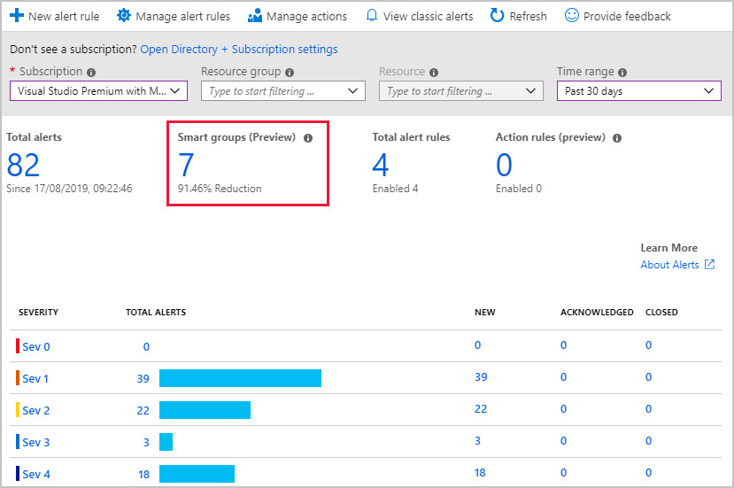
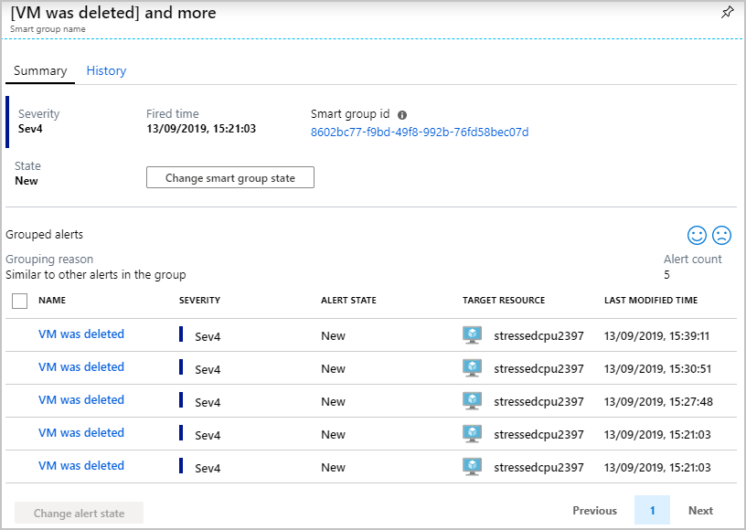
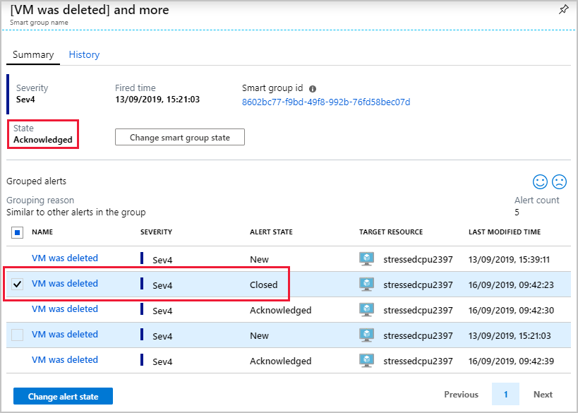

In a large environment, Azure Monitor can generate a large number of alerts. It can be hard to see the difference between your critical and nonessential issues. 

You want to explore the options available in Azure Monitor. Is there a mechanism that might reduce the alert noise and make the task of managing alerts easier?

In this unit, you'll investigate how to use smart groups, and see how they can help you manage alerts in Azure Monitor.

## What are smart groups?

Smart groups are an automatic feature of Azure Monitor. By using machine learning algorithms, Azure Monitor joins alerts based on repeat occurrence or similarity. Smart groups enable you to address a group of alerts instead of each alert individually.

The name of the smart group (its taxonomy), is assigned automatically, and is the name of the first alert in the group. It's important to assign meaningful names to each alert that you create, because the name of the smart group can't be changed or amended.

## When to use smart groups

Think of smart groups as a dynamic filter applied to all the alerts in Azure Monitor. The machine learning algorithm in Azure Monitor joins alerts based on information, such as historical patterns, similar properties, or structure. Using smart groups can reduce alert noise by more than 90 percent.

The power of smart groups is that they show you all related alerts and give improved analytics. They can often identify a previously unseen root cause.

## Managing smart groups

There are two ways to get to your smart groups: from the **Alert Summary** page or from the **All Alerts** page. Next, select **Alerts by Smart Group**.

Either method results in a new page that shows all the smart groups. Selecting a smart group opens its details page, which splits into two sections:

- **Summary**: Lists all the alerts included in the smart group.
- **History**: Provides a history of all the changes made to the smart group.

## Smart group states

Smart groups, like regular alerts, have their own state. The state shows the progress of the smart group in the resolution process. Changing the state of a smart group doesn't alter the state of the individual alerts.

To change the state, select **Change smart group state**.

The states are:

- **New**: The smart group has been created with a collection of alerts, but it hasn't yet been addressed.
- **Acknowledged**: When an admin starts the resolution process, they change the state to this.
- **Closed**: When the source of the alert is fixed, the admin changes the state to this.

Changing the state of the smart group doesn't affect the underlying alert. Each alert member shown in the smart group can have a different state.
