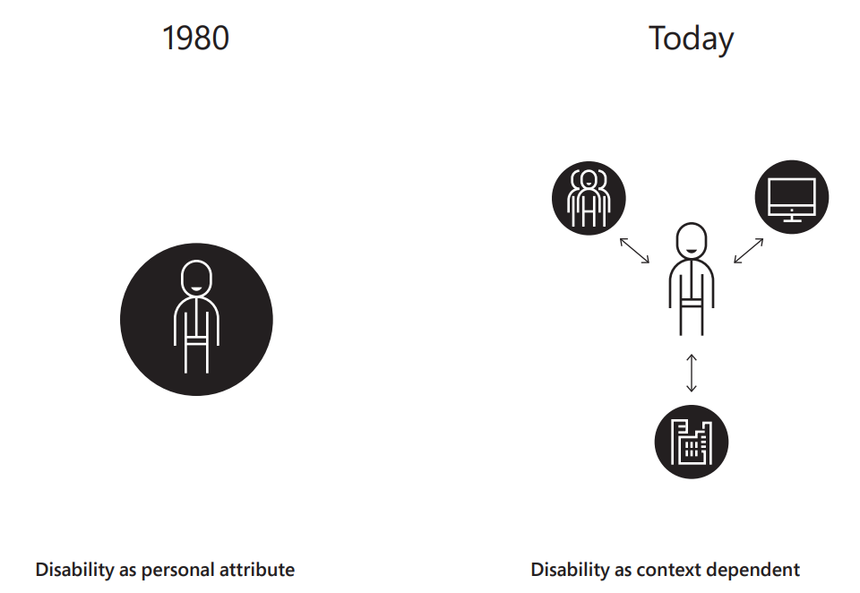
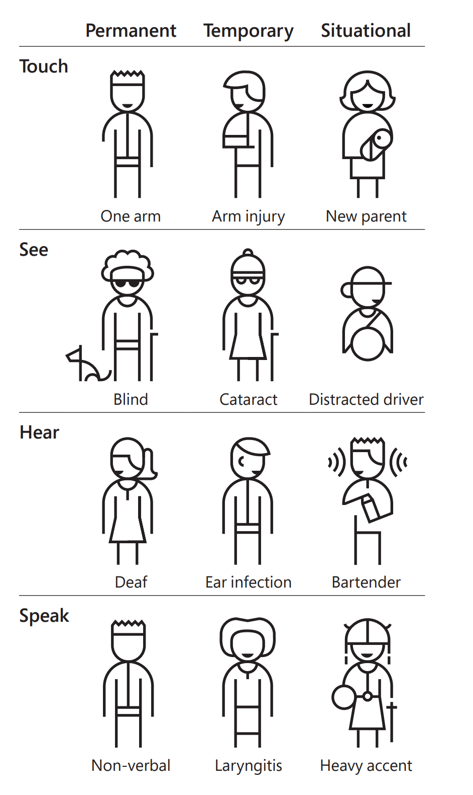

## The principles of inclusive design 

We use three core principles to approach inclusive design, creating the foundational thinking to learn from a range of people and perspectives. We seek to deliver increased access, reduced friction, and more emotional context to the greatest number of people.

The three principles are:

- Recognizing exclusion
- Solve for one, extend to many
- Learn from diversity

### Recognizing exclusion

If we use our own biases, exclusion occurs naturally and unintentionally. Much has changed since the World Health Organization originally released its formal definitions of disabilities in 1980. Our understanding of limitations under the label of "disability" has changed over time. Originally, it was described as a personal attribute.

Returning to Inclusive Microsoft Design: "In the context of health experience, a disability is any restriction or lack of ability (resulting from an impairment) to perform an activity in the manner or within the range considered normal for a human being."

In 2001, the updated view focused on disability as being context-dependent: "Disability is not just a health problem. It is a complex phenomenon, reflecting the interaction between features of a person's body and features of the society in which he or she lives."

The goal is to embrace the disparity between individuals and their situation, environment, and society at large.

> [!div class="mx-imgBorder"]
> 

Designing for inclusivity not only opens our products and services to more people, but it also reflects how people really are. All humans grow and adapt to the world around them, and we want our designs to reflect that. Disability happens at the points of interaction between a person and society. Mismatched interactions result in physical, cognitive, and social exclusion. It's a designer's responsibility to know how designs affect these interactions and create mismatches. Points of exclusion help generate new ideas and inclusive designs. They highlight opportunities to create solutions with utility and elegance for many people.

> [!div class="mx-imgBorder"]
> 

Finally, recognizing that exclusion isn't always permanent helps us to expand our awareness beyond the obvious. For instance, exclusion can be temporary. This could range from things like a broken appendage requiring a cast (short-term injury) to something contextual, such as trying to order a meal in a foreign country/region. Exclusion can also be situational, based on a person's environment. Distracted driving, loud environments, or simply having an overwhelming day can all be examples of how situational exclusion might present itself.

### Solve for one, extend to many

Everyone has abilities and limits to those abilities. Designing for people with permanent disabilities results in designs that can benefit a broader population. All humans have abilities and limitations and, as people interact with designs, they also experience exclusion. Inclusive design works across a spectrum of related abilities, connecting different people in similar circumstances. Seeing disability differently and understanding exclusion helps benefit more people.

When we design for a person with a permanent disability, we need to be aware that there might be individuals with similar temporary and situational limitations. For instance, closed captions were created for the hard of hearing, but they can also benefit someone who is trying to watch some webinar training in an open-office setting, or support teaching a child how to read. What we call a "Persona Spectrum" speaks to the range of people who can benefit when we solve for one and extend to many. Another example looks at solving for a permanent disability of having only one arm; the situational representation of this could include a person who has a broken arm or a new parent holding an infant. In the United States, 26,000 people a year suffer from loss of upper extremities, but when we include people with a temporary and situational impairment, the number is greater than 20 million.  

When looking at the following persona spectrum, we begin to better understand permanent, temporary, and situational scenarios as related mismatches. This becomes a powerful tool for how solutions can broadly scale, while also cultivating empathy. To accurately reflect these persona spectrums, we also need to be aware of the "Persona Network," which includes family, coworkers, friends, and others who may interact with your primary persona.

When we recognize the continuum that occurs from permanent disabilities to situational impairments, we can scale to serve more people in new ways.

> [!div class="mx-imgBorder"]
> 

When we aim to build experiences that unify people and embrace individuality, we have an opportunity to create rooted interactions with people and objects in the world around us. Seeing disability differently and understanding exclusion helps us extend a solution for one person into a solution for millions of people.

### Learn from diversity

Finally, learning from diversity is the principle at the heart of inclusive design because it places people at the center of the process from the start. Human beings are the true experts in adapting to diversity. Their fresh, unique, and diverse perspectives are the key to real insight. Humans can adapt when experiences and environments don't serve them as needed. This can happen in surprising ways that the designers never intended, providing extraordinary and impactful insights. When we observe and learn from the unique nature of humans, their emotional situation, and how they navigate their environment, product design is improved.

There's a saying in the disability community: nothing about us without us. We design with people who have disabilities, not for people with disabilities. For example, when creating the Xbox Adaptive Controller, the team engaged the accessible gaming community to gain insights into device functionality, what it enables, and to understand how the device's form reflects on the user. One organization expressed concern when learning that the new device would not look like a traditional gaming controller. They were worried that people with disabilities would feel left out. There was an idea that the traditional game controller would continue to be just that, but the new device would be something else.

It was a vital insight that shows how the things that people need to use can also stigmatize them, and also demonstrates how the device's form reflects on the user; for instance, people who need to use obviously "medical" equipment like wheelchairs to live and work in the world. Also, a lot of existing technology in areas like gaming tends to be candy-colored and look like toys, because the industry is trying to engage parents to purchase these items for their children. The adults who use the products might feel they're being treated as children. After the Xbox Adaptive Controller was released, the reviews and feedback reflected the insights gained from designing for people with disabilities. Even children in classrooms, who refused to use other assistive technology required for learning, were willing to use the Xbox Adaptive Controller because it was "cool!"

When placing people at the center of this process, empathy is an essential part of gaining insight. When building empathy for exclusion and disability, it's misleading to rely only on simulating different abilities through blindfolds and earplugs. Learning how people adapt to the world around them means spending time understanding their experience from their perspective. When this learning is done well, we can recognize more than just the barriers that people encounter. We also recognize the motivations that all people have in common.

We can try to imagine how a person with a given set of abilities would use an experience, but we can't imagine their emotional context, what gives them joy, or what frustrates them. Insights come when we understand those adaptations and what's shared across everyone's experiences.

How do we take these three principles and begin walking down the path of designing inclusively? What components do we need to be aware of to weave together the fabric that will eventually lead to impactful design? We must understand the aspects of function that will help create a path toward the goal.
