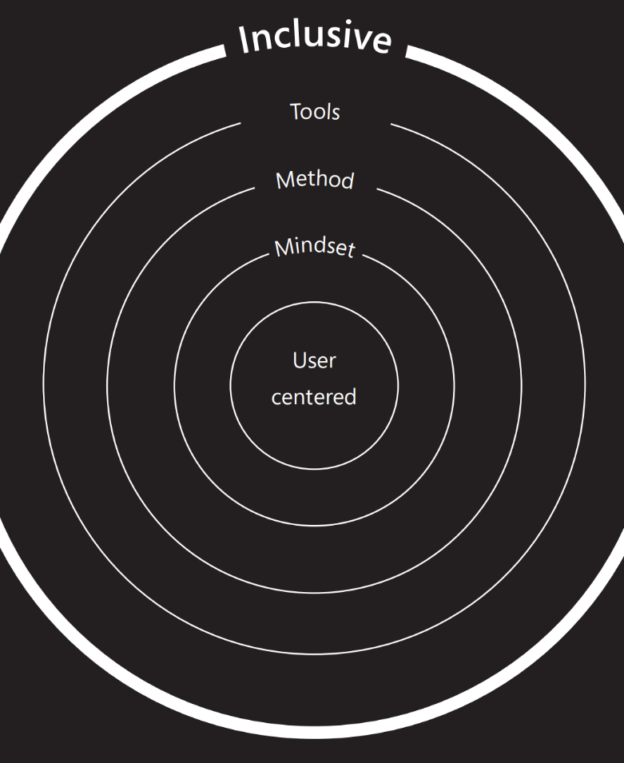

Inclusive design is a set of perspectives and practices that champion human diversity.

We use the following three simple design principles to guide the mindset and bring awareness:

- Recognizing exclusion
- Solve for one, extend to many
- Learn from diversity

Being inclusive begins with changing our perception. The benefits of designing through these practices pays off in many ways, including:

- Increased access.
- Reduced friction.
- More emotional context.

Traditional user-centered design has many techniques to clarify human needs, from personas to scenarios to usability testing. However, we also need tools that reintroduce diversity back into our design process. We need ways to check, balance, and measure the inclusivity of our designs.

The impact of inclusive design is more than just the products that people use. It's also a shift in our mindset, methods, and behaviors. Measuring the benefits includes measuring the shift in our culture and ourselves. This illustrates that what we design is a byproduct of how we design.

> [!div class="mx-imgBorder"]
> 

## References

- [Microsoft Design, Inclusive 1010 Toolkit – Manual](https://inclusive.microsoft.design/)
- [United States Census Bureau](https://www.census.gov/)
- [Limbs for Life Foundation](https://www.limbsforlife.org/about)
- [Amputee Coalition](https://www.amputee-coalition.org/)
- [Disability Statistics Center at the UCSF](https://disability.ucsf.edu/)
