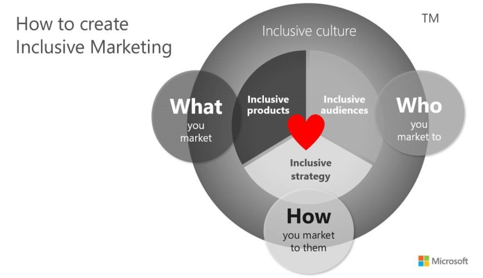

## Creating inclusive marketing

Inclusive Marketing is an operating model developed by Microsoft Advertising, it consists of three concepts focusing on the basics of what, who, and how. By being curious and uncovering exclusions, we can drive innovation:

- What you market, such as an inclusively designed product.
- Who you market to, such as an audience that typically isn’t considered part of mainstream society or a part of the majority—with authentic, representative creative that reflects that diverse population.
- How you market, such as search campaigns planned with inclusive consumer decision journey insights. An accessible marketing event experience, or campaign alignment with a supported cause that authentically aligns to your brand’s mission.

Having a growth mindset remains at the heart of uncovering these opportunities. This mindset is rooted in inclusion, deliberate curiosity, and an intimate understanding of your customer’s needs. It’s a mindset that shifts the way you see your business and changes forever how you go to market.

> [!div class="mx-imgBorder"]
> 

This model provides the flexibility to focus on one or all of the sections to help guide your thinking and approach. It's open to interpretation and to support creativity to support your brand and help fit your marketing goals.

## Proximity -> Empathy -> Insight -> Uncover exclusions -> Innovation

Where do you begin? Like inclusive design, you need to get close to your customers, especially customers that aren’t like you. Proximity is essential, and enables you to better understand how someone might be excluded from an experience, a product, or piece of information. This closeness helps create empathy, which in turn provides valuable insight.

The new knowledge of the customer experience drives innovation in the product you develop, who you market to, or how you market to them. This insight enables you to solve the exclusion you uncovered, and create new business impact. That solution can also span across new services—a new app, new audience marketing campaigns, or a content strategy—but at the heart of these new opportunities is inclusively thinking about others. Inclusive approaches to business report three times higher levels of innovation, along with better decision-making.

## Inclusive Marketing IS your campaign

If you take the time to understand your customer and the new trending consumer viewpoints, no additional budget is needed to embrace the journey. Couple this approach with enduring human values that span diverse populations, and your campaign can touch everyone’s hearts. If we highlight diversity along with a common human value that most people share, such as coming-of-age challenges, love of family, desire for success, community, having opportunities—or even the love of music or dance—we not only make the edge of a community feel understood and welcomed, but we also include the entire market with this inclusive storytelling strategy.

For example, imagine a young girl who loves football watching the Microsoft Surface ad titled “Be the One”, which features Katie Sowers as the first woman to coach in the NFL. The girl also watches the Super Bowl, so a connection is made. Inspiration and aspirations meet, so the girl now sees herself in coach Sowers. Parents feel supported in highlighting that their young girls can be trailblazers and are able to achieve in a male-dominated arena. Or, if you’re part of the LGBTQI+ community, you can also feel a connection to the Microsoft brand because Katie is openly gay. The Surface campaign also included a commercial called, “When inspiration strikes bring it to the surface,” that featured black, gay, entrepreneur Maurice Harris. Maurice’s story is about becoming successful by being his authentic self and “bringing his inspiration to the surface” by following his passion as a floral sculptor. Both of these commercials are about real people telling their inspiring stories. Stories that align to a common human value of triumph, achievement and being recognized for their accomplishments, while representing a diverse part of society. That common human value threaded throughout, is what makes their story so authentic.

Finally, evolve your thinking to create more possibilities. Our world is becoming more diverse every day. Younger generations are introducing new paradigms of consumerism. Older generations are also evolving their purchase considerations. The more digitally connected our world becomes, the more human diversity shapes our experiences with a broader array of inputs. Marketers are being called to represent the global customer’s needs with an inclusive audience marketing strategy that can bring local, personalized relevance.

Inclusion matters to business impact and there’s never been a better business case for empathy for our customers. Understanding the size of these trends and communicating to the individuals within these communities that they’re valued, that their needs matter, and that their individual experience and differences are essential, is crucial. Consumers are evolving their thinking about brand interaction to one that’s based more on common values versus being transactional. They use buying power to align to what they believe in and support.
