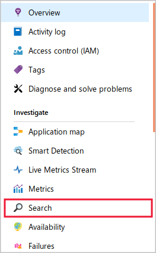
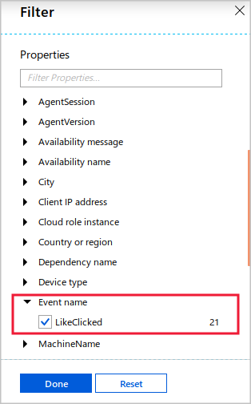

You can generate custom events and metrics from an app by using the `TelemetryClient` object from the Application Insights SDK.

For the video app, the development team has added and initialized the SDK in their code, and is ready to start adding logic to generate data about application-specific events and measurements.

In this exercise, you'll instrument your code with a custom event, run it to generate event occurrences, and view the results in the Azure portal.

## Add an action to the app

In this exercise, we'll track an event based on a user action. We'll present a **Like** button to users of the video app. When they select it, the code that runs will track an occurrence of an event called `Liked` as part of its work.

On the main page of the app, let's add the button and action.

1. Open the Cloud Shell editor if it isn't open already.

   ```bash
   cd videowebapp
   code .
   ```

1. To open *Views/Home/Index.cshtml*, use the file navigator of the Azure Cloud Shell editor.

1. At the bottom of the file, paste the following code to add a button.

   ```html
   <div>
       @using (Html.BeginForm("Like","Home"))
       {
           <input type="submit" value="Like" />
           <div>@ViewBag.Message</div>
       }  
   </div>
   ```

1. To open *Controllers/HomeController.cs*, use the file navigator.

1. To add an action that will run in response to the button click, add the following method inside the `HomeController` class.

   ```csharp
   [HttpPost]
   public ActionResult Like(string button)
   {
       ViewBag.Message = "Thank you for your response";
       return View("Index");
   }
   ```

## Instantiate the TelemetryClient object and track metrics

Now that you have a button in your app, and some code that will run when a user selects it, to send telemetry, you can add code that uses the Application Insights SDK.

1. Still working in *HomeController.cs*, at the top of the code file, add the `ApplicationInsights` using statement.

   ```csharp
   using Microsoft.ApplicationInsights;
   ```

1. At the top of the `HomeController` class, create a `TelemetryClient` field named `aiClient`.

   ```csharp
   private TelemetryClient aiClient;
   ```

1. Add a constructor to the `HomeController` class that accepts a `TelemetryClient` object, and assign it to your `aiClient` field.

   ```csharp
   public HomeController(TelemetryClient aiClient)
   {
       this.aiClient = aiClient;
   }
   ```

1. Within the **Like** action, before the two existing lines of code, call `TrackEvent` on `aiClient`.

   ```csharp
   this.aiClient.TrackEvent("LikeClicked");
   ```

1. Save any open files, and close the code editor.

## Deploy the web app and generate data

In the Cloud Shell from within the *videowebapp* folder, to build the application and deploy it to App Service, run the following commands.

   ```azurecli
   dotnet publish -o pub
   cd pub
   zip -r site.zip *

   az webapp deployment source config-zip \
       --src site.zip \
       --resource-group <rgn>[sandbox resource group name]</rgn> \
       --name <your-App-Service-name>
   ```

## Run the app and generate telemetry data

1. When the deployment is complete, switch to the Azure portal. To navigate to your web app, use the **All resources** view.

1. On the **Overview** page for your web app, select **Browse**. The web app opens in a new tab.

1. Near the bottom of the page, select **Like**. The page will reload and display the "Thank you for your response" message. To simulate multiple clicks entering the app, select the **Like** button a few more times.

1. Close the browser tab and return to the Azure portal.

## View information in the Azure portal

To locate and display the events you just created, use the Application Insights search tool. Perform the following steps.

1. On the left nav bar, under **Settings**, select **Application Insights**. In the Application Insights window, to go to the app's Application Insights resource, select **Application Dashboard** from the top menu.

1. On the left nav bar, under **Investigate**, select **Transaction search**.

    

1. At the top of the window, select the **Filters** icon, and then select **Clear filters**.

1. In the **Filter** window, scroll down to the **Properties** section, and then expand **Event name**.

1. Select **LikeClicked**, and then select **Done**.

    

    > [!NOTE]
    > If **LikeClicked** isn't available in the **Event names** section, close the **Filter** window, near the top of the Application Insights window, select the **Refresh** button, and wait a moment before re-opening the **Filter** window to try again. Telemetry data generated by your app is buffered and sent to the Application Insights resource in bursts. It might not arrive for a minute or two after the event has occurred. Until the first occurrence of the `LikeClicked` event arrives, it won't be available for filtering.

1. Close the **Filter** window. The search tool shows all the `LikeClicked` events you recorded in a timeline and a list.
