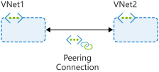
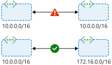

You can use virtual network peering to directly connect Azure virtual networks. When you use peering to connect virtual networks, virtual machines (VMs) in these networks can communicate with each other as if they were in the same network. 

In peered virtual networks, traffic between virtual machines is routed through the Azure network. The traffic uses only private IP addresses. It doesn't rely on internet connectivity, gateways, or encrypted connections. The traffic is always private, and it takes advantage of the high bandwidth and low latency of the Azure backbone network.

The two types of peering connections are created in the same way:

- **Virtual network peering** connects virtual networks in the same Azure region, such as two virtual networks in North Europe.
- **Global virtual network peering** connects virtual networks that are in different Azure regions, such as a virtual network in North Europe and a virtual network in West Europe.

Virtual network peering doesn't affect or disrupt any resources that you've already deployed to the virtual networks. But when you use virtual network peering, consider the key features that the following sections define.

## Reciprocal connections

When you create a virtual network peering connection in only one virtual network to connect to a peer in another network, you're not connecting the networks together. To connect the networks by using virtual network peering, you have to create connections in each virtual network. 

Think of how you connect two network switches together. You connect a cable to each switch and maybe configure some settings so that the switches can communicate. Virtual network peering requires similar connections in each virtual network. Reciprocal connections provide this functionality.

## Cross-subscription virtual network peering

You can use virtual network peering even when both virtual networks are in different subscriptions. This might be necessary for mergers and acquisitions or to connect virtual networks in subscriptions that different departments manage. Virtual networks can be in different subscriptions, and the subscriptions can use the same or different Azure Active Directory tenants. 

When you use virtual network peering across subscriptions, you might find that an administrator of one subscription doesn't administer the peer network's subscription. The administrator might not be able to configure both ends of the connection. To peer the virtual networks when both subscriptions are in different Azure Active Directory tenants, the administrators of each subscription must grant the peer subscription's administrator the `Network Contributor` role on their virtual network.

## Transitivity

Virtual network peering is nontransitive. Only virtual networks that are directly peered can communicate with each other. The virtual networks can't communicate with the peers of their peers. 

Suppose, for example, that your three virtual networks (A, B, C) are peered like this: A <-> B <-> C. Resources in A can't communicate with resources in C because that traffic can't transit through virtual network B. If you need communication between virtual network A and virtual network C, you must explicitly peer these two virtual networks.

## Gateway transit

You can configure transitive connections on-premises if you use virtual network gateways as transit points. Using gateway transit, you can enable on-premises connectivity without deploying virtual network gateways to all your virtual networks. This method might reduce cost and complexity. By using gateway peering, you can configure a single virtual network as a hub network. Connect this hub network to your on-premises datacenter and share its virtual network gateway with peers. 

To enable gateway transit, configure the **Allow gateway transit** option in the hub virtual network where you deployed the gateway connection to your on-premises network. Also configure the **Use remote gateways** option in any spoke virtual networks.

> [!NOTE]
> If you want to enable the **Use remote gateways** option in a spoke network peering, you can't deploy a virtual network gateway in the spoke virtual network.

## Overlapping address spaces

IP address spaces of connected networks within Azure and between Azure and your on-premises system can't overlap. This is also true for peered virtual networks. Keep this rule in mind when you're planning your network design. In any networks you connect through virtual network peering, VPN, or ExpressRoute, assign different address spaces that don't overlap.

## Alternative connectivity methods

Virtual network peering is the least complex way to connect virtual networks. Other methods focus primarily on connectivity between on-premises and Azure networks rather than connections between virtual networks.

You can also connect virtual networks together through the ExpressRoute circuit. ExpressRoute is a dedicated, private connection between an on-premises datacenter and the Azure backbone network. The virtual networks that connect to an ExpressRoute circuit are part of the same routing domain and can communicate with each other. ExpressRoute connections don't go over the public internet, so your communications with Azure services are as secure as possible.

VPNs use the internet to connect your on-premises datacenter to the Azure backbone through an encrypted tunnel. You can use a site-to-site configuration to connect virtual networks together through VPN gateways. VPN gateways have higher latency than virtual network peering setups. They're more complex to manage, and they can cost more. 

When virtual networks are connected through both a gateway and virtual network peering, traffic flows through the peering configuration.

## When to choose virtual network peering

Virtual network peering can be a great way to enable network connectivity between services that are in different virtual networks. Because it's easy to implement and deploy, and it works well across regions and subscriptions, virtual network peering should be your first choice when you need to integrate Azure virtual networks.

Peering might not be your best option if you have existing VPN or ExpressRoute connections or services behind Azure Basic Load Balancers that would be accessed from a peered virtual network. In these cases, you should research alternatives.
