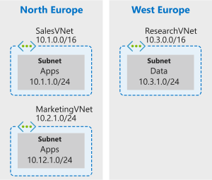

Your company is now ready to implement VNet peering to enable connectivity between systems deployed in different VNets. To test this out, you'll start by creating the virtual networks to support the services your company is already running in Azure. To do this, you need three virtual networks:

- The **Sales** VNet is deployed in **North Europe**. This VNet is used by the Sales systems and processes data input directly after customer engagement. The Sales team would like access to Marketing data.
- The **Marketing** VNet is deployed in **North Europe**. This VNet is used by the Marketing systems. Members of the Marketing team regularly chat with the Sales team, but must currently download their data before sharing it with the Sales team, as their systems do not currently have network connectivity between each other.
- The **Research** VNet is deployed in **West Europe**. This VNet is used by the Research systems. Members of the Research team have a logical working relationship with Marketing, but they do not want the Sales team to have direct access to their data.



You'll create the following resources:

| VNet | Region | VNet address space | Subnet | Subnet address space |
| ---- | ------ | ------------------ | ------ | -------------------- |
| SalesVNet | North Europe | 10.1.0.0/16 | Apps | 10.1.1.0/24 |
| MarketingVNet | North Europe | 10.2.0.0/16 | Apps | 10.2.1.0/24 |
| ResearchVNet | West Europe | 10.3.0.0/16 | Data | 10.3.1.0/24 |

[!include[](../../../includes/azure-sandbox-activate.md)]

## Create the virtual networks

1. Run the following command in the Cloud Shell to create the VNet and subnet for the **Sales** systems.

   ```azurecli
   az network vnet create --resource-group <rgn>[sandbox resource group name]</rgn> \
       --name SalesVNet \
       --address-prefix 10.1.0.0/16 \
       --subnet-name Apps \
       --subnet-prefix 10.1.1.0/24 \
       --location northeurope
   ```

1. Run the following command in the Cloud Shell to create the VNet and subnet for the **Marketing** systems.

   ```azurecli
   az network vnet create --resource-group <rgn>[sandbox resource group name]</rgn> \
       --name MarketingVNet \
       --address-prefix 10.2.0.0/16 \
       --subnet-name Apps \
       --subnet-prefix 10.2.1.0/24 \
       --location northeurope
   ```

1. Run the following command in the Cloud Shell to create the VNet and subnet for the **Research** systems.

   ```azurecli
   az network vnet create --resource-group <rgn>[sandbox resource group name]</rgn> \
       --name ResearchVNet \
       --address-prefix 10.3.0.0/16 \
       --subnet-name Data \
       --subnet-prefix 10.3.1.0/24 \
       --location westeurope
   ```

## Confirm virtual network configuration

Let's take a quick look at what we just created.

1. Run the following command in the Cloud Shell to view the virtual networks.

   ```azurecli
   az network vnet list --output table
   ```

1. You should see an output similar to the following:

    ```output
    Name           ResourceGroup                        Location    NumSubnets   Prefixes    DnsServers   DDOSProtection   VMProtection
    -------------- ------------------------------------ ----------- ------------ ----------- ------------ ---------------- --------------
    MarketingVNet <rgn>[sandbox resource group name]</rgn> northeurope 1            10.2.0.0/16              False            False
    SalesVNet     <rgn>[sandbox resource group name]</rgn> northeurope 1            10.1.0.0/16              False            False
    ResearchVNet  <rgn>[sandbox resource group name]</rgn> westeurope  1            10.3.0.0/16              False            False
    ```

## Create virtual machines in each virtual network

You're now going to deploy some Ubuntu virtual machines in each of the virtual networks to simulate the services residing in each VNet. In the final unit, you'll use these VMs to test connectivity between the virtual networks. For each virtual machine, be sure to note the password, as you'll need it later.

1. Run the following command in the Cloud Shell to create an Ubuntu virtual machine in the **Apps** subnet of the **SalesVNet**. Replace the `<password>` with a password that meets the [password requirements for Linux VMs](https://docs.microsoft.com/azure/virtual-machines/linux/faq?azure-portal=true#what-are-the-password-requirements-when-creating-a-vm). Note this password for later use.

    ```azurecli
    az vm create --resource-group <rgn>[sandbox resource group name]</rgn> \
        --no-wait \
        --name SalesVM \
        --location northeurope \
        --vnet-name SalesVNet \
        --subnet Apps \
        --image UbuntuLTS \
        --admin-username azureuser \
        --admin-password <password>
    ```

    > [!NOTE]
    > The `--no-wait` parameter in the above command lets you continue working in the Cloud Shell without waiting for the virtual machine to complete building.

1. Run the following command in the Cloud Shell to create another Ubuntu virtual machine in the **Apps** subnet of the **MarketingVNet**. Replace the `<password>` with a password that meets the [password requirements for Linux VMs](https://docs.microsoft.com/azure/virtual-machines/linux/faq?azure-portal=true#what-are-the-password-requirements-when-creating-a-vm). Note this password for later use.

    ```azurecli
    az vm create --resource-group <rgn>[sandbox resource group name]</rgn> \
        --no-wait \
        --name MarketingVM \
        --location northeurope \
        --vnet-name MarketingVNet \
        --subnet Apps \
        --image UbuntuLTS \
        --admin-username azureuser \
        --admin-password <password>
    ```

1. Finally, run the following command in the Cloud Shell to  create an Ubuntu virtual machine in the **Data** subnet of the **ResearchVNet**. Replace the `<password>` with a password that meets the [password requirements for Linux VMs](https://docs.microsoft.com/azure/virtual-machines/linux/faq?azure-portal=true#what-are-the-password-requirements-when-creating-a-vm). Note this password for later use.

    ```azurecli
    az vm create --resource-group <rgn>[sandbox resource group name]</rgn> \
        --no-wait \
        --name ResearchVM \
        --location westeurope \
        --vnet-name ResearchVNet \
        --subnet Data \
        --image UbuntuLTS \
        --admin-username azureuser \
        --admin-password <password>
    ```

    It may take several minutes for the virtual machines to be in a running state.

1. To confirm that the virtual machines are running, use the following command, replacing `<vm-name>` with the name of the VM you want to check:

    ```azurecli
    az vm get-instance-view --resource-group <rgn>[sandbox resource group name]</rgn> \
        --output table \
        --name <vm-name>
    ```

    A **ProvisioningState** of **Succeeded** and a **PowerState** of **VM running** indicates a successful deployment. Once your VMs are running, you're ready to move on.
