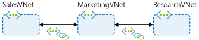
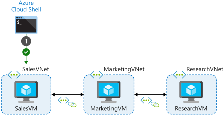
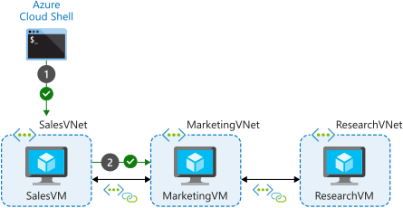
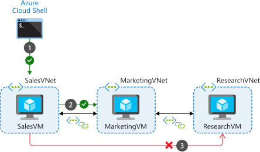
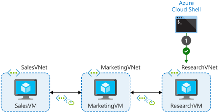
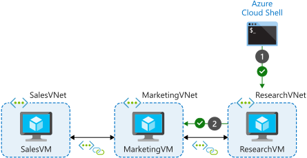
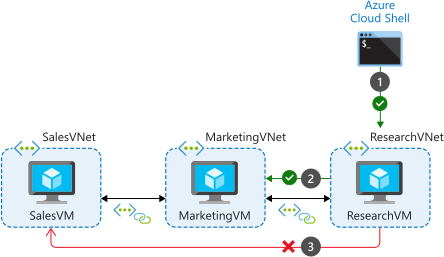
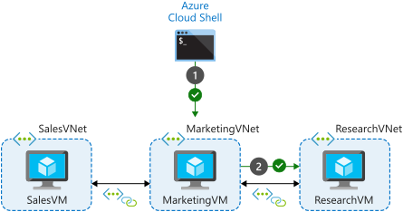
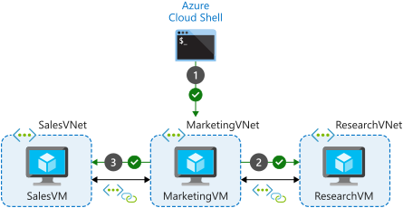

In the previous unit, you configured the VNet peering connections between the VNets to enable resources to communicate with each other. This configuration is an example of a hub and spoke topology, with the MarketingVNet as the hub, and with SalesVNet and ResearchVNet as spokes.



Remember, peering connections are non-transitive; intermediate VNets do not allow connectivity to flow through them to connected VNets. **SalesVNet** can communicate with **MarketingVNet**. **ResearchVNet** can communicate with **MarketingVNet**. **MarketingVNet** can communicate with both **SalesVNet** and **ResearchVNet**. The only communication that is not permitted is between the **SalesVNet** and **ResearchVNet**. Even though they are both connected to the **MarketingVNet**, they cannot communicate between each other unless directly peered to each other.

Let's confirm this connectivity across the peering connections. To do this, you'll first create a connection from the Azure Cloud Shell to a target VM's *public* IP. Then you'll connect from the target to the destination VM using the destination's *private* IP address.

> [!IMPORTANT]
> To test connectivity across the VNet peering connection, you must connect to the private IP address assigned to each VM.

1. To connect to your VMs, you'll use SSH (Secure Shell) directly from the Azure Cloud Shell. The first step, when using SSH, is to find the public IP addresses that have been assigned to your test virtual machines.

1. Run the following command in the Cloud Shell to list the IP addresses that you'll use to connect to the VMs:

   ```azurecli
    az vm list --resource-group <rgn>[sandbox resource group name]</rgn> \
        --query "[*].{Name:name, PrivateIP:privateIps, PublicIP:publicIps}" \
        --show-details \
        --output table
    ```

1. Record the output so that you can use the IP addresses during the exercises in this unit.

Before starting the tests, using what you have learned in this module so far, what do you expect the results to be? What virtual machines do you expect will and will not be able to communicate with each other?

## Test connections from SalesVM

In the first test, you'll use SSH to connect from the Azure Cloud Shell to the public IP address of **SalesVM**. You'll then attempt to connect from **SalesVM** to **MarketingVM** and **ResearchVM**.

1. Run the following command in the Cloud Shell to SSH to the public IP address of **SalesVM**, replacing `<SalesVM public IP>` with the **public** IP address of this VM.

   ```bash
   ssh azureuser@<SalesVM public IP>
   ```

   

1. Type `yes` to accept the security warning.

1. Sign in with the password that you used when you created the VM.

1. The prompt now shows you are logged on to the **SalesVM**.

1. Run the following command in the Cloud Shell to SSH to the private IP address of the **MarketingVM**, replacing `<MarketingVM private IP>` with the **private** IP address of this VM.

   ```bash
   ssh azureuser@<MarketingVM private IP>
   ```

   

1. The connection attempt should be successful because there is a VNet peering connection between the **SalesVNet** and **MarketingVNet** virtual networks.

1. Accept the warning as before, then sign in with the password used to create the VM.

1. Type `exit` to close this SSH session, returning to the **SalesVM** prompt.

1. Run the following command in the Cloud Shell to SSH to the private IP address of the **ResearchVM**, replacing `<ResearchVM private IP>` with the **private** IP address of this VM.

   ```bash
   ssh azureuser@<ResearchVM private IP>
   ```

1. The connection attempt should fail because there is no VNet peering connection between the **SalesVNet** and **ResearchVNet** virtual networks. It may take up to 60 seconds before the connection attempt fully times out. To forcefully stop the attempt, you can use Ctrl-C.

   

1. Type `exit` to close the SSH session and return to the Azure Cloud Shell.

## Test connections from ResearchVM

In the second test, you'll use SSH to connect from the Azure Cloud Shell to the public IP address of **ResearchVM**. You'll then attempt to connect from **ResearchVM** to **MarketingVM** and **SalesVM**.

1. Run the following command in the Cloud Shell to SSH to the public IP address of **ResearchVM**, replacing `<ResearchVM public IP>` with the **public** IP address of this VM.

   ```bash
   ssh azureuser@<ResearchVM public IP>
   ```

   

1. Type `yes` to accept the security warning.

1. Sign in with the password that you used when you created the VM.

1. The prompt now shows you are logged on to the **ResearchVM**.

1. Run the following command in the Cloud Shell to SSH to the private IP address of the **MarketingVM**, replacing `<MarketingVM private IP>` with the **private** IP address of this VM.

   ```bash
   ssh azureuser@<MarketingVM private IP>
   ```

   

1. The connection attempt should be successful because there is a VNet peering connection between the **ResearchVNet** and **MarketingVNet** virtual networks.

1. Accept the warning as before, then sign in with the password used to create the VM.

1. Type `exit` to close this SSH session, returning to the **ResearchVM** prompt.

1. Run the following command in the Cloud Shell to SSH to the private IP address of the **SalesVM**, replacing `<SalesVM private IP>` with the **private** IP address of this VM.

   ```bash
   ssh azureuser@<SalesVM private IP>
   ```

1. The connection attempt should fail because there is no VNet peering connection between the **ResearchVNet** and **SalesVNet** virtual networks. It may take up to 60 seconds before the connection attempt fully times out. To forcefully stop the attempt, you can use Ctrl-C.

   

1. Type `exit` to close the SSH session and return to the Azure Cloud Shell.

## Test connections from Marketing VM

In the final test, you'll use SSH to connect from the Azure Cloud Shell to the public IP address of **MarketingVM**. You'll then attempt to connect from **MarketingVM** to **ResearchVM** and **SalesVM**.

1. Run the following command in the Cloud Shell to SSH to the public IP address of **MarketingVM**, replacing `<MarketingVM public IP>` with the **public** IP address of this VM.

   ```bash
   ssh azureuser@<MarketingVM public IP>
   ```

   

1. Type `yes` to accept the security warning.

1. Sign in with the password that you used when you created the VM.

1. The prompt now shows you are logged on to the **MarketingVM**.

1. Run the following command in the Cloud Shell to SSH to the private IP address of the **ResearchVM**, replacing `<ResearchVM private IP>` with the **private** IP address of this VM.

    ```bash
    ssh azureuser@<ResearchVM private IP>
    ```

    

1. The connection attempt should be successful because there is a VNet peering connection between the **MarketingVNet** and **ResearchVNet** virtual networks.

1. Accept the warning as before, then sign in with the password used to create the VM.

1. Type `exit` to close this SSH session, returning to the **MarketingVM** prompt.

1. Run the following command in the Cloud Shell to SSH to the private IP address of the **SalesVM**, replacing `<SalesVM private IP>` with the **private** IP address of this VM.

   ```bash
   ssh azureuser@<SalesVM private IP>
   ```

1. The connection attempt should also be successful because there ***is*** a VNet peering connection between the **MarketingVNet** and **SalesVNet** virtual networks.

   

1. Accept the warning as before, then sign in with the password used to create the VM.

1. Type `exit` to close this SSH session, returning to the **MarketingVM** prompt.

1. Type `exit` to close the SSH session and return to the Azure Cloud Shell.

This was a simple test using SSH, but demonstrates that network connectivity was available between peered VNets, and was not available for transitive connections. If these servers were running application services, the connectivity enabled here would allow for the services running on the VMs to communicate, enabling the business to share data across departments as required.