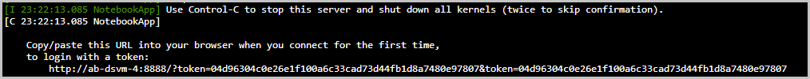

As a software developer at your company, you've the opportunity to grow your skills and become part of the in-house AI team. While you ramp-up on this exciting new role, you still have your day job to do. The senior AI engineer on your team has told you about some useful Jupyter notebooks that have PyTorch-based labs to train an image classification model. Exciting stuff, but you don't want to install a set of frameworks onto your dev rig. Instead, you decide to create a virtual machine based on the Data Science Virtual Machine (DSVM) image. 

[!include[](../../../includes/azure-sandbox-activate.md)]

## What is the Azure CLI

The Azure CLI is Microsoft's cross-platform command-line tool for managing Azure resources. It's available for macOS, Linux, and Windows, or in the browser using [Azure Cloud Shell](https://docs.microsoft.com/azure/cloud-shell/overview). We have complete coverage of using this tool in the **Control Azure services with the CLI** module.

## Managing deployments

The Azure CLI includes the `az group deployment` command to manage Azure Resource Manager deployments. We can supply several subcommands to do specific tasks. The most common include:

| Subcommand | Description |
|-------------|-------------|
| `create` | Start a deployment. |
| `list` | Get all the deployments for a resource group. |
| `export` | Export the template used for a deployment. |

For a complete list of available deployment commands, see the [az group deployment command reference](https://docs.microsoft.com/cli/azure/group/deployment?view=azure-cli-latest#az-group-deployment-create)

We'll use `az group deployment create` to provision our virtual machine.

## Create a JSON deployment parameters file

We're going to create our VM using an Azure Resource Manager template. The template defines the Linux DSVM image we want to provision. We need to supply some parameters to the template, such as the VM size we want to use, the admin username and password, and the host name of our machine. 

1. Execute the following command in Azure Cloud Shell to the right of this unit:

    ```azurecli
    code .
    ```
    <!-- TODO add a link to official doc that explains the built-in editor when it becomes available -->
    This command opens and empty file in the built-in editor. 

1. Paste the following JSON snippet into the empty file in the code editor.

    ```json
    { 
      "$schema": "https://schema.management.azure.com/schemas/2015-01-01/deploymentParameters.json#",
      "contentVersion": "1.0.0.0",
      "parameters": {
         "adminUsername": { "value" : "<USERNAME>"},
         "adminPassword": { "value" : "<PASSWORD>"},
         "vmName": { "value" : "<HOSTNAME>"},
         "vmSize": { "value" : "Standard_DS2_v2"},
      }
    }
    ```

1. Update the following parameters in the JSON you pasted in the editor:

    |Parameter  |Current value  |Your value  |
    |---------|---------|---------|
    |adminUsername     |  `<USERNAME>`       |    Choose a name for the admin user of this new machine, such as, *azuser*.     |
    |adminPassword     |  `<PASSWORD>`       |   Choose a password for this admin user account. To learn more about password requirements, see [Frequently asked question about Linux Virtual Machines](https://docs.microsoft.com/azure/virtual-machines/linux/faq?azure-portal=true)     |
    |vmName     |   `<HOSTNAME>`      |  Choose a name for the new virtual machine. Your name must begin with a letter and contain only lowercase letters and numbers. Try to choose a unique name, such as one that includes your initials and your birth year. |
    |vmSize     |  Standard_DS2_v2       |  This VM size will work fine for this exercise, but you are free to change it. A list of available vm sizes can be found here [Sizes for Linux virtual machines in Azure](https://docs.microsoft.com/azure/virtual-machines/linux/sizes?azure-portal=true)       |

1. Select the three ellipses (**...**) to the top right of the editor and then select **Save** from the menu to save the file as `parameter_file.json` and close the text editor.

    > [!IMPORTANT]
    > Remember the values you chose for adminUsername, adminPassword and vmName. We'll use them again in this exercise.

## Create a resource group 

> [!IMPORTANT]
> Normally you'd create a resource group in a region of your choice. However, the sandbox session you are currently in supplies a resource group for you to use. Your resource group for this session is **<rgn>[sandbox resource group name]</rgn>**.

## Deploy the DSVM to your resource group

We now have a resource group and have defined parameters for the DSVM Resource Manager template in a file called `parameter_file.json`. We'll run the `az group deployment create` next to provision our virtual machine.

1. Execute the following command in Azure Cloud Shell:

    ```azurecli
    az group deployment create \
    --resource-group  <rgn>[sandbox resource group name]</rgn> \
    --template-uri https://raw.githubusercontent.com/Azure/DataScienceVM/master/Scripts/CreateDSVM/Ubuntu/azuredeploy.json \
    --parameters parameter_file.json
    ```

    [!include[](../../../includes/azure-cloudshell-copy-paste-tip.md)]

    The command uses the Resource Manager template and our parameters to create the virtual machine in our resource group. 

2. Deploying a virtual machine takes a few minutes to complete. The console displays ` - Running ..` and not much else until the operation completes. When the operation finishes, a JSON response is output to the screen. Scroll to the bottom of the JSON and check that the field **"provisioningState"** has the value *Succeeded*.

    > [!TIP]
    > If you get an error stating that the DNS record is already used by another public IP, try changing **vmName** in `parameter_file.json` to another name that's unique.

3. Execute the following command to get information about the VM, replacing `<HOSTNAME>` with the host name you defined for your VM.

    ```azurecli
    az vm show -d \
    --name <HOSTNAME> \
    --resource-group <rgn>[sandbox resource group name]</rgn> \
    --output table
    ```

    This command displays the status of the VM. The **PowerState** field should say *VM running*. Later in this exercise, we'll connect to the VM using the IP address in the **PublicIps** field. We could also connect using the Fully Qualified Domain Name (FQDN) displayed here in the **Fqdns** field.

Congratulations! You've created and deployed a Linux VM based on the DSVM image.

## Open the VM to ssh traffic on port 22

By default, our VM doesn't have any ports open. Our goal is to connect remotely, start a Jupyter Notebook server and run other local commands on the machine. To remote into the VM using the Secure Shell (SSH) protocol, we need to open a port. Port 22 is the default port for ssh.  

1. Execute the following command in Azure Cloud Shell, replacing `<HOSTNAME>` with the name you gave your virtual machine during setup. 

    ```azurecli
    az vm open-port \
    -g <rgn>[sandbox resource group name]</rgn> \
    -n <HOSTNAME> \
    --port 22 \
    --priority 900
    ```

This command can take up to a minute to complete. When the command finishes, it returns a JSON response to the command line. Check that the field **"provisioningState"** has the value *Succeeded*. 
We'll test that ssh works shortly, but first let's open one more port.

## Open the VM to access the Jupyter Notebook server remotely

As mentioned previously, the DSVM image comes pre-installed with software, tools, and samples to help you with your data science, machine learning, and deep learning projects. Jupyter is installed in the image, along with sample notebooks. We want to start a Jupyter notebook server on the VM and then remotely connect to the notebook server from our local machine. By default, the notebook server runs on port 8888. To access the server remotely, we need to open that port on our VM. 

1. Execute the following command in Azure Cloud Shell, replacing `<HOSTNAME>` with the name you gave your DSVM virtual machine during setup.

    ```azurecli
    az vm open-port \
    -g <rgn>[sandbox resource group name]</rgn> \
    -n <HOSTNAME> \
    --port 8888 \
    --priority 901
    ```

Again, this command can take up to a minute to complete. When the command finishes, it returns a JSON response to the command line. Check that the field **"provisioningState"** has the value *Succeeded*.  

## Connect to the VM with Secure Shell (ssh)

1. Execute the following command in Azure Cloud Shell to find the public IP address of the VM. Replace `<HOSTNAME>` with the name you gave your DSVM virtual machine during setup.

    ```azurecli
    az vm list-ip-addresses \
    -g <rgn>[sandbox resource group name]</rgn> \
    -n <HOSTNAME> \
    --output table
    ```

1. Execute the following command in the Cloud Shell to sign into the VM. Replace `<USERNAME>` with the username you chose at the start of this exercise. Replace `<IP>`  with the value from the **PublicIPAddresses** column of the previous step.

    For example, if the username you chose was *azuser* and the PublicIPAddresses had a value of 33.165.103.23, then this command would read:
    
    `ssh azuser@33.165.103.23`
    
    ```azurecli 
    ssh <USERNAME>@<IP>
    ``` 

1. When prompted, enter the password for the admin user you chose at the start of this exercise. When you've signed in successfully, your prompt should change to the format `username@hostname`, for example, `azuser@js1982`.

The next step is to start the Jupyter notebook server on our VM and open a notebook remotely.

## Start the Jupyter notebook server on the VM

There's a set of notebooks in the `~/notebooks` folder of your VM. Assuming you are still logged in through an SSH session,  start the notebook server and open one of these notebooks to make sure everything is working.


1. Run the following command at the command prompt of your VM:

    ```bash
    jupyter notebook --ip=0.0.0.0 --no-browser --allow-root
    ```

> [!CAUTION]
> Access to the notebook server in this exercise happens over `http://`. If you want to run a notebook server in public, you should secure it. For more information about securing a notebook server, see the official Jupyter documentation online. 

In the preceding command, we start the Jupyter Notebook server with the `jupyter notebook` command. We supply three important command-line arguments. Remember, we're logged into this machine remotely through a console. Notebooks are served in a browser. 

 - `--ip=0.0.0.0` By default, a notebook server runs locally at 127.0.0.1:8888 and is accessible only from localhost. You can access the notebook server from the browser locally using http://127.0.0.1:8888. Setting the IP Address to 0.0.0.0 tells the server to listen for traffic on all IPs. If the notebook server listens on 0.0.0.0, it will be reachable through the IP address of the host machine.  
 - `--no-browser`  Because we want to connect to the notebook from another computer over the internet, we configure the notebook server to not open the browser, which is the default behavior. 
 - `--allow-root`  In this exercise, we only have an admin account on the VM, so  we want to be able to run notebooks as root.

## Connect to the Jupyter Notebook server from a remote browser

When the above command runs on the VM, the notebook server starts and the console displays a URL for you to use in a browser. 



1. Copy the URL the notebook server displays into the address bar of your favorite browser. You can also click on the URL to open in your default browser. 

    You will receive a "Site can't be reached" message because the URL you were given is the connection to the notebook server from the host machine.

1. To access the server remotely,  replace the hostname in the URL with the IP address of the VM you saved earlier. 

    Here's a sample notebook server URL.

    ´http://**ab-dsvm-4**:8888/?token={some token}´

    In this case, we would replace **ab-dsvm-4** with IP address of the machine. If our IP address is `52.175.199.43`, then the URL becomes:

    ´http://**52.175.199.43**:8888/?token={some token}´

    Make sure `:8888`, the port address, is kept in the URL.

    > [!TIP]
    > If you don't want to use the IP address, you can also use the fully qualified name of your server which is in the form `<HOST NAME>.<REGION>.cloudapp.azure.com`

    The following  screenshot shows what the Jupyter dashboard looks like in your browser.

    

1. Navigate to **notebooks/IntroToJupyterPython.ipynb** and select it. Try out this notebook to verify everything  works as expected.

    Congratulations! You now have a running DSVM-based virtual machine running and can work remotely with Jupyter. In this exercise, we're running the software that was installed on the VM. In the next exercise, we'll isolate the software in a container on the VM so we can experiment with confidence.

4. When you have finished with the notebook, you can stop the Jupyter server with `Control-C` in the Cloud Shell.
