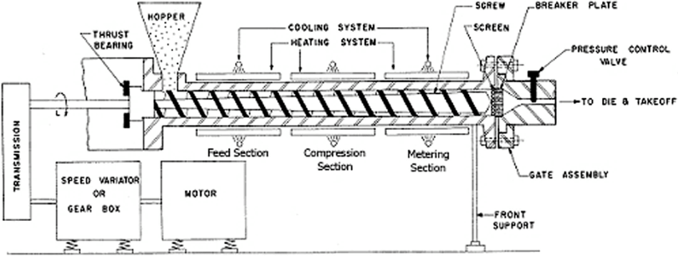

**Machine Teaching** is a new paradigm of AI that divides the problem into different tasks or modules, mimicking the skills and strategies of subject matter experts, and then combines these modules to solve the larger problem, using the technologies for each module that best fits the tasks.

Suppose you’re a part of the Engineering team and you work in a factory producing thousands of tons of soap per year. Extrusion is a common process to produce soap that heats material in an extrusion screw, then forces it through the tie at the end to press it into the preferred shape.

Soap making is a complex chemical process and difficult to control. Describing and predicting what happens to the soap inside the extruder is particularly challenging. The process is also dynamic and control methods change depending on the type of soap being made. For example, when changing over from making more oily soaps to dryer soaps, or when changing soap color. Other sources of manufacturing variability include:

- Quality changes in the raw materials
- Mechanical wear of the extruder components
- Soap residue left in the extruder from previous runs

The current control methods for this extrusion process include an industry-proven Advanced Process Control (APC) system supervised by expert operators. The operators pass supervisory commands to the APC system to implement control strategies. The APC system adjusts the line equipment based on the control strategy.

The control system can set the following control actions:

- the speed of the screw
- the temperature in different zones of the screw
- the cutting frequency

Each control parameter must be tightly controlled to produce soap that meets quality specifications.

The current automated methods have reached their maximum capability. However, the engineering team can improve product yield up to 15% by taking over manually, especially during the line changeovers. The company wants to know if Autonomous AI will be able to replicate or improve upon that (currently manual) 15% increase in productivity.

The company wants to build an Autonomous AI brain solution that:

- automatically signals their APC system
- adapts quickly to production changeovers
- applies short-term process changes when the extruder becomes coated with soap over multiple runs
- applies long-term process changes as extruder equipment wears

For any company, the knowledge of expert operators is the highest value asset. The Autonomous AI brain will store the knowledge of subject matter experts in a trained model. That brain will help operators improve manual extruder control by advising operators (on the line or in the control room). When completely trusted and fully validated, it can also control the extruder directly.

In this module, you’ll learn how you can use Machine Teaching to address scenarios such as the soap making extruder. By the end of this module, you’ll be able to understand the capabilities of Machine Teaching and evaluate the role of Machine Teaching to bring intelligence to control industrial systems.
