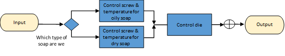
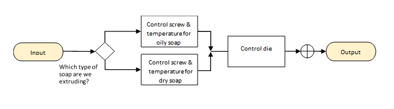

Let's practice the three step approach to brain design by sketching out a brain design for the soap extruder scenario.

## Step 1: Decompose your task into skills/modules

When the subject matter experts (engineers and expert operators) meet with the Autonomous AI Architects to design the AI brain for the soap extruder, they start by defining the problem they want to solve.

Describing and predicting what happens to the soap inside the extruder is particularly challenging. The process is dynamic and the control strategies change depending on the type of soap being made. For example, the strategies change when making oily soaps or dryer soaps, or when changing soap color.

By asking many questions to the subject matter, specially to the expert operators that gain the skill of operating the soap extruder over many years (sometimes decades), we will be able to identify the skills or modules that will be included in the brain design.

Being curious is one of the most important abilities of the Autonomous AI Architect.

The most efficient way to obtain the strategies that will become the skills or modules of our brain design is to be able to fill up the following 3-column table that includes:

- The scenario or situation that happens in the environment.
- What the expert operator thinks it means when the scenario happens.
- What the expert operator does when the scenario happens. A strategy is a labeled course of action that describes what to do in a specific scenario. It's an action, therefore expressed with a verb and it will be the name of the skill or module of our brain design.

For the soap extruder example here's the 3-column table:

| When the scenario looks like this (problem) | What we think it means (cause)    | Do this (response)          |
| ------------------------------------------- | --------------------------------- | --------------------------- |
| Soap chunks outside the extruder            | Oily soap was heated incorrectly  | Modify heat                 |
| Throughput drops for dry soap               | Screw is configured for oily soap | Modify heat and screw speed |
| Output soap bar shows unexpected rugosity   | The die has moved from center     | Modify die                  |

The distinction between oily and dry soap is fuzzy because it changes for different soap colors, ingredients and process conditions. Therefore, the AI brain will need to learn to distinguish them after being trained on clearly oily and clearly dry soaps. Therefore, we'll need a DRL selector.

So, the team defines the skills as three control strategies that should be taught to the brain separately:

- Strategy 1 will be for oily soap
- Strategy 2 will be for dry soap
- Strategy 3 will be to adjust the die no matter the soap type

## Step 2: Orchestrate how your skills/modules work together

After you decompose the task into the skills, next you'll orchestrate how the learned skills will work together successfully.

The following brain diagram designed by the team lists and orchestrates the skills needed to perform a soap extruder. The brain design will include two strategies (Oily Soap and Dry Soap) and a selector to determine when each strategy is appropriate. After that, an independent strategy will focus on aligning for optimal extrusion the die position.

## Step3: Select the best technology to implement each skill/module

Now it's time to color the brain design based on the technology to be used by each one of the modules.

After training, the brain can be exported and integrated into the soap extruder control process. Like their old control system, their new brain knows how to apply optimal operational strategies. And unlike their old control system, the AI brain also knows how to combine those strategies in new ways and automatically respond to changes in the extruder and characteristics of the raw ingredients.
