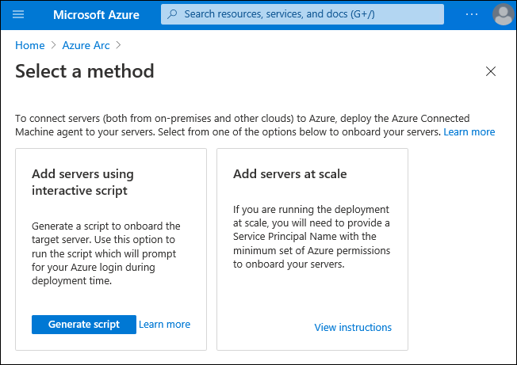

Business technology landscape continuously evolves and becomes increasingly complex with multiple applications running on different hardware across on-premises datacenters, multiple public and private clouds, and the edge. Managing these disparate environments at scale, enhancing security across an entire organization, and enabling developer agility and innovation are critical for businesses to succeed and thrive. Microsoft Azure provides tools and solutions that help customers like Contoso to innovate their hybrid environments in the secure manner and with a minimized management overhead. Azure Arc is an example of such solution. While it offers support for a range of different scenarios, the majority of on-premises workloads still rely on physical or virtual servers running either Windows or Linux, so our focus will be on Azure Arc enabled servers. 

Azure Arc consists of a set of technologies that simplify administration of complex, distributed, hybrid environments, such as the one you deal with as the IT Engineering team lead of Contoso. It provides a centralized, multi-cloud, and on-premises governance and management platform. It facilitates adoption of automation, single-pane-of-glass monitoring and comprehensive security, and promotes the cloud-first strategy, regardless of where your resources are located. At the same time, Azure Arc still allows you to continue using traditional ITOps tools and practices, as you transition to the DevOps model to fully benefit from cloud native architectural and operational patterns.

In this unit, you'll learn about the characteristics of Azure Arc enabled servers and how to enable Azure Arc.

## What are Azure Arc enabled servers?

Azure Arc relies on a locally installed agent to establish a logical connection between the local resource and Azure. By establishing this connection, a non-Azure resource automatically becomes a hybrid Azure resource, with its own identity represented by an Azure Resource Manager resource ID. Azure Resource Manager serves as the management interface that allows you to create, modify, and delete Azure resources. After you Arc-enable a non-Azure resource, you can use Azure Resource Manager to manage and monitor its configuration and operations. This allows for facilitates implementing a range of additional scenarios that use Azure services to optimize server management and monitoring.

## How to enable Azure Arc?

With Azure Arc enabled servers, the connection to Azure relies on the Connected Machine agent. You have the option to install it on individual Windows or Linux servers manually or by running a script available from the Azure portal. This requires that you authenticate to your Azure subscription interactively for each installation. In enterprise environments, you will likely perform installations at scale, by using a script or PowerShell Desired State Configuration-based installation with authentication via an Azure Active Directory (Azure AD) service principal. 

Effectively, to Arc enable a server, you need:

- a direct connection from the server to Azure
- the Connected Machine agent installed on the server
- an Azure subscription

Connecting the agent to your subscription creates an Azure Resource Manager object representing the server. From that point on, you can use the Azure portal, Azure command-line tools, or REST API to manage the server.

The Connected Machine agent allows you to enhance management of Windows and Linux computers residing in on-premises datacenters or hosted by third party private and public cloud providers. The Azure Connected Machine agent supports the following operating systems:

- Windows Server 2012 R2 and higher (including Windows Server Core)
- Ubuntu 16.04 and 18.04 (x64)
- CentOS Linux 7 (x64)
- SUSE Linux Enterprise Server (SLES) 15 (x64)
- Red Hat Enterprise Linux (RHEL) 7 (x64)
- Amazon Linux 2 (x64)

Choose the best response for each of the following questions. Then select "Check your answers".
