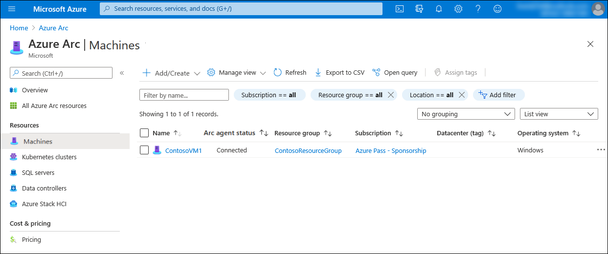
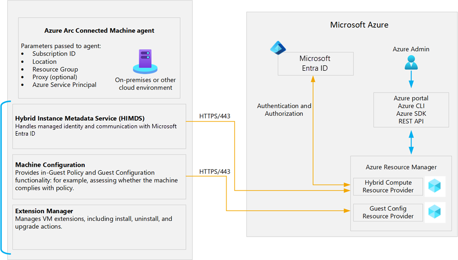
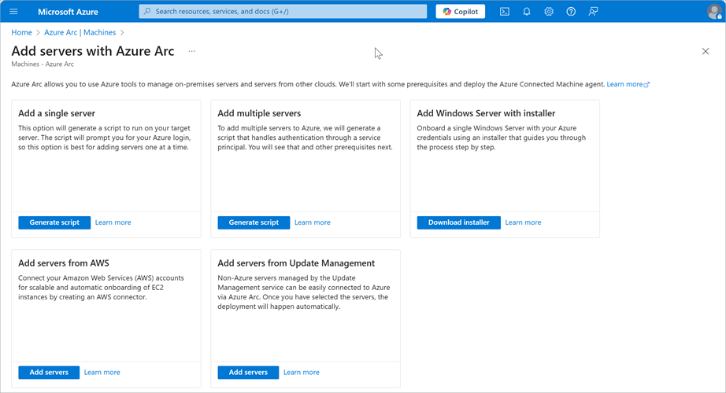

The business technology landscape continuously evolves and becomes increasingly complex, with multiple applications running on different hardware across on-premises datacenters, multiple public and private clouds, and the edge. Managing these disparate environments at scale, enhancing security across an entire organization, and enabling developer agility and innovation are critical for businesses to succeed and thrive. Microsoft Azure provides tools and solutions that help customers like Contoso to innovate their hybrid environments in a secure manner and with a minimized management overhead. Azure Arc is an example of such solution. While it offers support for a range of different scenarios, most on-premises workloads still rely on physical or virtual servers running either Windows or Linux, so our focus will be on Azure Arc-enabled servers. 

Azure Arc consists of a set of technologies that simplify administration of complex, distributed, hybrid environments, such as the one you deal with as Contoso's IT Engineering team lead. It provides a centralized, multicloud, and on-premises governance and management platform. It facilitates adoption of automation, single-pane-of-glass monitoring, and comprehensive security, and promotes the cloud-first strategy regardless of where your resources are located. At the same time, Azure Arc still allows you to continue using traditional ITOps tools and practices as you transition to the DevOps model to fully benefit from cloud native architectural and operational patterns.

In this unit, you'll learn about the characteristics of Azure Arc-enabled servers and how to enable Azure Arc.

## What are Azure Arc-enabled servers?

Azure Arc relies on the Azure Arc Connected Machine agent, a locally installed agent, to establish a logical connection between the local resource and Azure. By establishing this connection, a non-Azure resource automatically becomes a hybrid Azure resource, with its own identity represented by an Azure Resource Manager resource ID. Azure Resource Manager serves as the management interface that allows you to create, modify, and delete Azure resources.

By connecting your machines to Azure with Azure Arc-enabled servers, you can use Azure Resource Manager to manage and monitor its configuration and operations. This facilitates a range of other scenarios that use Azure services to optimize security, monitoring, and governance.

## What is the Connected Machine agent?

The Azure Arc-enabled servers Connected Machine agent allows you to manage your Windows and Linux machines hosted outside of Azure on your corporate network or other cloud providers. The Azure Connected Machine agent package consists of three core components:

- The Hybrid Instance Metadata service (HIMDS) manages the connection to Azure and the connected machine's Azure identity.
- The Guest Configuration agent provides In-Guest Policy and Guest Configuration functionality, such as assessing whether the machine complies with required policies.
- The Extension agent manages the install, uninstall, and upgrade of VM extensions, which are lightweight software components that automate post-operating system deployment configuration and automation tasks.

Together, the Hybrid Instance Metadata service, Guest Configuration agent, and Extension agent constitute the Connected Machine Agent.

## What are the supported methods for onboarding machines to Azure Arc-enabled servers?

With Azure Arc-enabled servers, the connection to Azure relies on the Connected Machine agent. You can install the agent on individual Windows or Linux servers manually or by running a script available from the Azure portal. This requires that you authenticate to your Azure subscription interactively for each installation. In enterprise environments, you'll likely perform installations at scale by using a script or PowerShell Desired State Configuration-based installation with authentication via an Azure Active Directory (Azure AD) service principal. You can automate this service principal script by using the tooling of your choice, including Endpoint Configuration Manager, Group Policy, and Ansible. Effectively, to Arc-enable a server, you need:

- A direct connection from the server to Azure
- The Connected Machine agent installed on the server
- An Azure subscription

Connecting the agent to your subscription creates an Azure Resource Manager object representing the server. From that point on, you can use the Azure portal, Azure command line tools, or REST API to manage the server. Additionally, you can onboard non-Azure machines connected to Azure Automation Update Management with a point-and-click experience in Azure portal. You can also onboard machines to Azure Arc directly from Windows Admin Center.

## What are the supported environments and operating systems for the Connected Machine agent?

The Connected Machine agent allows you to enhance management of Windows and Linux computers residing in on-premises datacenters or hosted by third party private and public cloud providers. Azure Arc-enabled servers support the installation of the Connected Machine agent on any physical server and virtual machine hosted outside of Azure. Supported environments include:

- VMware
- Azure Stack HCI
- Other cloud environments

Azure Arc-enabled servers does not support installing the agent on virtual machines running in Azure, or virtual machines running on Azure Stack Hub or Azure Stack Edge as they are already modeled as Azure VMs.

The Azure Connected Machine agent supports the following operating systems:

- Windows Server 2008 R2 SP1, 2012 R2, 2016, 2019, and 2022
  - Both Desktop and Server Core experiences are supported
  - Azure Editions are supported on Azure Stack HCI
- Windows 10, 11 (see client operating system guidance)
- Windows IoT Enterprise
- Azure Stack HCI
- CBL-Mariner 1.0, 2.0
- Ubuntu 16.04, 18.04, 20.04, and 22.04 LTS
- Debian 10 and 11
- CentOS Linux 7 and 8
- Rocky Linux 8
- SUSE Linux Enterprise Server (SLES) 12 SP3-SP5 and 15
- Red Hat Enterprise Linux (RHEL) 7, 8 and 9
- Amazon Linux 2
- Oracle Linux 7 and 8

Choose the best response for each of the following questions, then select **Check your answers**.
