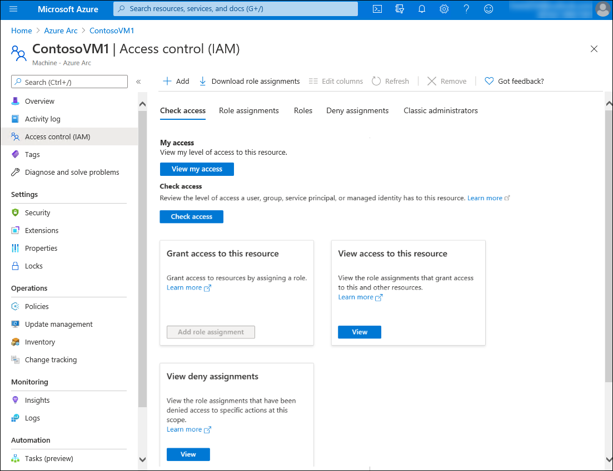
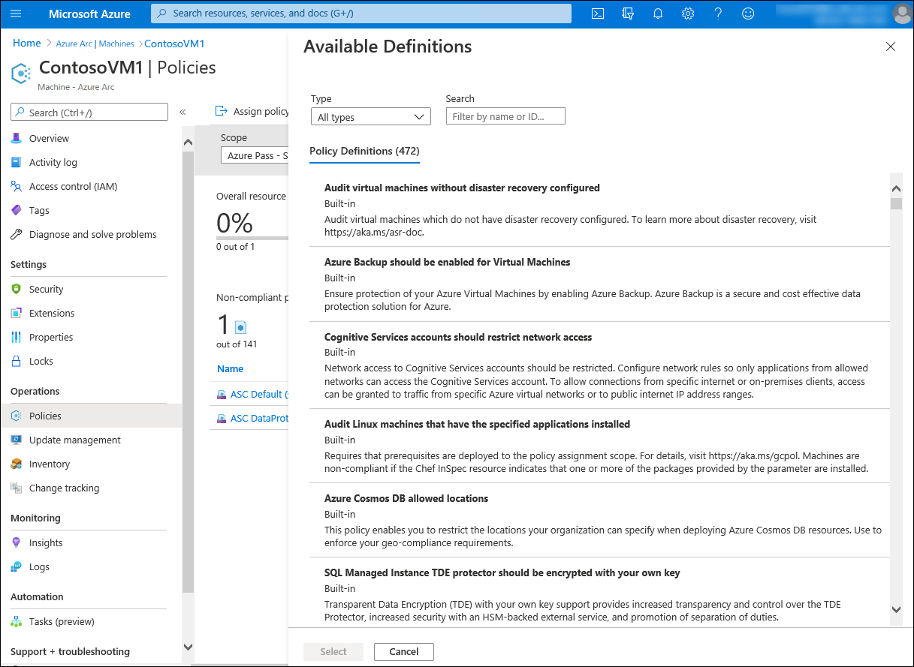
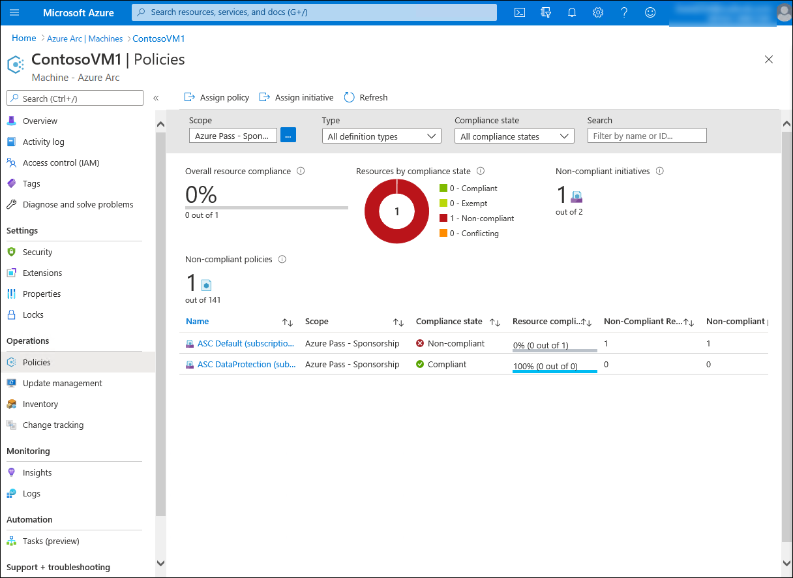

Azure Arc allows you to extend the scope of several Azure services to non-Azure Windows and Linux servers. This helps companies like Contoso to standardize their management strategy when operating in hybrid scenarios. In this unit, you'll learn about the capabilities of Azure Arc, focusing on those available exclusively to Azure and Azure Arc-enabled servers. 

## What are the core resource management capabilities of Azure Arc-enabled servers?

A number of Azure Arc benefits are independent of the resource type, because they reflect the capabilities of Azure Resource Manager. These benefits include:

- The ability to organize all organizational resources by using Azure management groups, subscriptions, resource groups, and tags.
- A single, comprehensive inventory of organizational assets across multiclouds and on-premises, including support for searching and indexing by using Azure Resource Graph.
- A consolidated view of Azure and Azure Arc-enabled resources via the Azure portal, Azure Command Line Interface (CLI), Azure PowerShell, and Representational state transfer (REST) Application Programming Interface (API).
- Direct access from the Azure portal to most of the management features of the Azure Arc-enabled servers:

  - Role Based Access Control (RBAC) for viewing logs and server inventory data
  - VM extensions to deploy software agents and run scripts on your server
  - Azure Policy guest configuration to audit operating system and software configuration
  - An Azure Active Directory system assigned managed identity for apps running on the server to use when authenticating to other Azure services

There are also benefits specific to Azure Arc-enabled servers, such as:

- The ability to apply Azure Virtual Machine (VM) extensions to automate configuration of Azure and non-Azure Windows and Linux servers in the consistent manner.
- The Support for Azure Policy guest configuration. Azure Policy supports auditing Azure Arc-enabled servers in the same way as their Azure-resident counterparts. This allows you to use the same approach to evaluate whether configurations of all servers in your environment comply with organizational standards.

### What are VM extensions and how are they used with Azure Arc-enabled servers?

VM extensions are lightweight software components that automate post-operating system deployment configuration and automation tasks. Traditionally, VM extensions were available only on Azure VMs, but now it's possible to use selected ones on Azure Arc-enabled servers. The following table describes the extensions that you can add to Azure Arc-enabled servers running Windows Server or Linux operating system:

| Extension | Additional information |
| --- | --- |
| Log Analytics agent | Installs the Log Analytics agent on the target Arc-enabled server and configures it for log forwarding to a Log Analytics workspace. |
| Dependency agent | Installs the Dependency agent on the target Arc-enabled server to facilitate identifying internal and external dependencies of server workloads. |
| Azure Key Vault agent | Synchronizes certificates from an Azure Key Vault instance to the Arc-enabled server. |
| Qualys extension | Microsoft Defender for servers vulnerability assessment scanning solution. |
| Desired State Configuration | Applies a PowerShell DSC configuration on the target Arc-enabled server. |
| Custom Script Extension | Executes a script on the target Arc-enabled server. |

### What is Azure Policy and how is it used for Azure Arc-enabled server governance?

Azure Policy is a service that can help organizations manage and evaluate internal and regulatory compliance of their Arc-enabled servers, in addition to a wide range of Azure services. Azure Policy uses declarative rules based on properties of target resource types, including Windows and Linux operating systems. These rules form policy definitions administrators can apply through policy assignment to resource groups, subscriptions, or management groups that host Azure Arc-enabled servers. To simplify policy definition management, you can combine multiple policies into initiatives, then create a few initiative assignments in lieu of multiple policy assignments.

Azure Policy supports auditing the state of Arc-enabled server with Guest Configuration policies. Guest Configuration policies don't apply configurations, but they audit settings within the target operating system and evaluate their compliance. You can, however, use Azure Policy to apply configuration of the Azure resource representing an Arc-enabled server. You can also use Azure Policy to deploy configurations by using VM extensions.

For example, Contoso could use Azure Policy to implement the following rules:

- Assigning a specific tag to resources representing Arc-enabled servers during their registration.
- Identify Arc-enabled servers running Windows with Windows Defender Exploit Guard disabled.
- Identify Arc-enabled servers running Windows that are not joined to a specific Active Directory Domain Services (AD DS) domain.
- Identify Arc-enabled servers running Windows or Linux without Log Analytics agent installed.
- Identify Arc-enabled servers running Linux that are not using SSH keys for authentication.

> [!NOTE]
> Policies that support remediation do not have to evaluate the policy logic inside the operating system of the Azure Arc-enabled server, but instead rely on Azure resource metadata. Examples of such policies include enforcement of tag compliance or deployment of VM extensions.

> [!NOTE]
> Azure Policy supports Azure VMs and Azure Arc-enabled servers, providing a consistent, organization-wide view of compliance information.

### How do you assign Azure Policies to Azure Arc-enabled servers?

You can manage and assign Azure policies to Azure Arc-enabled servers directly from the Azure portal.

Once you create a policy assignment, shortly afterwards, you will be able to review the outcome of the policy evaluation on the target Azure Arc-enabled servers.

## What are the benefits of Azure Automation Update Management in hybrid scenarios?

Azure Automation is an Azure service that helps you automate maintenance tasks in Azure and in on-premises environments by using custom PowerShell or Python scripts. In addition, Azure Automation supports configuration management by using several built-in solutions that include Update Management.

Azure Automation Update Management is a hybrid solution that facilitates management and monitoring of operating system updates in hybrid scenarios. It provides comprehensive information on the update status and helps remediate any gaps in an automated manner. It supports integration with any of the standard update deployment technologies, including Windows Update Services, Windows Server Update Services (WSUS), and Endpoint Configuration Manager.

Just like Microsoft Defender for Cloud, the Update Management solution relies on data collected from Windows servers by Azure Monitor and stored in the Log Analytics workspace you designate. This, in turn, requires a locally installed Log Analytics agent, which registers managed computers with the Log Analytics workspace and continually uploads into it locally collected data. The Log Analytics engine analyzes collected data to determine the update compliance status of each managed server.

In general, Update Management allows you to:

- **Track the status of updates on your servers**: The service includes the Azure portal-based interface, where you can review update statuses across your managed environment.
- **Configure dynamic groups of machines to target deployments of updates**: The service supports targeting updates to groups based on Log Analytics queries or groups imported from another source, like WSUS or Endpoint Configuration Manager.
- **Search Azure Monitor logs**: The service allows you to run queries against logs stored in Log Analytics.

## What are the benefits of Azure Automation Desired State Configuration (DSC) in hybrid scenarios?

PowerShell DSC is a technology that implements declarative configuration management through a combination of PowerShell scripts and operating system features. The configuration can be as simple as ensuring a specific Windows feature is enabled or as complex as deploying SharePoint. You can deploy a DSC configuration in either push mode or pull mode. The push mode involves invoking deployment from a management computer against one or more managed computers. In the pull mode, managed computers perform deployment automatically, based on configuration data from a designated location called a pull server. Azure Automation includes a managed, Azure-resident DSC pull server. You can apply a DSC configuration in the push mode to non-Azure computers, including Azure Arc-enabled servers by using VM extension. Alternatively, you can onboard both types of systems into Azure Automation and manage their configuration via a pull server.

## What are the benefits of Azure Automanage in hybrid scenarios?

Azure Automanage machine best practices is a service that eliminates the need to discover, know how to onboard, and how to configure certain services in Azure that would benefit your Arc-enabled server. After onboarding your machines to Azure Automanage, each best practice service is configured to its recommended settings. Azure Automanage also automatically monitors and corrects for drift when detected. Participating services include:

- Machines Insights Monitoring
- Update Management
- Change Tracking & Inventory
- Azure Guest Configuration
- Azure Automation Account
- Log Analytics Workspace

Choose the best response for each of the following questions, then select **Check your answers**.
