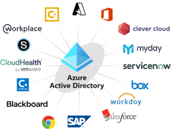
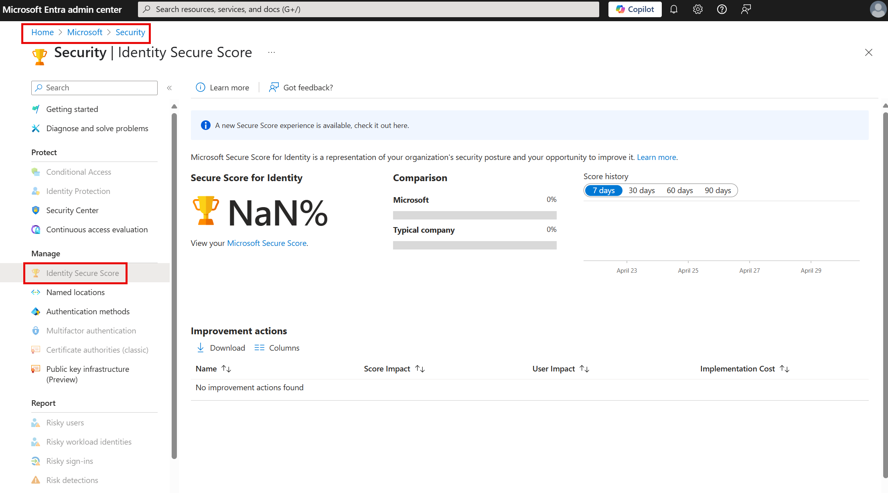
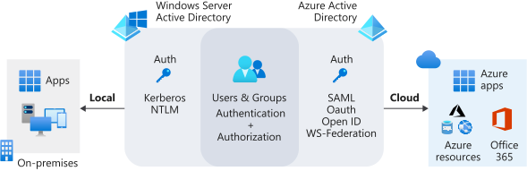

The board wants to enable secure and easy access to applications and services. These applications are available to internal staff and doctors from various countries/regions. Your team manager believes that Microsoft Entra ID can address these needs. Your manager wants you to find out what Microsoft Entra ID is, how it works, and what it does.

Here, you get an overview of Microsoft Entra ID and see why you would use it. You learn about the differences between Microsoft Entra ID and the traditional on-premises Active Directory.

## What is Microsoft Entra ID?

Microsoft Entra ID is a cloud-based identity-management solution. It helps your company's internal users to:

- Access external resources like Azure services, Microsoft 365, and third-party SaaS applications.

- Access internal resources such as applications on the corporate network and cloud-based applications that your company builds.

Microsoft Entra ID also helps you keep user identities and applications secure through features like Conditional Access and identity protection.

Microsoft Entra ID stores your users in a *tenant* that represents an organization. For example, say you have a company tenant where all of your employee user accounts are stored. You can add users in this tenant to groups so they have a common shared-access level. You could have one group for developers and another group for application testers. These groups would have different access levels for applications. Each tenant can have multiple groups that hold multiple users.

## Who benefits from Microsoft Entra ID?

Microsoft Entra ID meets the needs of many types of users. For instance, an IT administrator can use Microsoft Entra ID to determine who should have access to applications and resources, based on company requirements. An administrator can add another layer of protection to applications and services by enforcing multifactor authentication on sign-ins.

Application developers can use Microsoft Entra ID to allow users to use pre-existing credentials to access applications. Developers can also use Microsoft Entra ID to create personalized end-user experiences by accessing organizational user data through APIs that are specific to Microsoft Entra ID.

If you subscribe to services like Azure or Microsoft 365, you're already taking advantage of Microsoft Entra ID. You could use Microsoft Entra ID to further manage access to your cloud applications.

## Identity secure score in Microsoft Entra ID

If you're an administrator, you need to know how secure your Microsoft Entra tenant is. The identity secure score can help you understand. Microsoft Entra ID gives an overall percentage between 1 and 100. This value represents how well you match the recommendations and best practices that Microsoft suggests for tenant security. The identity secure score reveals how effective your security is and helps you implement improvements.

You can find your tenant's identity secure score in the Azure portal. Go to your Microsoft Entra tenant, select **Security**, and then select the **Identity Secure Score** dashboard.

The dashboard shows information such as how you compare with the industry average and with tenants of the same size as yours. The dashboard also provides a graph that shows the changes in your score over time. You can see what to do to improve your score and how much effect each improvement can have on your score.

Use the identity secure score to improve and monitor the security of your identities in Microsoft Entra ID.

## How Microsoft Entra ID compares with Active Directory

Active Directory and Microsoft Entra ID are separate services that are used for different purposes.

Microsoft Entra ID is a cloud-based identity solution that helps you manage users and applications. Active Directory manages objects, like devices and users, on your on-premises network. Here are some other differences:

|Service|Authentication  |Structure  |Used for  
|---------|---------|---------|---------|
|Active Directory     |Kerberos, NTLM| Forests, domains,  organizational  units | Authentication and authorization for on-premises printers, applications, file services, and more
|Microsoft Entra ID     |Includes SAML, OAuth, WS-Federation|Tenants|Internet-based services and applications like Microsoft 365, Azure services, and third-party SaaS applications

Microsoft Entra ID doesn't replace Active Directory. The service you use depends on your organization's needs. You can use the two services together so you can take advantage of their combined features and capabilities.

## Hybrid identity for linking on-premises Active Directory with Microsoft Entra ID

Your users want to access applications from both the cloud and on-premises. You can use Microsoft Entra ID and Active Directory together to provide an identity solution that spans on-premises and the cloud. Users can use single user identity for authentication and to access applications and resources, whatever their location. This user identity is called a hybrid identity.

Multiple authentication methods let you achieve hybrid identity for users:

- **Microsoft Entra password hash synchronization**. Here, the user's password is hashed twice and synchronized between the on-premises Active Directory and Microsoft Entra ID. Users have the same credentials to access resources and applications both on-premises and in the cloud.

- **Microsoft Entra pass-through authentication**. Here, an agent is installed on on-premises servers that authenticates against the on-premises Active Directory. When a Microsoft Entra user account tries to authenticate, password authentication is handled on-premises through these servers and Active Directory.

- **Federated authentication**. Here, an on-premises Active Directory Federation Services (AD FS) server that validates users' passwords performs the authentication process. Use this authentication method if you want advanced measures like smart card-based authentication for users.

These authentication options allow you to give users a single sign-on experience. Using single sign-on means users are automatically signed in when they use company devices and connect to your internal corporate network.

Use the following table as a reference for which options to use for particular scenarios:

|You want to:  |Password hash synchronization|Pass-through authentication|Federated authentication|
|---------|---------|---------|---------|
|Automatically synchronize to the cloud the users, contacts, and groups that are set up on on-premises Active Directory|Yes|Yes|Yes|
|Allow users to access cloud applications and resources by using their on-premises password|Yes|Yes|Yes|
|Ensure that password hashes aren't stored in the cloud|No|Yes|Yes|
|Use cloud-based multifactor authentication|Yes |Yes|Yes|
|Use on-premises multifactor authentication|No|No|Yes|
|Use smart card authentication for added protection|No|No|Yes|

## European identity data storage

When you subscribe to a service like Azure or Microsoft 365, all of your identity data is stored based on the address you provide during the subscription process. If you're a customer who uses an address in Europe, Microsoft Entra ID stores most of your data in European datacenters. However, services that you use with Microsoft Entra ID store some data outside Europe. Here are a few examples of some of the data stored outside Europe:

|Microsoft Entra ID-based service |Data location  |
|---------|---------|
|Microsoft Entra B2B (Microsoft Entra B2B)| Guest users access applications through a link in an invitation email or a link shared directly with them. These redemption links are stored in US datacenters. If a user unsubscribes from invitation messages, their email address is also stored in US datacenters.  |
|Azure Active Directory B2C (Azure AD B2C)|No personal data is stored outside of Europe, but policy configuration data is stored in US datacenters.|
|Microsoft Entra multifactor authentication|Phone calls and text messages come from US datacenters, and global providers handle the routing. OAuth code validation happens in the US. Push notifications for the Microsoft Authenticator app come from US datacenters.|
