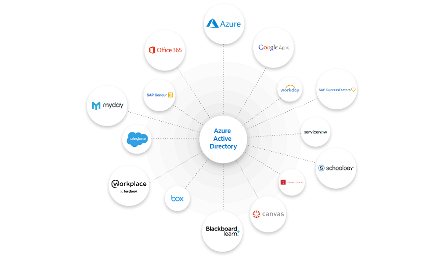
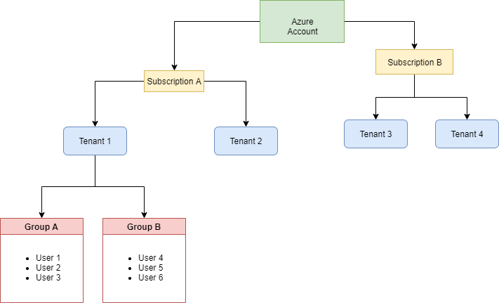

The board wants to enable secure and easy access to applications and services for internal staff, and doctors from various countries.
Your team manager believes Azure Active Directory can address this need. Your manager wants you to find out what Azure Active Directory (Azure AD) is, how it works, and what it does.

Here, you'll get an overview of Azure AD and see why you would use it. You'll learn about the differences between Azure AD and a traditional on-premises Active Directory.

## What is Azure Active Directory?

Azure Active Directory (Azure AD) is a cloud-based identity management solution. Azure AD helps your company's internal users to:

- Access external resources, like Azure services, Office 365, and third-party SaaS applications

- Access internal resources such as applications on your corporate network, and cloud-based applications built by your company

Azure AD also helps you keep user identities and applications secure through features like Conditional Access, and Identity Protection.

Azure AD stores your users in a tenant that represents an organization. For example, you'd have a company tenant where all of your internal staff members are maintained. Tenant users can also be grouped so they have a common shared access level. You could have one group for developers, and a separate group for application testers. These groups would have different access levels for applications.

You can create multiple tenants in Azure under multiple subscriptions. Each tenant can have multiple groups that hold multiple users.

### Who benefits from Azure AD?

Azure AD meets the needs of many different types of users. For instance, an IT administrator can use Azure AD to determine who should have access to applications and resources, based on company requirements. An administrator could, for example, add another layer of protection to applications and services by enforcing multi-factor authentication on sign-ins.

Application developers can also use Azure AD to enable users to use pre-existing credentials to access applications. Developers also use Azure AD to create personalized end-user experiences by accessing organizational data for users through Azure AD-specific APIs.

If you're subscribed to services like Office 365, Azure, or Microsoft 365, you're already taking advantage of Azure AD. You could use Azure AD to further manage access to your cloud applications.

## Identity secure score in Azure AD

An administrator needs to know how secure their Azure AD tenant is. The identity secure score can help you understand. Azure AD gives an overall value between 1 and 223 that represents how well you're matching recommendations and the best practices that Microsoft suggests for tenant security. The identity secure score reveals how effective your security has been, and helps you implement future improvements.

You can find your tenant's identity secure score in the Azure portal. Go to your Azure AD tenant, then the identity secure store dashboard.

The dashboard shows information such as how well you're doing compared with the industry average, and with tenants of the same size as yours. The dashboard also provides a graph that shows how your score changed over time. You'll also see what you can do to improve your score, and how much impact each improvement will have.

Use the identity secure score to improve and monitor the security of your identities in Azure AD.

## Default user permissions

Azure AD gives all of the users in your tenant a default set of permissions. Permissions dictate what a user can and can't do. The set of permissions granted by default depends on whether a particular user is a natural member user of the tenant (like an internal employee) or if they belong to an outside organization. The latter would be considered a guest, such as an external collaborating user. Guest users are invited to the tenant through a feature for Azure AD called Azure Active Directory B2B.

Member users can do many things that guest users can't. For example, member users manage their own profile details, like their phone number, profile photos, and more. Guest users typically have more restrictions. A guest user can, for instance, view their display photo but can't change it. The external healthcare professionals your company works with regularly, could be given guest user access. This way, they'd have more restricted permissions than a regular internal staff member, but they would still have enough permissions to get their work done.

### Member and guest default permissions compared

Here are some of the default permissions for member and guest type users:

|Area  |Member user permissions  |Guest user permissions  |
|---------|---------|---------|
|Users and contacts|Can view all profile details. Change own password, update own mobile phone number, and profile photos.|Only view profile name, email, sign-in name, photo, user principal name, and user type properties of other users and contacts; change own password.|
|Devices|Can read all properties of devices. Manage all properties of owned devices.|Can't read all properties of devices. Can't manage all properties of owned devices. Can delete owned devices.|
|Applications |Can register new applications.|Can't register new applications. Can delete owned applications.|
Policies|Read all properties of policies, manage all properties of owned policy.|No permissions.|
Subscriptions|Read all subscriptions, enable Service Plan Member.|No permissions.|
Roles and Scopes|Read all administrative roles and memberships, read all Roles and Scopes and membership of administrative units.|No permissions.|

## Azure AD compared with Active Directory

Active Directory and Azure AD share a similar name but are separate services used for different purposes.

Azure AD is a cloud-based identity solution to help you manage users and applications. Active Directory manages objects like devices, and users, on your on-premises network. Here are some other differences:

|Service|Authentication  |Structure  |What it's used for  
|---------|---------|---------|---------|
|Active Directory     |Kerberos, NTLM| Forests, domains,  organizational  units. | Authentication and authorization for on-premises printers, applications, file services, and more.
|Azure Active Directory     |Includes SAML, OAuth, WS-Federation|Tenants.|Internet-based services and applications like Office 365, Azure services, and third-party SaaS applications.

Azure AD doesn't replace Active Directory. Which service you use depends on your organization's needs. The two services can also be used together, to take advantage of their combined features and capabilities.

### Use hybrid identity to link your on-premises AD with Azure AD

Your users will want to access applications from both the cloud and on-premises. Azure AD and Active Directory can be used together to provide an identity solution that spans on-premises and the cloud. There's a single user identity for authentication and to access applications and resources, whatever their location. This user is called a hybrid identity.

There are multiple authentication methods that let you achieve hybrid identity for users.

- **Azure AD password hash synchronization**. Here, the user's password is hashed twice and synchronized between the on-premises Active Directory and Azure AD. Users have the same credentials to access resources and applications on-premises, and in the cloud.

- **Azure AD pass-through authentication**. Here, an agent is installed on on-premises servers that authenticate against the on-premises Active Directory. When an Azure AD user account tries to authenticate, password authentication is handled on-premises through these servers and Active Directory.

- **Federated authentication**. Here, the authentication process is performed by an on-premises Active Directory Federation Services (AD FS) server that validates users' passwords. Use this authentication method if you want to have advanced measures like smart card-based authentication for users.

These options allow you to give users single sign-on. Using single sign-on means users are automatically signed in when using company devices and connected to your internal corporate network.

Use the table below as a reference for which options to use for particular scenarios:

|You want to:  |Password hash synchronization|Pass-through authentication|Federated authentication|
|---------|---------|---------|---------|
|Automatically synchronize users, contacts, and groups, which have been set up on on-premises AD, to the cloud.|Yes|Yes|Yes|
|Allow users to access cloud applications and resources with their on-premises password.|Yes|Yes|Yes|
|Password hashes aren't stored in the cloud.|No|Yes|Yes|
|Use cloud-based multi-factor authentication.|Yes |Yes|Yes|
|Use on-premises multi-factor authentication.|No|No|Yes|
|Use smart card authentication for additional protection.|No|No|Yes|

## How is your identity data stored if you're in Europe?

When you subscribe to a service like Azure or Office 365, all your identity data is stored based on the address you provide during the subscription process. If you're a customer who uses an address in Europe, Azure AD will store most of the data in European datacenters. However, some data is stored outside Europe by services that you use with Azure AD. Here are a few examples of some of the data that is stored outside Europe:

|Azure AD-based service |Data location  |
|---------|---------|
|Azure Active Directory B2B (Azure AD B2B)| Guest users access applications through a link in an invitation email, or a link shared directly with them. These redemption links are stored in US datacenters. If a user unsubscribes from invitation messages, their email address is also stored in US datacenters.  |
|Azure Active Directory B2C (Azure AD B2C)|No personal data is stored outside of Europe, but policy configuration data is stored in US datacenters.|
|Azure multi-factor authentication|Phone calls and SMS come from US datacenters and global providers handle the routing. OAuth code validation happens in the US. Push notifications for the Microsoft Authenticator app come from US datacenters.|
