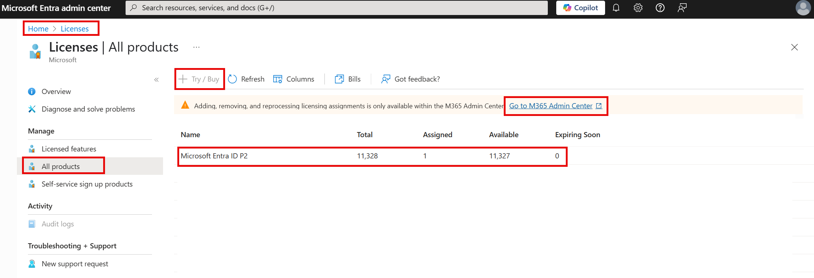

Your company always looks for the most experienced healthcare professionals and external contractors to work with. Research projects can become costly if they're not managed properly. Your company wants to improve its cost-effectiveness. The company has asked you to investigate how Azure Active Directory (Azure AD) is licensed. You also need to provide a clear and concise outline of the critical terminology your company will come across in Azure AD.

Here, you'll explore how Azure AD is licensed and which features fall under the different licenses. You'll see how to add or change licenses in Azure AD. And you'll learn the key terms you need to understand when you use Azure AD.

## Azure AD licenses

You can use different features of Azure AD, depending on the type of license you choose:

- **Azure Active Directory Free**. You can manage users and groups, and you get necessary reports, on-premises Active Directory synchronization, and self-service password reset for Azure AD users. You also get single sign-on for Microsoft 365, Azure services, and many third-party SaaS applications.

- **Pay-as-you-go licenses for specific features**. You access specific Azure AD features, like Azure AD B2C, on a pay-as-you-go basis. Azure AD B2C lets you manage identity and access for consumer users and the applications they use.

-**Office 365 Apps**.  You get all of the free tier features, but you can also have custom login and logout pages, self-service password reset for cloud users and device write-back.

- **Azure Active Directory Premium P1**. You get all the features from the free tier, but you can also let users access on-premises and cloud-based services and resources. You can use self-service group management or dynamic groups, where users are added and removed automatically, based on your criteria. This tier supports on-premises identity management suites like Microsoft Identity Manager. Self-service password reset is also supported for users who are based on-premises.

- **Azure Active Directory Premium P2**. You get all the features of the previous two tiers, along with Active Directory Identity Protection. This feature helps you configure risk-based conditional access to protect applications from identity risks. You can also use privileged identity management, which lets you monitor and put detailed restrictions on administrators.

Choose the license type you want, based on your organization's needs.

View your active license plans in the Azure portal by selecting **Azure Active Directory** > **Licenses** > **All products**. Here, you can also buy or try new licenses.

Select a license plan to see which users are included. In the plan, you can add or remove users or groups of users.

## Azure AD terminology

To use Azure AD effectively, you need to understand some key Active Directory terms. 

Here's an explanation of some of those terms: 

|Term|Description|
|---------|---------|
|Identity|Something that has to be identified and authenticated. An identity is typically a user with a username and password credentials, but the term can also apply to applications or services.|
|Account|An identity and its associated data. An account can't exist without an identity.|
|Azure AD account|An identity created in Azure AD or in services like Microsoft 365. These identities are stored in Azure AD. For example, internal staff members might use Azure AD accounts daily at work.|
|Azure subscription| Your level of access to use Azure and its services. For pay-as-you-go access, use your credit card to set up an Azure subscription. There are several types of subscriptions. For example, enterprise-level customers can use Azure Enterprise Agreement subscriptions. Each account can use many subscriptions.|
|Azure AD tenant|An instance of an Azure AD. This tenant is automatically created for you when you first sign up for Azure or other services like Microsoft 365. A tenant, which represents an organization, holds your users, their groups, and applications.|
|Multi-tenant|Multiple-tenant access to the same applications and services in a shared environment. These tenants represent multiple organizations.|
|Azure AD directory|An Azure resource that's created for you automatically when you subscribe to Azure. You can create many Azure AD directories. Each of these directories represents a tenant.|
|Custom domain|A domain that you customize for your Azure AD directory. When you create an Azure AD directory, Azure automatically assigns it a default domain like `<your-organization>.onmicrosoft.com`. But you can customize domain names. Your users could then have accounts like `joesmith@contoso.com` instead of `joesmith@contoso.onmicrosoft.com`.|
|Owner role|The role you use to manage all Azure resources, including the access levels that users need for resources.  |
|Global administrator| The role that gives you access to all administrative capabilities in Azure AD. When you create a tenant, you automatically have this role for the tenant. This role allows you to reset passwords for all users and administrators, for example.|
| | |

## Default user permissions

Azure AD gives all of the users in your tenant a default set of permissions. Permissions dictate what a user can and can't do. The set of permissions granted by default depends on whether a user is a natural member of the tenant (as an internal employee) or a member of an outside organization. The latter is considered a guest. An example of a guest would be a vendor that is performing work for you but is not an official employee of the organization. Guest users are invited to the tenant through an Azure AD feature called Azure Active Directory B2B.

Member users can do many things that guest users can't. For example, member users manage their own profile details, like their phone number and profile photos. Guest users typically have more restrictions. Guest users can, for instance, view their display photos but can't change them. For the external healthcare professionals that your company works with regularly, you could grant guest-user access. This way, they'd have more restricted permissions than a regular internal staff member, but they would still have enough permissions to do their work.

### Comparison of member and guest default permissions

Here are some of the default permissions for member users and guest users:

|Area  |Member user permissions  |Guest-user permissions  |
|---------|---------|---------|
|Users and contacts|Can view all profile details. Can change own password, mobile phone number, and profile photos.|Can view only profile name, email, sign-in name, photo, user principal name, and user type properties of other users and contacts. Can change own password.|
|Devices|Can read all properties of devices. Can manage all properties of owned devices.|Can't read all properties of devices. Can't manage all properties of owned devices. Can delete owned devices.|
|Applications |Can register new applications.|Can't register new applications. Can delete owned applications.|
Policies|Can read all properties of policies and manage all properties of owned policies.|No permissions.|
Subscriptions|Can read all subscriptions and enable service plan members.|No permissions.|
Roles and scopes|Can read all administrative roles and memberships. Can read all roles and scopes and membership of administrative units.|No permissions.|
