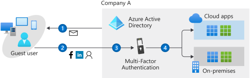
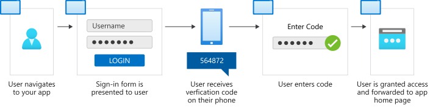
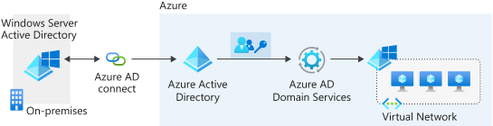
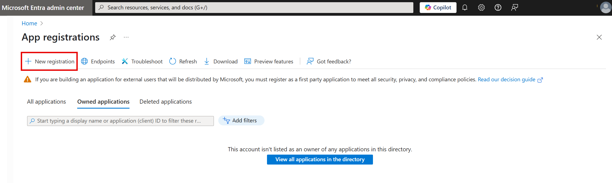
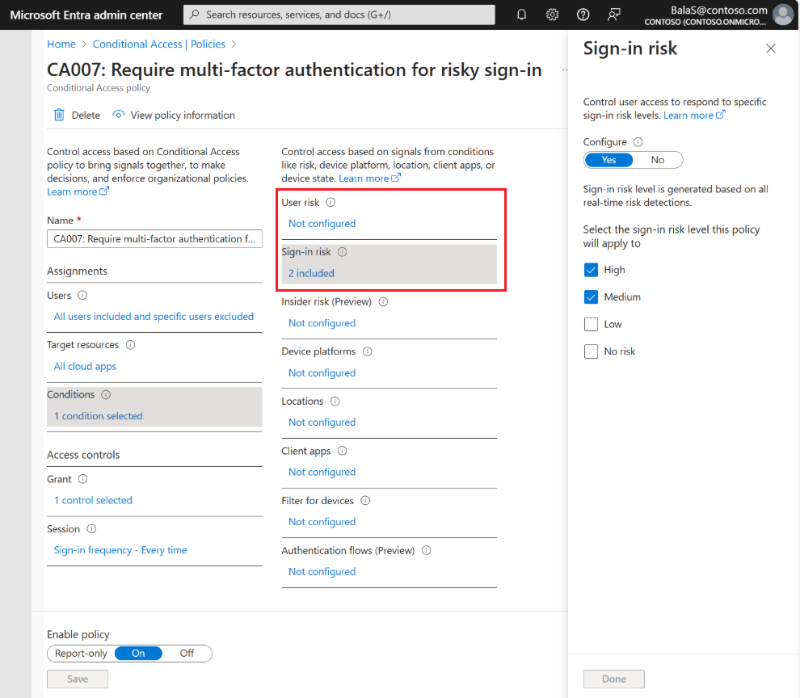

Your company wants to improve how it provides services to doctors and how it collaborates with external healthcare organizations. You're asked to investigate what other capabilities and services Microsoft Entra ID can provide for the organization.

Here, we explore some essential features of Microsoft Entra ID and how you can use them. Specifically, we look at Microsoft Entra B2B, Azure AD B2C, Microsoft Entra Domain Services (AD DS), and Microsoft Entra ID Protection. Features, that you can use to help improve how you manage apps in Microsoft Entra ID.

## Microsoft Entra B2B

Use Microsoft Entra ID to invite external users to your tenant. Your organization can then collaborate with external healthcare partner staff members through Microsoft Entra B2B Collaboration.

For example, your company works with external healthcare partners. You can invite these partners as guest users to your tenant. When their work is done, you can revoke access for those external partners until they need it again.

Here's the B2B collaboration process:

1. The external user either receives an email invitation that includes a redemption link or gets a direct link.
1. The user selects the redemption link to access the apps they were invited to.
1. If multifactor authentication is set up, the user receives a verification code on their phone.
1. The user provides the code they received.
1. The user can access the app, whether it's on-premises or in the cloud.

This feature is available for all licensing tiers in Microsoft Entra ID.

## Azure AD B2C

You can also use Azure AD B2C to manage your customers' identities and access. You want to give your doctors' accounts protected access to resources and services. Use Azure AD B2C to securely authenticate the doctors through their preferred identity providers.

AD B2C also helps you monitor for threats&mdash;like brute force attacks and denial-of-service attacks&mdash;on doctors' user accounts. To use Azure AD B2C, you first register your apps. Then, you configure user flows to set up the user's journey to access an app.

For example, a flow for the sign-in process might go like this:

1. On their browser or mobile phone, the user goes to the app they want to access.
1. The user is required to complete the sign-in form.
1. If the credentials are verified and multifactor authentication is enabled, the user receives a verification code on their phone.
1. The user provides the code they received.
1. The user is granted access to the app.

This feature is available on a pay-as-you-go basis.

## Microsoft Entra Domain Services

Microsoft Entra Domain Services lets you add virtual machines to a domain without needing domain controllers. Your internal staff users can access virtual machines by using their company Microsoft Entra credentials.

Use this service to reduce the complexity of migrating on-premises apps to Azure. An organization could also use Microsoft Entra Domain Services to handle its infrastructure if it runs apps both on-premises and in the cloud. The process might go like this:

1. The organization deploys its apps and servers in a virtual network on Azure.
1. Microsoft Entra Connect Sync synchronizes identity information between the on-premises Active Directory instance and the organization's tenant in Microsoft Entra ID.
1. The company enables Microsoft Entra Domain Services on their Microsoft Entra tenant.
1. The apps and servers in Azure can use features like domain joining and Kerberos authentication.

This feature is available for pay-as-you-go, based on the total number of objects in your domain managed by Microsoft Entra Domain Services. Objects can include users, groups, and domain-joined computers.

## App management

Your company might provide many apps that internal and external users rely on. Users might want to access these apps from different devices and locations. You can use Microsoft Entra ID as a cloud-based solution to manage user access for all of these apps.

You can manage different categories of apps in Microsoft Entra ID:

- **Microsoft Entra App Gallery applications**. Thousands of SaaS apps are integrated with Microsoft Entra ID. Find these apps in Azure Marketplace.

    

- **Custom applications**. You can register your company-built apps with Microsoft Entra ID. You can then control and monitor authentication for these apps.

    

- **Non-gallery applications**. You can manually add any apps that you don't see in the gallery.

    

- **On-premises applications**. You can add on-premises apps by configuring the Microsoft Entra application proxy. This process creates secure remote access for your on-premises apps. To connect them, download and install the Application Proxy connector on-premises.

    

In the following sections, you learn about other Microsoft Entra features you can use to benefit your apps.

### Protect your apps through conditional-access policies

You can use conditional-access policies to require users to pass more authentication challenges before they access an app. For example, you can configure a conditional-access policy to require users to complete a multifactor authentication challenge after their credentials are verified and before they access the app.

Conditional-access policies are available for Premium P1 and Premium P2 license tiers.

### Monitor your app access

Microsoft Entra ID can help monitor your app sign-ins by generating reports that cover sign-in dates, user details, the apps a user uses, risk detection, location, and more. You can access those reports through the Azure portal or specific APIs for programmatic usage.

Reports are available for all licensing tiers.

## Microsoft Entra ID Protection

Microsoft Entra ID Protection helps you to automatically detect, investigate, and remediate identity risks for users. Identity Protection also lets you export all the information collected about risks. You can export the information to non-Microsoft tools and solutions so that you can further analyze it.

Identity Protection uses risk policies to automatically detect and respond to threats. You can configure a risk policy to set up how Identity Protection should respond to a particular type of risk. Use policies in this way to save time and give you peace of mind.

First, the admin configures the risk policies by using automated risk detection and remediation through Identity Protection. The policies then monitor for identity risks. When a risk is detected, the policies enforce measures to remediate it. For example, a policy might require a user to reset their password in response to a detected risk. The user then resets their password, and the risk is remediated.

You can configure risk policies through the Azure portal. For example, the following risk policy detects user risks and remediates them by requiring the user to reset their password.

Identity Protection is available for the Premium P2 licensing tier.
