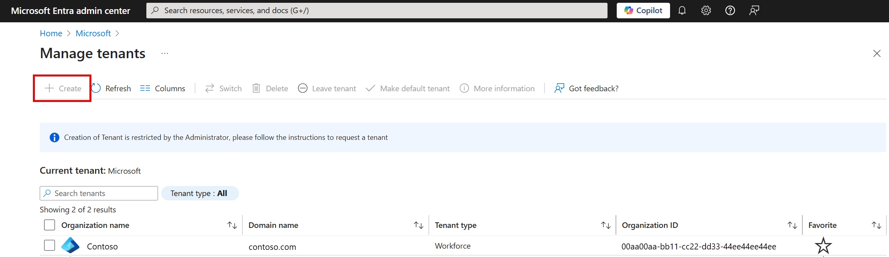
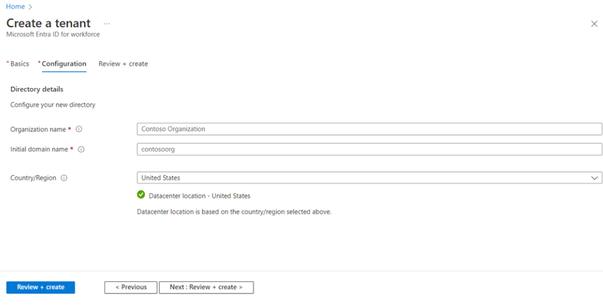

Your organization decides to use Microsoft Entra ID to manage secure access. Users include doctors, external healthcare partners, and all internal staff members. You're asked to look into implementing secure access for your organization.

Here, you learn how to take a phased approach to deploying Microsoft Entra ID for your organization. You learn how to lay a foundation, deploy Microsoft Entra ID by creating a tenant, and associate a subscription with it.

## Deploy in phases

A good way to deploy Microsoft Entra ID is in phases. Your deployment is split into several stages. Each stage addresses a key aspect of Microsoft Entra ID. A phase includes the  tasks you need to complete before you go to the next stage. This approach lays a secure foundation for your Microsoft Entra instance.

### Stage 1: Build a secure foundation

In the first stage, build a foundation of security for your Microsoft Entra ID. The doctors, internal staff members, and external healthcare partners all need the most secure access you can provide. Configure baseline security features before you add or create user accounts. The work you do here helps ensure your Microsoft Entra instance is in a secure state from the start. The following table describes your tasks.

| Task | Description | License needed |
|---|---|---|
| **Assign more than one global administrator**| Give at least two Microsoft Entra accounts the global admin role. Make sure you don't use these accounts daily. Ensure the accounts have long and complicated passwords.| Free |
| **Use regular administrative roles where possible** | Admins who aren't global admins should never have more permissions than they need to do their work. Use these regular admin roles by default. Avoid using the global admin roles unless you need to. | Free |
| **Configure Privileged Identity Management (PIM) to track administrators** | Use PIM to monitor how your admin roles are used. This action helps you improve your governance and compliance.| Microsoft Entra ID P2 |
| **Configure self-service password reset** | Let internal users reset their passwords through policies that you configure. This action reduces the number of help desk tickets for password resets. | Free |
| **Create a list of banned passwords** | Use this list to prevent users from using passwords that are common phrases or words in your organization. Your list can include your company name or headquarters location, for example. | Microsoft Entra ID P1 |
| **Warn users to not reuse credentials** | When someone reuses the same credentials on multiple platforms, an attacker can use the credentials to access all of those platforms if a single platform is compromised. | Free |
| **Set passwords to never expire for cloud-based user accounts** | Routine password resetting tempts users to increment their existing passwords. For example, they might change their password from `R4ndom1Strong` to `R4ndom2Strong`, and so on. In this case, because most of the password remains the same, it increases the risk of using already exposed credentials to gain access to an account. | Free |
| **Enforce multifactor authentication through conditional-access policies** | Configure conditional-access policies to require users to pass multiple authentication challenges before they can access an application. | Microsoft Entra ID P1 |
| **Configure Microsoft Entra ID Protection (AADIP)** | Flag and block suspicious sign-ins and compromised user credentials for your organization's users. You can also use AADIP to automatically trigger multifactor authentication or a password reset, depending on the severity of the detected risk. | Microsoft Entra ID P2 |

### Stage 2: Add users, manage devices, and configure synchronization

Now you can add users and plan how to handle external guest-user access. The following table describes your tasks in this stage.

| Task | Description | License needed |
|---|---|---|
|**Install and configure Microsoft Entra Connect**| Use Microsoft Entra Connect to synchronize users from your on-premises instance of Active Directory to Azure. | Free                                                |
|**Use password hash synchronization**| You can synchronize password changes and detect and fix bad passwords. You get reports about leaked user credentials. | Free                                                |
|**Use password writeback**| Configure password writeback so any changes to passwords in Azure are written to your on-premises instance of Active Directory. | Microsoft Entra ID P1                                          |
|**Use Microsoft Entra Connect Health**|  Use Microsoft Entra Connect Health to monitor the health statistics for your Microsoft Entra Connect environment. | Microsoft Entra ID P1                                          |
|**Give users the licenses they need at a group level**| When you assign licenses at a group level, you control licensing for many users simultaneously. This action saves your organization time and reduces complexity.|Free|
|**Use Microsoft Entra B2B Collaboration for guest-user access**| Use this resource to ensure that external healthcare partner users can use their own work or social identities to access your applications and services. You don't need to manage their credentials for them. | Required licenses depend on which features you want the guest users to access|
|**Prepare a device-management strategy** | Put together a plan based on which devices your company allows. For example, are you going to permit Bring Your Own Device (BYOD), or is the company only accepting its own devices given to users? |Free|
|**Provide authentication methods that don't require passwords**| Make authentication more convenient. For example, if users install Microsoft Authenticator on their phones, they can receive a notification that provides a code to enter at sign-in, along with a PIN or a biometric attribute like their fingerprint. | Microsoft Entra ID P1

### Stage 3: Manage your applications

You can now integrate your applications with Microsoft Entra ID. The following table describes your tasks in this stage.

| Task | Description | License needed |
|---|---|---|
| **Identify applications**                                   |  Investigate the applications in your organization. Your organization could, for example, have applications on-premises or software-as-a-service (SaaS) applications in the cloud. Choose applications that you want to manage in Microsoft Entra ID. | N/A |
|**Use SaaS applications in the Microsoft Entra gallery**|  Your organization probably uses SaaS applications that are already in the gallery and that you can find in the Azure portal. Use these applications from the gallery whenever you can. You can save time by integrating your applications and Microsoft Entra ID.  | Free       |
| **Integrate your on-premises applications using Application Proxy**| You can let Microsoft Entra users sign in to your on-premises applications using their Microsoft Entra account. |Free

### Stage 4: Monitor your administrators, do access reviews, and automate user life cycles

Now you can address how much privilege your admins should have, and you can complete access reviews. In this stage, you also configure how to automate common user life-cycle tasks. The following table describes your tasks in this stage.

| Task | Description | License needed |
|---|---|---|
|**Use PIM to control administrator access** | Ensure that admins can use their account only after they pass a multifactor authentication challenge or receive approval from an accepted approver. | Microsoft Entra ID P2 |
|**Complete access reviews for Microsoft Entra directory roles in PIM**| Configure access review policies in PIM so you can regularly review administrative access based on your organization's requirements for privileged roles.  | Microsoft Entra ID P2 |
|**Configure dynamic group membership policies**| Save time and effort by automatically adding users to specific groups based on known profile information, like department or region. For example, you can automatically add all users who are part of the human resources department to a user group called Human Resources. | Microsoft Entra ID P1 or P2 |
| **Use group-based application assignment**| Use group-based access management to give all group members access to an application. When you use dynamic groups, users who are removed from a group automatically lose access to the application. This action helps keep your applications secure. |Free |
| **Configure automated user account provisioning and deactivation** | Automatically create application-specific accounts to allow users to use SaaS applications based on existing Microsoft Entra users and groups. You can also automatically deprovision user accounts when a user leaves the organization. This action keeps your organization protected from unauthorized access. | Free|

## Create a tenant

After you lay the groundwork for your instance of Microsoft Entra ID, you can begin to configure and start using it. You need to create a tenant, which is considered a resource in Azure.

Use the Azure portal to create a tenant and a new Microsoft Entra resource.

Use a form in the Azure portal to create your Microsoft Entra directory.

## Associate a subscription

After you create your tenant, associate it with a subscription. In the Azure portal, go to your subscription and change it to your new directory.

