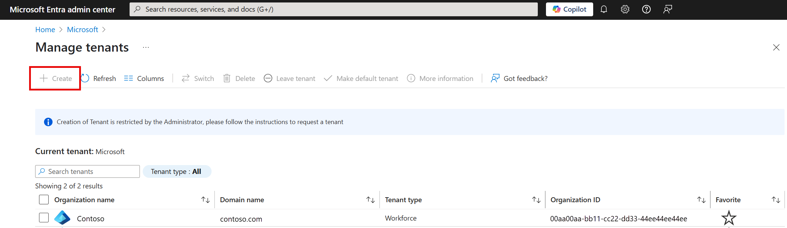

Your company has given the go-ahead to start using Azure Active Directory (Azure AD), and has asked you to set it up.

Here, you'll create a tenant using the Azure portal. When you've created your tenant, you'll associate a new subscription with it.

### Create a tenant

1. [Sign in](<https://portal.azure.com/learn.docs.microsoft.com?azure-portal=true>)  to the Azure portal with the same account you used to activate your sandbox.

1. Select **Create a resource**.

    

1. Search for "Azure Active Directory", in the search box. Select **Azure Active Directory** in the results list.

    

1. Select **Create**.

    

<!--CE: Please check the capitalization (or not) of, for example, 'Organization name' and 'initial domain name'.--> 

5. Fill in the form that appears. Give your Azure AD directory a name in the **Organization name** field. Use a unique domain name in the **initial domain name** field, and select a country or region of your choice. Then select **Create** at the bottom of the form.

    

### Associate a subscription with your tenant

1. In the search box at the top of your Azure portal, search for "Subscriptions". Then select **Subscriptions** in the dropdown list that appears.

    

1. Select your subscription from the list that appears.

    

1. Select **Change directory** then select **Change**.

    

1. In the new pane that appears, select your directory in the dropdown.

    

1. Select the notification bell at the top of the Azure portal, to see if your subscription has been moved. Then select **The directory changed**.

    

1. Select your new directory in the list of directories.

    

1. In the search box at the top of your Azure portal, search for "Subscriptions". Then select **Subscriptions** in the dropdown list that appears.

    

1. You'll see your subscription listed in the subscriptions list.

    
