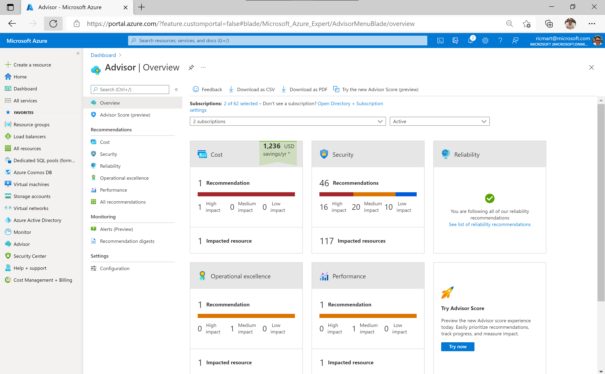
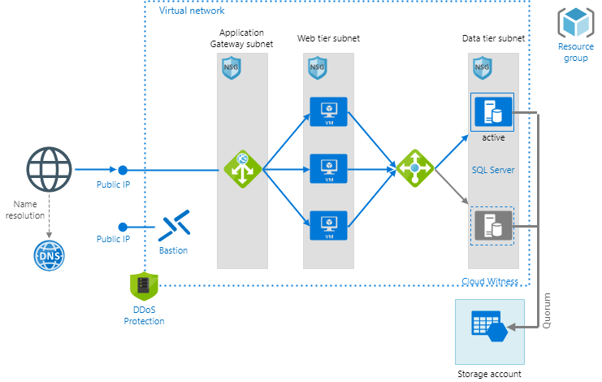

In a cloud environment is easy to create resources, explore features and try everything. In the same way becomes easy to create environments without taking consideration of some important best practices.

So how to track your environment and ensure cloud usage with correct approach over some pillars like cost effectiveness, security, reliability, operational excellence, and performance?

To address this, Azure Advisor will give to you proactive, actionable, personalized recommendations to help you follow best practices over those five pillars of cloud usage.

## Example scenario

You are running a critical workload composed by different types of IaaS resources such as virtual machines and database servers plus PaaS resources like storage account, bastion host, dns, application gateway. The following illustration shows this architecture:

## What will we be doing?

As you are running a workload running a mixed set of resources, ensure you are using the best approach of usage for each one isn't an easy task. It will require deep knowledge on the most diverse type of resources, besides a good cloud skills expertise in order to have it done by a person.

Then here we will be learning how we can use a tool called Azure Advisor to accomplish it in a smart and fashioned way.

## What is the main goal?

By the end of this session, you'll be able to check and validate the recommendations besides to act, customize how to receive and create alerts for them.
