# How Azure Advisor works?

## How access the recommendations?

You can access Advisor through the Azure portal. Sign in to the portal, locate Advisor in the navigation menu, or search for it in the All services menu. Then you will be able to see the recommendations divided into five categories: Cost, Security, Reliability, Operational excellence and Performance.

### Costs Recommendations

Azure Advisor help to identify idle and underutilized resources. You can get cost recommendations from the Cost tab on the Advisor dashboard. Here you can see a list of recommendations to reduce costs:

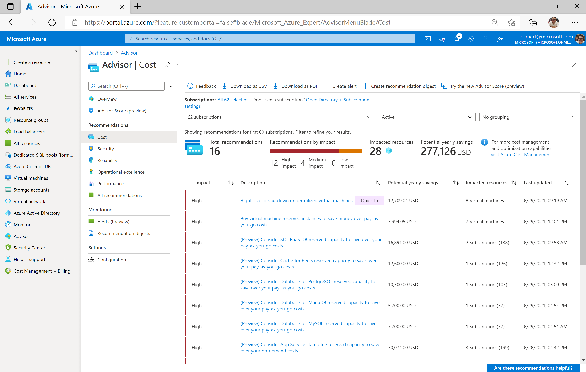

In this case I chosen the recommendation to shut down or resize my virtual machine and I can have more details regarding the recommendation, rules used, additional details over the potential saving, related subscription and take some action.

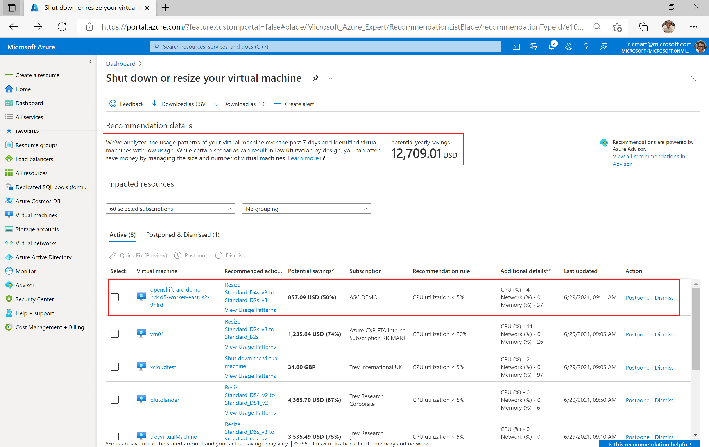

### Security Recommendations

Security recommendations are integrated with Azure Security Center. You can get security recommendations from the Security tab on the Advisor dashboard. Full list of security recommendations to selected subscriptions: 

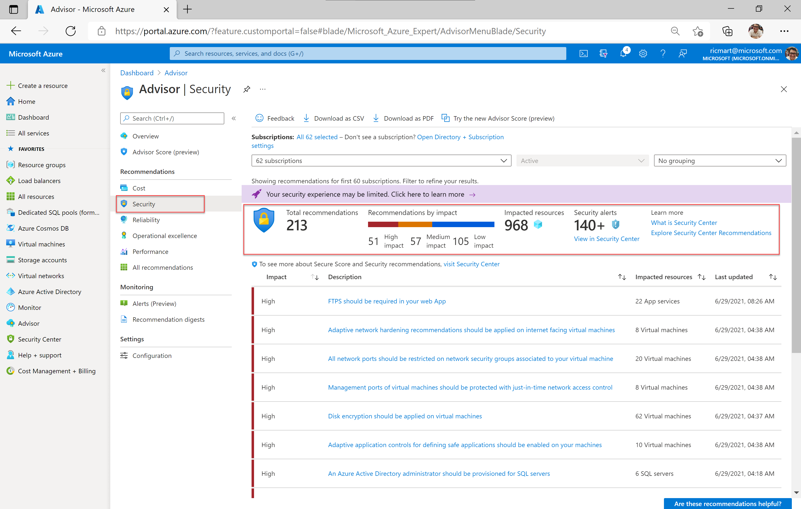

Example of a recommendation regarding system updates available for my virtual machines, affected resources and more:

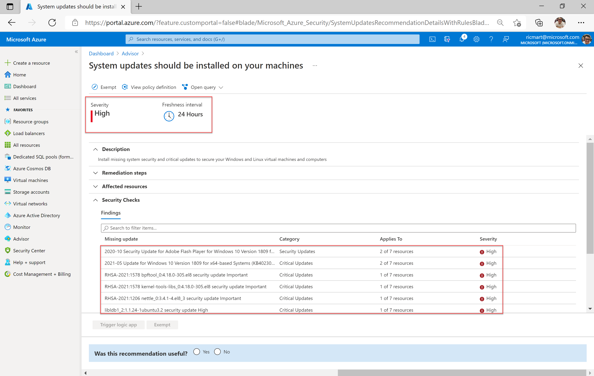

### Reliability Recommendations

Azure Advisor helps you ensure and improve the continuity of your business-critical applications. You can get reliability recommendations from Advisor on the Reliability tab of the Advisor dashboard. List of recommendations to my subscriptions:

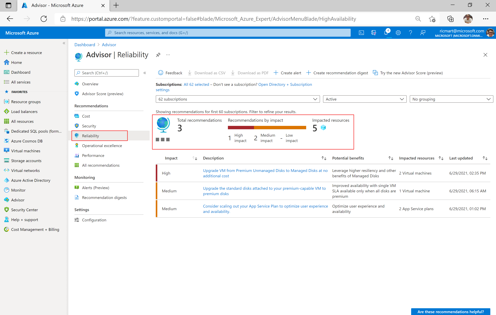

Example of a recommendation suggesting upgrade virtual machines to Managed Disks in order to improve the reliability of my virtual machines:

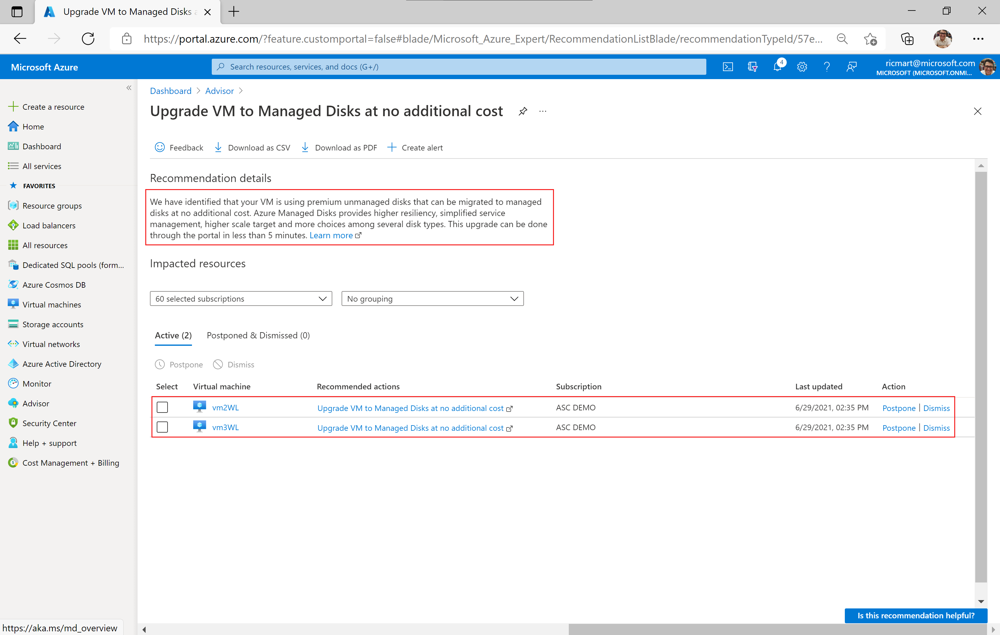

### Operational excellence Recommendations

Operational excellence recommendations in Azure Advisor can help you with:

* Process and workflow efficiency.
* Resource manageability.
* Deployment best practices.
* You can get these recommendations on the Operational Excellence tab of the Advisor dashboard.

Recommendations to ensure operational excellence on my subscriptions:

Example of a recommendation to assign a policy to restrict the allowed SKUs for virtual machines:

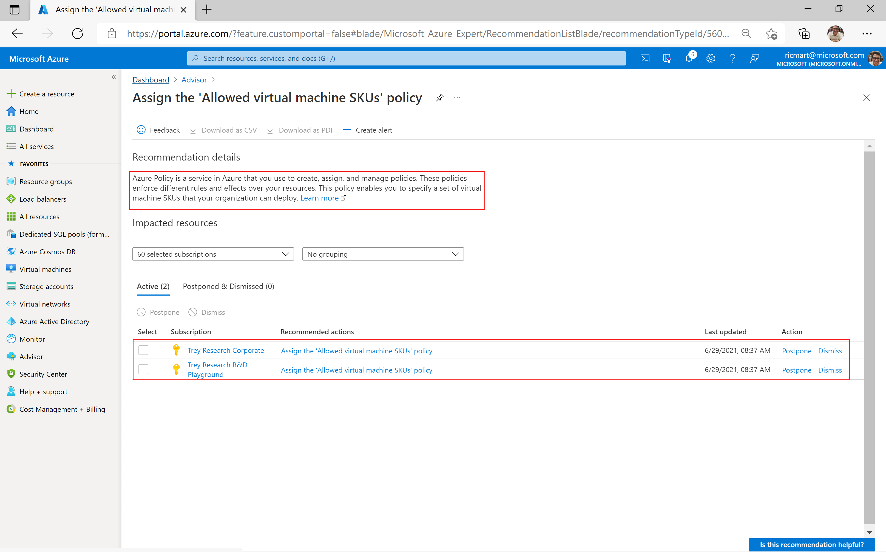

### Performance Recommendations

The performance recommendations in Azure Advisor can help improve the speed and responsiveness of your business-critical applications. You can get performance recommendations from Advisor on the Performance tab of the Advisor dashboard.

Recommendations to ensure performance improvements:

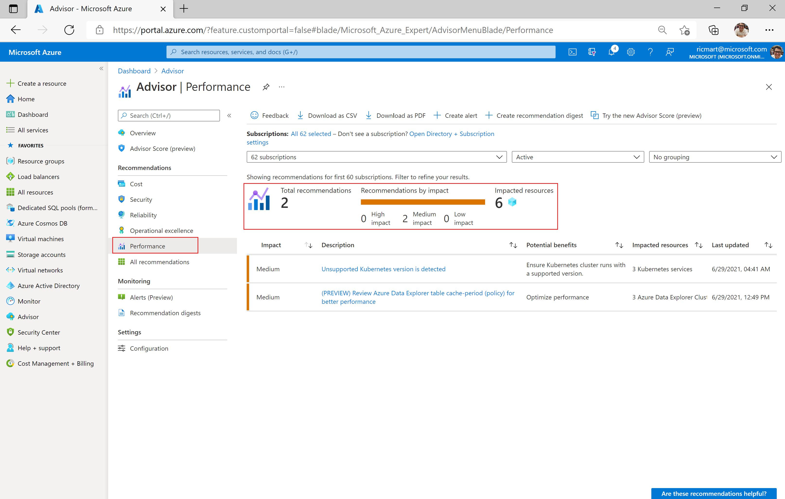

Recommendation warning about a unsupported Kubernetes version detected, which can affect the overall performance on the workload:

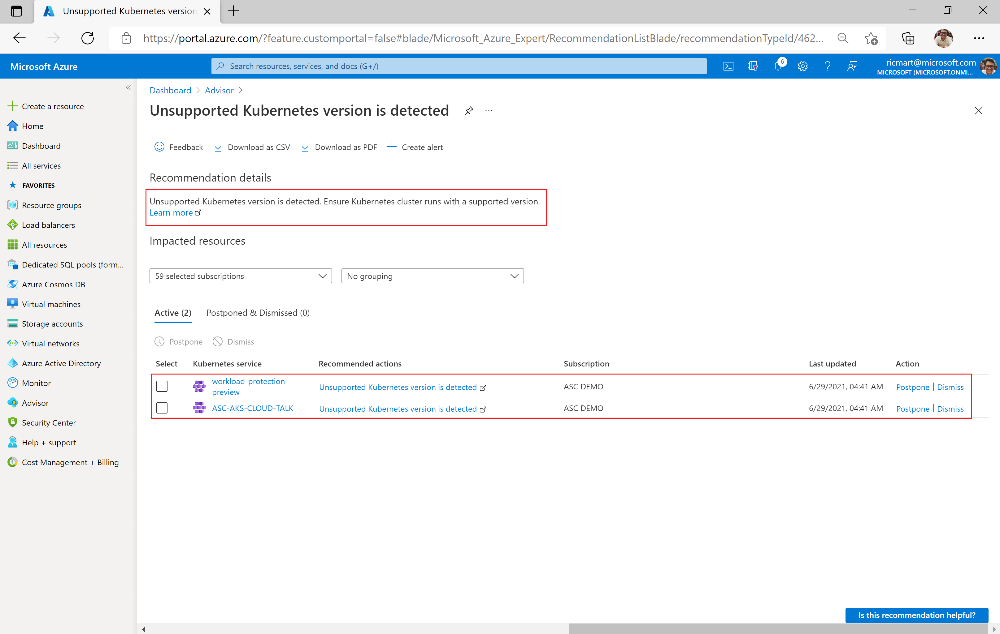

## How configure recommendations

It's possible to choose for which Subscriptions and Resource Groups you want receive recommendations from Azure Advisor. To do this, open Advisor then click on **Configuration** under **Settings** and apply.

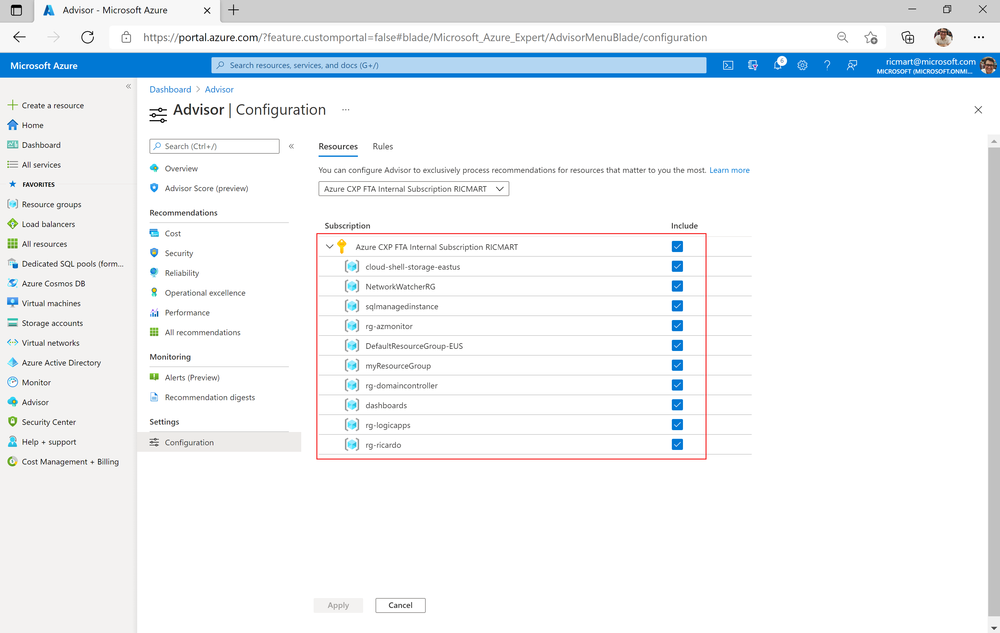

Also is possible configure the average CPU utilization rule for the low usage virtual machine recommendation. The CPU utilization rule can be set to 5%, 10%, 15%, or 20%.

*Please note that to adjust the average CPU utilization rule for identifying low usage virtual machines, you must be a subscription Owner. If you do not have the required permissions for a subscription or resource group, the option to include or exclude it will be disabled in the user interface.*

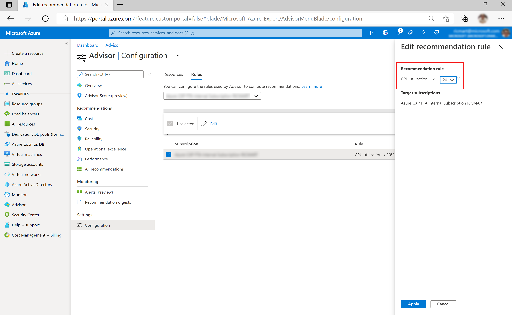

## How download the recommendations

You can download a summary of the recommendations from Advisor in a CSV or PDF format. This makes easy share with your co-workers or perform your own analysis

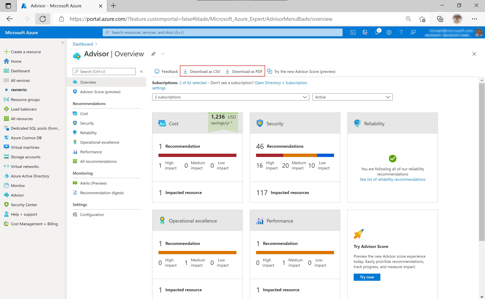

Example of a PDF file generated:

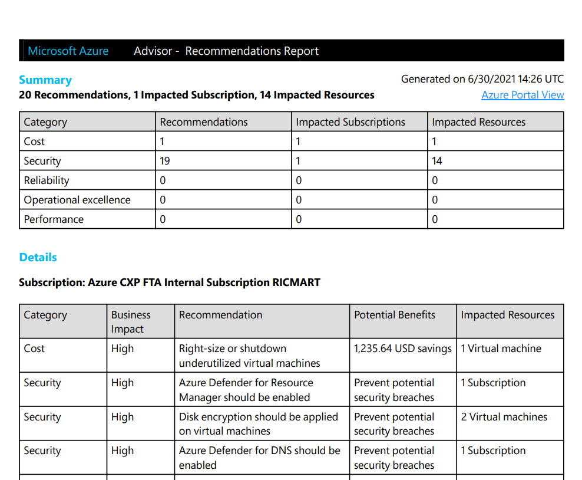

## How create alerts on new recommendations

Alerts

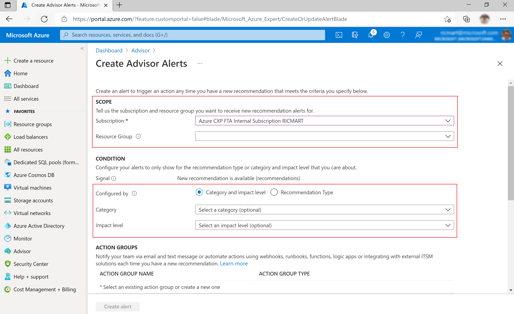

## How configure recommendations summary

Summary

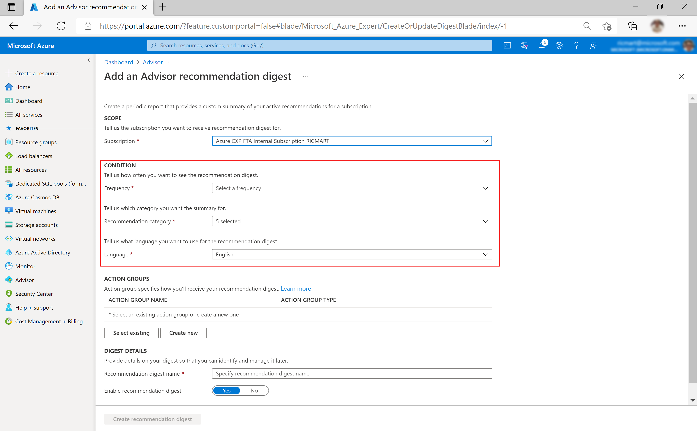
