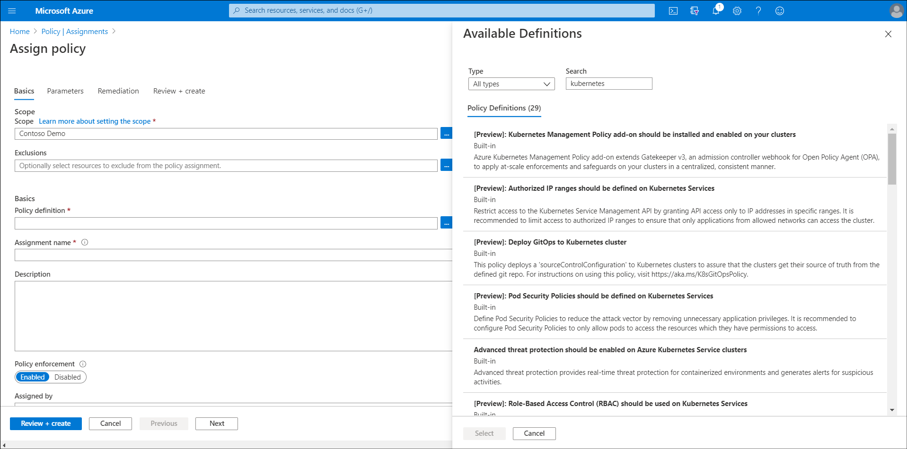

<!-- topic title: Use Azure Policy with Azure Arc. -->

<!-- 6 minutes to read -->

Azure Arc enables you to extend some capabilities of *Azure Policy* to operating systems of computers that are in on-premises datacenters or are hosted on Azure or another cloud provider. This functionality applies to auditing the compliance of settings for the OS, applications, and environment.

Additionally, you can configure the time zone on servers that are running the Windows Server OS. You can also use Azure Policy to manage and evaluate compliance for Azure Arc-enabled Kubernetes clusters.

> [!NOTE]
> Enabling this functionality requires that you install the Azure Connected Machine agent on each computer in the scope of management.

## What is Azure Policy?

*Azure Policy* is a service that can help organizations manage and evaluate compliance for their Azure environments' organizational standards. Azure Policy uses declarative rules based on properties of target Azure resource types. These rules form policy definitions, which administrators can apply through policy assignment to a resource group or subscription.

For example, to simplify management of policy definitions, Contoso could consider combining multiple policies into initiatives and then create a few initiative assignments instead of multiple policy assignments.

Azure Policy functionality groups into four main categories:

- Enforcing compliance when provisioning new Azure resources.
- Auditing the compliance of existing Azure resources.
- Remediating noncompliance of existing Azure resources.
- Auditing the compliance of the OS, application configuration, and environment settings within Azure VMs.

> [!TIP]
> The last of these categories implements by using the Azure Policy Guest Configuration client, which is available as an Azure VM extension. Azure Arc for servers uses the same client to provide auditing functionality in hybrid scenarios.

Specifically, Contoso IT support could use Azure Policy to implement the following rules:

- Restricting Azure regions into which they can deploy resources.
- Restricting types of resources that they can deploy.
- Restricting Azure VM sizes that they can deploy.
- Assigning tags to resources during their deployment.
- Installing Microsoft Antimalware extension to Azure VMs.
- Identifying Azure VMs without Microsoft Antimalware extension installed.

> [!NOTE]
> Only assigning tags to resources during their deployment can implement with Azure Arc at the present time.

After you install the agent, it requires outbound connectivity to Azure Arc over TCP port 443. At that point, any Azure Policy Guest Configuration client-based configuration that's in the assigned policy or initiative definition will automatically take effect.

### Assign policies with Azure Arc

To manage and assign Azure Arc policies for a computer, browse to Azure Arc in the Azure portal. In the returned list of managed servers, select the appropriate server, and then assign a policy to it. You'll need to configure the:

- Scope and any exclusions from the scope of the policy.
- Policy definition.

    

- Assignment name.
- Description.
- Policy enforcement (Enabled or Disabled).

> [!NOTE]
> Strictly speaking, by using this procedure, you're assigning the Azure policy to the resource group that has the configured server resource.

You can select and apply a number of Kubernetes policies.

After assigning policies, you can review the policy settings on the selected server from Azure Arc.

## Additional reading

You can learn more by reviewing the following documents:

- [Azure Policy built-in definitions for Azure Arc enabled servers (preview)](https://aka.ms/azure-policy-definitions?azure-portal=true).
- [Quickstart: Create a policy assignment to identify non-compliant resources](https://aka.ms/assign-policy-portal?azure-portal=true).
- [Enable monitoring of Azure Arc enabled Kubernetes cluster](https://aka.ms/container-insights-enable-arc-enabled-clusters?azure-portal=true).
