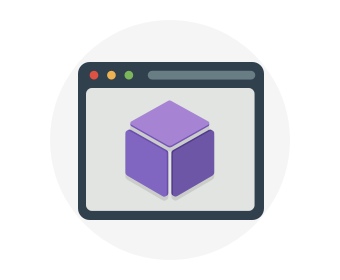
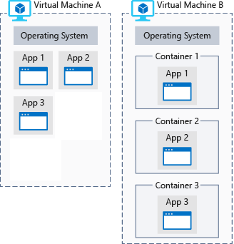

Your research team has collected massive amounts of image data that might lead to a discovery on Mars. They need to perform computationally intense data processing but don't have the equipment to do the work. Let's see why Azure is a good choice to do the data analysis.

## What is Azure compute?

Azure compute is an on-demand computing service for running cloud-based applications. It provides computing resources like multi-core processors and supercomputers via virtual machines and containers. It also provides serverless computing to run apps without requiring infrastructure setup or configuration. The resources are available on-demand and can typically be created in minutes or even seconds. You pay only for the resources you use and only for as long as you're using them.

There are three common techniques for performing compute in Azure:

- Virtual machines
- Containers
- Serverless computing

## What are virtual machines?

**Virtual machines**, or VMs, are software emulations of physical computers. They include a virtual processor, memory, storage, and networking resources. They host an operating system, and you're able to install and run software just like a physical computer. And by using a remote desktop client, you can use and control the virtual machine as if you were sitting in front it.

:::row:::
  :::column:::
    
  :::column-end:::
	:::column span="3":::
**Virtual machines in Azure**

Virtual machines can be created and hosted in Azure. Typically, new virtual machines can be created and provisioned in minutes by selecting a pre-configured virtual machine image.

Selecting an image is one of the most important decisions you'll make when creating a VM. An image is a template used to create a virtual machine. These templates already include an operating system (OS) and often other software, such as development tools or web hosting environments.

  :::column-end:::
:::row-end:::

## What are containers?

> [!VIDEO https://www.microsoft.com/videoplayer/embed/RE2yMhY]

Containers are a virtualization environment but, unlike a virtual machine, they do not include an operating system. Instead, they reference the operating system of the host environment that runs the container. For example, if five containers are running on a server with a specific Linux kernel, all five containers are running on that same kernel.

The following illustration shows a comparison between applications running directly on a VM and applications running inside containers on a VM.

Containers typically contain an application that you write &mdash; along with any libraries required for your application to run on the host environment's kernel.

Containers are meant to be lightweight and are designed to be created, scaled out, and stopped dynamically. This allows you to respond to changes on demand and quickly restart in case of a crash or hardware interruption.

An additional benefit of using containers is the ability to run multiple isolated applications on a virtual machine. Since containers themselves are secured and isolated, you don't necessarily need separate VMs for separate workloads.

Azure supports Docker containers and several ways to manage those containers. Containers can be managed manually or with Azure services such as Azure Kubernetes Service.

### What is serverless computing?

Serverless computing is a cloud-hosted execution environment that runs your code but completely abstracts the underlying hosting environment. You create an instance of the service, and you add your code; no infrastructure configuration or maintenance is required, or even allowed.

#### What is Serverless Computing?

> [!VIDEO https://www.microsoft.com/videoplayer/embed/RE2yzjL]

You configure your serverless apps to respond to _events_. This could be a REST endpoint, a periodic timer, or even a message received from another Azure service. The serverless app runs only when it's triggered by an event.

Essentially, infrastructure isn't your responsibility. Scaling and performance are handled automatically, and you are billed only for the exact resources you use. There's no need to even reserve capacity.

:::row:::
  :::column:::
    
  :::column-end:::
	:::column span="3":::
**Serverless computing in Azure**

Azure has two implementations of serverless compute:

- **Azure Functions** which can execute code in almost any modern language.
- **Azure Logic Apps** which are designed in a web-based designer and can execute logic triggered by Azure services without writing any code.

  :::column-end:::
:::row-end:::

## Which computing strategy is right for me?

You don't need to take an "all or nothing" approach when choosing a cloud computing strategy. Virtual machines, containers, and serverless computing each provide benefits as well as tradeoffs against other options.

For example, although serverless computing removes the need for you to manage infrastructure, serverless computing expects work to be completed quickly; usually within seconds or less. Therefore, you might run your core application on a virtual machine or container but offload some of the data processing onto a serverless app.

In the next part, you'll look at each option more closely to help you decide when to use each service.